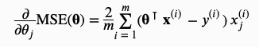
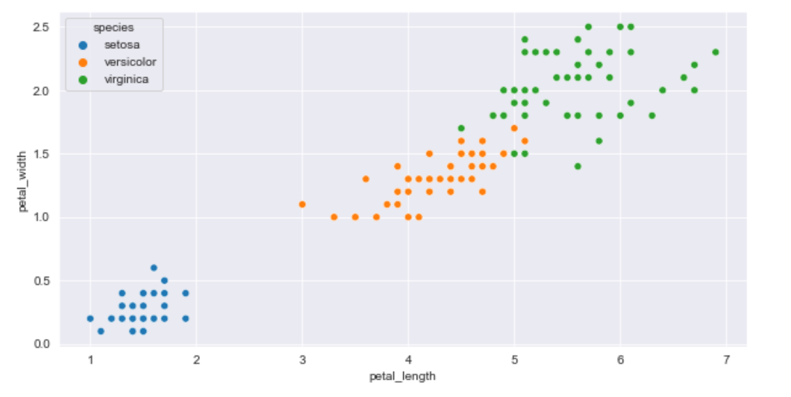
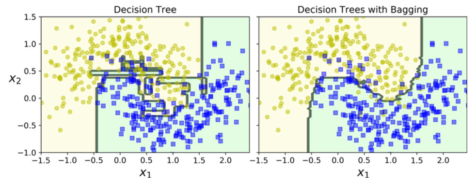

[TOC]


# Notes on Hands-on Machine Learning with Scikit-Learn, Keras, and TensorFlow

These are my notes on ML from the second edition of this book. The notes also include theory where it is missing in the book. My notes follow each of the chapters in the book as is but also inlcude a summary of the chapter, additional material to support the chapter, and python code that is clearly listed out. 

## Chapter 1: The ML Landscape

Let's start by defining what Machine Learning (ML) is: 

>   Machine learning is the science (and art) of programming computers so they can learn from data. 

This is the simplest definition of ML. An example of a simple ML program is the spam filter. It learns from the data and is then able to identify spam emails by itself without being explicitly programmed. 

A more mathematical definition of ML is: 

>   A computer program is said to learn from experience E with respect to some task T and some performance measure P, if its performance on T, as measured by P, improves with experience E

A machine learning program makes uses of data to be trained. This data is called a **training set**. A training set is composed of **training instances** or **samples**. The ML program is designed for a task T (e.g. flag spam emails). It learns this from the training set and builds the experience, E from these samples. The program's performance, P is then evaluated through a measure of accuracy metric with the use of another data set called the **test set**. The test set contains **test instances** that the ML program has never seen. 

### Why Use ML? 

Here are reasons why ML is important: 

1.   **ML programs automatically adapting to changing data**. Rather than being explicitly program, ML programs adapt as the training data changes. This helps to make the programs shorter and saves us a lot of time from writing code. 
2.  **ML programs allow us to find insights that we could normally miss**. ML algorithms work with patterns. When a ton of data that the ML programs can go through, they have the ability to find patterns that we, humans, can easily miss.  Moreover, we don't have the time or the ability to go through a large amount of data and look for patterns. The ML program helps us do that for us. 
3.  **ML programs help to solve Complex Problems**. Some problems do not have a direct solution that we can code. In fact, there are a lot of problems that do not have a mathematical solution. In such cases, the ML program help us solve such problems. 

### Types of ML Systems

ML programs can be broadly put into three categories: 

1.  **Systems that require or don't require human interactions** - Systems that require human supervision called are **supervised ** or **unsupervised** ML systems. These include: 
    1.  Supervised
    2.  Semi-supervised
    3.  Unsupervised
    4.  Reinforcement Learning
2.  **Systems that learn incremenatally or on the fly** - Such systems learn as the data flows through them. Such systems include: 
    1.  Online Learning
    2.  Batch Learning
3.  **Systems that use instance-based or model-based learning** - Such systems either use the new information by comparing with what they have already learned or they create a model of the system and then use the new information to make predictions. 

It is to be noted that a ML system will not exclusively fall into these three buckets. Most often they include a combination of one or two buckets. 

Let's look at each of these in greater detail: 

#### Supervised & Unsupervised Learning 

In supervised learning, the samples and associated labels are provided to the ML system. The ML system find patterns between the samples and the labels so that it is able to make predictions of the labels based on only the sample data. If the label is a category, then the supervised ML system is called a **classification** while if the label is numerical, the ML system is called **regression**. Here are some important supervised learning algorithms that we cover: 

*   k-Nearest Neighbors
*   Linear Regression
*   Logistic Regression
*   Support Vector Machines
*   Decision Trees & Random Forest
*   Neural Networks

In the case of unsupervised learning, the training set has samples but no associated labels. The ML system then learns from the data to create categories or make predictions. Some important unsupervised learning algorithms we cover are: 

*   K-Means
*   DBSCAN
*   Hierarchical Cluster Analysis
*   Anomaly Detection
    *   One-class SVM
    *   Isolation Forest
*   Visualization & Dimensionality Reduction
    *   Principle Component Analysis (PCA)
    *   Kernel PCA
    *   Locally Linear Embedding
    *   t-Distributed Stochastic Neighbor Embedding (t-SNE)
*   Association Rule Learning
    *   Apriori
    *   Eclat

#### Semi-Supervised & Reinforcement Learning

**Semi-supervised learning systems** work best when when we have a partially labeled dataset. For example, you may have a large collection of photos. Now a ML system is able to tag you in all of the photos in which you are there if you can tag yourself in 1% or less of the photos. 

Semi-supervised learning is a combination of supervised and unsupervised learning. Some examples are: 

*   Deep Belief Networks (DBNs)
*   Restricted Boltzmann Machines (RBMs)

In **Reinforcement Learning systems** we have an agent. This agent can observe the environment, select and perform actions, and get rewards in return or negative rewards (punishment). The agent must learn by itself and devise a strategy, called a policy, to get most rewards over time. The policy defines what action the agent should choose when it it is in a given situation. 

#### Batch and Online Learning

**Batch learning** is when a system learns from training data that is fed to it in batches. At times if the data is too large for a system to handle due to restricted resources, breaking the data into smaller batches allows the system to continually learn. The disadvantage of batch learning is that when the learning takes place, the system goes into offline mode. This is known as **offline learning**.

If system is required to be continuously online, then **online learning ** is the best option. This sytem learns sequentially when it fed with small groups of data called **mini batches**. Each learning step is fast and cheap and more importantly the system does not need to be offline. The drawback of online learning is that such systems adapt quickly, called **learning rate**, to the data that is fed. So, if the data that is fed to an online system is bad, the system will train on bad data and make bad predictions. So, care must be taken to limit feeding bad data to online systems. 

#### Instance-based vs Model-Based Learning

In **instance-based learning**, the system learns the patterns from the training data and sort of by hearts all the information it has learned. When a new instance is provided, it simply compares the closest instance to that new instance and make predictions. An example of instance-based in KNN. The KNN simply learns what each of the instances in the training examples are labled. When a new instance is given, it find the closest labeled instances and labels the new instance based on majority rule. 

In **model-based learning** the system generalizes the pattern from the training examples and then uses that information to make predictions on the new instance it has been provided. An example of model-based would be SVM, which creates a boundary between classes. The new instance is labeled a category based on where it falls. 

### Main Challenges of ML

There are two things that can go wrong: bad data and bad algorithm. 

#### Insufficient Quantity of Training Data

ML systems require a lot more data than humans to either predict or classify accurately. If we have less data, then the ML systems are as good as the data they are fed. 

#### Nonrepresentative Training Data

Care must be taken to select data that will ultimately help the ML system to accurately make predictions or inference. If the data are nonrepresentative, the ML system will be trained badly and will be a poor system. 

When the training sample is too small, it is said to have high **sampling noise**. Of course, large sample that is not representative can also have sampling noise. Large nonrepresentative data are said to have **sampling bias**.

#### Poor Quality Data

Data that has a lot of missing values across features or outliers is said to be of poor quality. Such poor quality of data will result in poor performance of any ML system. So, care must be taken to clean the data before passing it through any ML system. 

#### Irrelvant Features

A ML system learns best when it is given a good set of features to train on. By good we mean relevant features that will help it to be more accurate. The process of creating good, relevant features that are passed to a ML system is called **feature engineering**. Feature engineering involves the following steps: 

*   **Feature selection** - Selection fo relevant features to be used for training the model
*   **Feature extraction** - Combining existing features to produce a more useful feature. This also helps to reduce the dimensionality of the feature space. 
*   **Creating new Features by acquiring more data** - Once the problem is known and we find that the current features do not aid in good accuracy, we may choose to gather more relevant data with featuresthat will help. 

#### Overfitting the Training Data

It is easy for an ML system to overfit the data. **Overfitting** means when an ML system fits the noise in the data rather than just the data. The symptoms of overfitting is close to 100% accuracy of the model on training dataset but poor accuracy on test dataset. Overfitting can also occur when a more complex model is used instead of a simple model for the given dataset. 

Here are steps taken to avoid overfitting: 

*   Use a simple model
*   Gather more data
*   Reduce noise in the training data
*   Constrain the model through regularization

#### Underfitting the Training Data

Underfitting is the opposite of overfitting. Underfitting occurs when the model used is too simple.   Underfitting results in poor training accuracy. Here are some reasons for why we may have underfitting:

*   Select a more powerful model with more parameters or choose a non-parametric model
*   Feed better features to the learning algorithm
*   Reduce the constrains through regularization so the model is more flexible

### Testing & Validation

Once the model is trained, it 's accuracy is evaluated by running it on a **test dataset**. We also evaluate the error rate of the model on the test set. This error is called **generalization error (or out of sample error** or **test error rate**. Here' s a scenario that can happen: 

*   If the training error is low but the test error rate is high, the model is overfitting on the training data

More often than not, when working on a project, we work on multiple ML systems. We then need to tune each of these model parameters called **hypertuning** and evaluate the best model, which is called, **model selection**.

The hypertuning is used to tune the parameters of a given model so that we can increase the test accuracy or reduce the generalization error. As we will see later, we can construct a list of hypertuning parameters and run of model through the data and find which combination of hypertuning parameters work best. 

Generalization error is determined through a validation set, like a test set. However, a test set is a single instance of the process to get us the result. We cannot be completely sure that the result we get from this is the actual accuracy of the model. Also, at times the validation set could be too small which may doubt our results. Hence, we make use of **cross-validation**. 

The cross-validation is a technique in which a dataset is broken into $k$ groups. One group is used for validation while the $k-1$ groups are used for training. This process is repeated across all $k$ groups. This results in a accuracy score along with the standard deviation of the score. This gives a good picture how the model performs. 

>   When performing validation, it is important that the validation set is representative of the training set. If this is not the case, we have a **mismatch** between the two sets. The model will perform badly on the validation set. 


## Chapter 2: End-to-End Machine Learning Project 

In this chapter we will go through a project from the beginning to the end. This will illustrate how a typical machine learning project works in practice.

Here are the main steps to follow when working on a ML project: 

1.  Look at the big picture
2.  Get the data
3.  Discover and Visualize the data to gain insights
4.  Prepare data for ML algorithms
5.  Select a model and train it
6.  Fine-tune your model
7.  Present your solution
8.  Launch, monitor, and maintain your system

As an example to go through these steps, we will look at the housing prices. 

### Look at the Big Picture

We are given a data of California housing prices. The data contains population, median income, median housing price for each block and other geographical information. **Our goal is to predict the median housing price in any district given all the other metrics.** 

Before we launch into building a model, we need to ask our manager or boss about how this model is going to be used. Is this a stand-alone model or would this be part of a pipeline. We also need to know how accurate this model should be. How critical is the accuracy of the model and how would the prediction from the model be used. All these questions help us decide how we build and test the model. 

We find out that our model is just a piece in the company's pipeline. It would look something like this: 


>   A sequence of data processing components is called a **data pipeline**. 

We have been asked to make predictions on the housing prices at a given location. So, we are looking at a numerical output. So, this is a regression problem as opposed to a classification problem. We know that there are a lot of features that we will use to make the prediction so this is a multivariate problem. So, this is a **multivariate regression problem**. We also know that we have labeled data. So we will be working with a **supervised learning** ML system. 

Next, we find that the data are small enough to fit in memory. So, we are looking at batch learning as opposed to online learning. 

>   If the data are large, you can break it up using MapReduce technique, and then use the batch learning method. 

#### Select Performance Measure

Now that we know the type of ML system to use, we need to decide what metric we should use to evaluate the model performance. Knowing that this is a regression problem, the typical metric to use the **Root Mean Square Error (RMSE)**. The RMSE is given by: 


Here the $\bold{X}$ is the feature matrix and $h$ is the prediction matrix ($h = \hat{y}^{(i)} = h(\bold{x}^{(i)})$). The other $y^{(i)}$ is the target or the label for a given sample $i$, while $m$ are the total number of samples or observations. 

Ofen in linear regresssion we use the **mean absolute error (MAE)** instead as it is robust against outliers. The MAE is given by, 

 

Both RMSE and MAE are ways to measure the distance between two vectors: the vector of predictions and the vector of target values. 

#### Check the Assumptions

When working with any ML system, it is important to know what the assumptions are. There are two types of assumptions that we make:

1.  Assumptions involving the ML system. Each ML algorithm requires the data to be in certain type and format. We need to ensure that the assumptions are satisfied. If not, we will get erroneous decision. We will work on this when we prepare the data for ML algorithms. 
2.  Assumptions regarding what the format of the output of the ML system is and how it is going to be used. We find that the downstream system takes in actual prices and not the price categories. 

### Getting the Data

When working on a project, it is important to create a new environment so that other projects are not affected. So, we begin by creating an environment:

```python
python3 -m pip3 install --user --U virtualenv
virtualenv my_env
source my_env/bin/activate
```

We then install all python packages in that environment. 

#### Take a Quick Look at the Data Structure

We can do a quick EDA to see how the data looks like. This includes:

*    Use of `.head()` to see the data structure
*   Use of of `.info()` to find which features have null values
*   Use of `.value_counts()` to find the categories in a categorical variable
*   Use of `.describe()` to see the descriptive statistics of numerical features
*   Use of `.hist()` to see the distribution of numerical values

#### Creating a Test Set

Now that we know how the data looks like. We first start with a test set. This is important because we do not want to create a test data after we have done EDA on the data. We do not want to be biased by it. 

The test split is creating using the scikit-learn algorithm `train_test_split()`:

```python
from sklearn.model_selection import train_test_split
train_set, test_set = train_test_split(housing, test_size=0.2, random_state=42)
```

The above function randomly selects samples from the `housing` dataset and assigns 20% to test and the remaining to the train. However, there are times when you want to preserve the distribution of features of the original dataset within both the train and test. In such a case, we will do a **stratefied sampling**:

```python
from sklearn.model_selection import StratifiedShuffleSplit
strat_splits = StratifiedShuffleSplit(n_split = 1, 
            	                  test_size=0.2,
                	              random_state=42)
for train_index, test_index in strat_splits.split(housing, 
                                                  housing['income_category']):
    strat_train_set = housing.loc[train_index]
    strat_test_set = housing.loc[test_index]

# Finally we remove the `income_cat` attribute: 
for set_ in (strat_train_set, strat_test_set):
    set_.drop('income_cat', axis=1, inplace=True)
```

### Discover & Visualize the Data to Gain Insights

To gain insights into the data, we begin by creating multiple plots. 

#### Visualize the Data

Here we begin by plotting the data. 

```python
housing.plot(kind='scatter', x='longitude', y='latitude')
```


We can also create a heatmap to see where the housing prices are high. These would be expensive places: 

```python
housing.plot(kind="scatter", x="longitude", y="latitude", alpha=0.4,
    s=housing["population"]/100, label="population", figsize=(10,7),
    c="median_house_value", cmap=plt.get_cmap("jet"), colorbar=True,)
plt.legend()
```

The result is the following: 


We see that the housing prices are very high next to the coast but much cheaper inland, as expected. 

#### Looking for Correlation

If the data is not too large, we can create correlation matrix. 

```python
corr_matrix = housing.corr()
```

Lookinag at this matrix, for one of the variable, `median_housing_value`, we find:

```python
print(corr_matrix["median_house_value"].sort_values(ascending=False))

median_house_value    1.000000
median_income         0.687170
total_rooms           0.135231
housing_median_age    0.114220
households            0.064702
total_bedrooms        0.047865
population           -0.026699
longitude            -0.047279
latitude             -0.142826
Name: median_house_value, dtype: float64”

```

 We notice that `median_income` is high correlated with `median_house_value`. The other features are less so. Some are weakly anticorrelated. 

We can also plot some correlations as well, 

```python
from pandas.plotting import scatter_matrix

attributes = ["median_house_value", "median_income", "total_rooms",
              "housing_median_age"]
scatter_matrix(housing[attributes], figsize=(12, 8))
```


We see that some are strongly correlated but we notice something vety interesting: 


Notice some data are exactly at 500000. This is most likely due to a capping of the data. We may need to remove some district that have these values capped to prevent the algorithm from learning to reproduce these data quirks. 

#### Working with Attribute Combinations

You will notice that some distributions are tail heavy. We may need to transform them so that the distributions are normal. This is important because the multiple linear regression assumes that the attributes are normally distributed. This is where our assumptions about the ML system comes into picture. 

You also want to explore the features to see if there are features that can be removed or which can be modified. We have a total number of rooms per district, which is not quite helpful. Instead, we want total number of rooms per household. Also, the total number of bedrooms are not useful. Instead, we want the total number of bedrooms in terms of the total number of rooms. We make this change

```python
housing["rooms_per_household"] = housing["total_rooms"]/housing["households"]
housing["bedrooms_per_room"] = housing["total_bedrooms"]/housing["total_rooms"]
housing["population_per_household"]=housing["population"]/housing["households"]
```

Looking at the correlation matrix for `median_house_value`, we find the following: 

```python
“corr_matrix = housing.corr()
print(corr_matrix["median_house_value"].sort_values(ascending=False))

median_house_value          1.000000
median_income               0.687160
rooms_per_household         0.146285
total_rooms                 0.135097
housing_median_age          0.114110
households                  0.064506
total_bedrooms              0.047689
population_per_household   -0.021985
population                 -0.026920
longitude                  -0.047432
latitude                   -0.142724
bedrooms_per_room          -0.259984
Name: median_house_value, dtype: float64
```

We see that `rooms_per_household` is much more correlated with `median_house_value` rather simply the `total_rooms`. We also see that `bedrooms_per_room` is strongly anti correlated than simply `total_bedrooms`. 

>   The round of exploration does not have to be rigorous, instead it should be just enough to get started. 

### Prepare Data for ML Algorithms

The data preparation should be written as a pipeline rather than doing it manually. So, it is important to write functions instead. Such functions can then be used in future projects. 

#### Data Cleaning

As we saw earlier, our feature `total_bedrooms` has some missing values. We can either drop rows that have missing values, we can drop the feature entirely, or we can impute the missing values. 

We will use the impute method to impute the missing values. Here's how it is done: 

```python
from sklearn.impute import SimpleImputer
imputer = SimpleImputer(strategy='median')
```

Now the imputer requires that the dataframe be purely numerical. So, we will get rid of all categorical features and then pass this to the imputer: 

```python
housing_num = housing.drop('ocean_proximity', axis=1)
```

Now we are ready to impute: 

```python
imputer.fit(housing_num)
X = imputer.transform(housing_num)
```

This gives is X, which is a numpy ndarray. We can put this back into a dataframe: 

```python
housing_tr = pd.DataFrame(X, columns=housing_num.columns, index=housing_num.index)
```

This takes care of all missing values across features. We have simply used a median value of that feature to be imputed. 

#### Handling Text & Categorical Attributes

For ML systems to use the data, the categorical features need to be numeric. Therefore, we need to transform them. The most common way to convert is to use `OneHotEncoder`:

```python
from sklearn.preprocessing import OneHotEncoder
cat_encoder = OneHotEncoder()
housing_cat = cat_encoder.fit_transform(housing_cat)
```

>   The drawback of OneHotEncoding is that the resultant matrix is a sparse matrix. If this is the case, you should think about transforming the categorical feature into a numerical feature. For example, rather than using `ocean_proximity` as a categorical feature, you can use a distance measure from the ocean as a feature. Alternatively, you could replace each category with a learnable, low-dimensional vector called **embedding**. We will see this Chapter 13 and 17. 

#### Feature Scaling


## Chapter 3: Classification

We will begin our exploration of ML algorithms with classification. As an example, we will use the **MNIST** dataset. It has a set of 70,000 small images of digits that were written by highschool students. 

Scikit-learn provides this dataset: 

```python
from sklearn.datasets import fetch_openml
mnist = fetch_openml('mnist_784', version=1)

# Get the X and y vectors
X, y = mnist['data'], mnist['target']
```

We can see their shapes: 

```python
print(X.shape)
print(y.shape)
```

```python
(70000, 784)
(70000,)
```

We see that there are 70,000 images and each image has `28 x 28` pixels, which amount to 784 features. 

Here's how the MNIST dataset looks like: 


Now let's split the dataset and get started with classification: 

```python
X_train, X_test, y_train, y_test = X[:60000], X[60000:], y[:60000], y[60000:]
```

### Binary Classifier

We will start with a very simple classifier. It is a binary classifier, in the sense the number we are looking at, say 5, is either true or false. For this we will use the **Stochastic Gradient Descent** classifier. The advantage of SGD is that it can easily handle very large datasets efficiently. This is because SGD deals with instances rather than large batches of data. Think of it as online learning vs batch learning. 

To make things easier, we will create a binary classifier that evaluate whether an image has a '5' in it or not. So, we will train the classifier on all the images of 5: 

```python
y_train_5 = (y_train == '5')
y_test_5 = (y_test == '5')
```

This creates our labels, which are booleans. Now we train the classifier:

```python
from sklearn.linear_model import SGDClassifier
sgd_clf = SGDClassifier(random_state=42)
sgd_clf.fit(X_train, y_train_5)
```

Looking ath `y_test_5`, we know that the last two digits are False. 

```python
for index in [998, 999]:
    single_sample = X_test.iloc[index].values.reshape(1, -1)
    print(sgd_clf.predict(single_sample))
```

And we get: 

```python
[False]
[False]
```

This is rather painful way of evaluating the classifier. Let's automate the process. 

#### Evaluating the Classifier

We will implement cross-validation to evaluate the classifier. 

```python
from sklearn.model_selection import cross_val_score
cross_val_score(sgd_clf, X_train, y_train, cv=5, scoring='accuracy')
```

Here we have done a k-fold cross validation with `k=5`. The result is the following: 

```python
array([0.88083333, 0.88325   , 0.88116667, 0.86625   , 0.8875    ])
```

We see that the accuracy on average is greater than 88%. Now before we get excited about the result, we should know that only 10% of the images are that of '5', so any dumb classifier will get over 90% of accuracy. **This suggests that accuracy is generally not the preferred performance measure for classifiers**, especially when the datasets are skewed. 

#### Confusion Matrix

A much better way to evalute the performance of a classifier is to use the confusion matrix. Given two classes A and B, the confusion matrix counts the number of times the classifier has: 

*   Correctly classifier numbers belonging to class A 
*   Correctly classified the number belonging to class B
*   Incorrectly classified the number belonging to class A
*   Incorrectly classified the number belonging to class B

Here's how we setup our confusion matrix: 

```python
from sklearn.model_selection import cross_val_predict

y_train_pred = cross_val_predict(sgd_clf, X_train, y_train_5, cv=3)
```

Just like `cross_val_score()`, the `cross_val_predict()` makes k-fold cross-validation but rather than returning the scores, it returns the predictions on each test fold. 

Now we are ready to construct our confusion matrix: 

```python
from sklearn.metrics import confusion_matrix
confusion_matrix(y_train_5, y_train_pred)
```

The output is the following: 

```python
array([[53892,   687],
       [ 1891,  3530]])
```

Few things to know about confusion matrix as we see above: 

*   Each row corresponds to the actual class
*   Each column corresponds to predicted class. 

>   In a confusion matrix, we want higher numbers along the diagonal and smaller numbers along the off-diagonal for the classifier to be good. A perfect classifier will have 0 values in its off-diagonal

The confusion matrix gives us a lot of information but we may be interested in a summary of the result, a more concise metric. There are two such metrics that are often used to evaluate accuracy of a classifier. But before we go into the metrics, let's use some definitions: 

*   **True Positive (TP)** - Observations that are correctly predicted to belong to the positive class. 
*   **True Negative (TN)** - Observations that are correctly predicted to belong to the negative class
*   **False Positive (FP)** - Observations that actually belong to the negative class but are predicted to belong to the positive class
*   **False Negative (FN)** - Observations that actually belong to the positive class but are predicted to belong to the negative class. 

Here's an example to look at: 


With these definitions, let's look at some metrics that are often used to evalutate a classifier: 

*   **Precision** - This is the ratio of the total number of observation that were predicted correctly to be positive over the total number of observations predicted to be positive class (TP + FP). 
    $$
    \text{precision} = \frac{TP}{TP + FP}
    $$
    The drawback of using only precision is that if we make one prediction and it is correct, we get a 100% precision. Therefore, precision is used along another metric. 

*   **Recall** - This is the ratio of the total number of observations that are predicted correctly to be positive over the total number of actual observations that belong to the positive class (TP + FN) 
    $$
    \text{recall} = \frac{TP}{TP + FN}
    $$
    
*   **F1-score** - The F1-score is the harmonic mean of precision and recall. F1-score is particularly useful to compare two or more classifiers. The difference between mean and harmonic mean is that the latter gives more weight to low values. As a result, the classifier will only get a high F1-score if both recall and precision are high.

    $$
    F_1\text{ score} = 2 \times \frac{precision \times recall}{precision + recall}
    $$

Here is how you can do that in sklearn: 

```python
from sklearn.metrics import precision_score, recall_score, f1_score

print("Precision: ", np.round(precision_score(y_train_5, y_train_pred),2))
print("Recall: ", np.round(recall_score(y_train_5, y_train_pred),2))
print("F1-score: ", np.round(f1_score(y_train_5, y_train_pred),2))
```

And here is the result: 

```python
Precision:  0.84
Recall:     0.65
F1-score:   0.73
```

>    The F1-score favors classifiers that have similar precision and recall

There are cases when this is not something we would want. In some cases, you may want higher precision while in other cases, you may want higher recall. Let's think of precision and recall in terms of a car alarm. We are in a bad neighborhood, so we get an alarm in our car in order to prevent it from a carjack. 

*   **When Precision Matters** - What does it mean to have high precision? We can get high precision, if the **False Positives** are smaller. Fewer False positives mean that few number of times the alarm rings when car is shaken by the wind or if a large truck passes close-by. 
*   **When Recall Matters** - What does it mean to have high recall? We can get high recall if the **False Negatives** are smaller. Few False negatives mean that a carjack happens when the alarm does not ring. 

This all boils down to **sensitivity** of our alarm. If we make the alarm less sensitive, we will have less of false positives but it will increase false negatives. In other words, we will not have the alarm go off every now and then, but we risk on it not going off when the carjack happens. On the other hand, if we increase the sensitivity, we will definitely catch the thief but we are also likely to have the alarm go off more times. 

Unfortunately, we cannot have high precision and high recall. This is because increasing precision reduces recall and vice versa. This is known as **precision-recall trade-off**

#### Precision/Recall Trade-off

A classifier makes use of a decision boundary. Based on where the observation is, in terms of the decision boundary, the classifier assigns it to one or the other class. For example, the images are ranked by the classifier score as follows: 


We have three positions of a decision boundary. Based on where the boundary is, we may have higher precision or higher recall. 

sklearn does not let you set the threshold or the decision boundary explicitly but gives you access to the decision scores that it uses to make predictions. Rather than using `.predict()`, if you used, `.decision_function()` method, you will get the score for that instance. 

```python
single_sample = X_test.iloc[996].values.reshape(1, -1)
sgd_clf.decision_function(single_sample)

array([-7861.86923293])
```

We see that the value is lot negative then if we used another value: 

```python
single_sample = X_test.iloc[999].values.reshape(1, -1)
sgd_clf.decision_function(single_sample)

array([-5838.15108052])
```

This is indicative that the decision boundary is set to zero. 

#### Setting up a Threshold

So, how do we decide what threshold to use? We follow these steps: 

1.  We get decision scores of all instances in our training set
2.  We use a `precision_recall_curve()` to compute precision and recall values for all possible thresholds or decision boundaries and not just at zero. 
3.  We plot the result. 

```python
# Get decision scores for all instances
y_scores = cross_val_predict(sgd_clf, X_train, y_train_5, cv=3, 
                            method='decision_function')

# Get precision and recall values for all thresholds
from sklearn.metrics import precision_recall_curve
precisions, recalls, thresholds = precision_recall_curve(y_train_5, y_scores)

# Plot to view the curves
plt.plot(thresholds, precisions[:-1], "b--", label="Precision")
plt.plot(thresholds, recalls[:-1], "g-", label="Recall")
plt.legend()
plt.ylabel('Score')
plt.xlabel('Threshold')
```


For a given decision boundary (red) we can get the precision and recall scores. 

>   The precision curve is bumpier than recall curve. This happens because precision can go down even when the threshold is increased. Notice that the precision goes down when we move our threshold in the above numbers image when we go right. However, the recall will always increase or decrease. 

#### Precision - Recall Curve 

We could select a good precision recall value by simply plotting a recall and precision curve. 

```python
plt.plot(recalls, precisions)
plt.ylabel('Precision')
plt.xlabel('Recall')
```


If we want a 90% precision, we need to have a recall of about 40%. Ignore the bump, we see that if we wish to have a precision of 99%, our recall will be 5% or so. 

#### ROC Curve

The **Receiver Operating Characteristic (ROC)** curve is another common tool used for binary classifiers. Rather than using precision, we use  **true positive rate** (also known as **recall**) and **false positive rate**. The false positive rate is defined as `1 - True Negative Rate`. The TNR is the ratio of negative instances that are correctly classified as negative. The TNR is also called **specificity**. 

```python
from sklearn.metrics import roc_curve
fpr, tpr, thresholds = roc_curve(y_train_5, y_scores)

plt.plot(fpr, tpr, linewidth=2)
plt.plot([0,1],[0,1], 'k--')
plt.xlabel('False Positive Rate')
plt.ylabel('True Positive Rate')
```


We see again a trade-off. Higher the recall value (TPR), the higher will be the False Positive Rate. 

The False positive rate is calculated as, 
$$
\text{False Positive Rate} = \frac{FP}{FP + TN}
$$

>   The false positive rate is the probability that the true event will be missed by the test. In other words, the FPR is the probability of falsely rejecting the null hypothesis (i.e. making a Type I error). 

#### Area Under the Curve (AUC)

The ROC allows you to compare classifiers graphically. Rather than graphical representations, we can simply compute the area under the curve of the ROC. The closer the AUC is to 1, the better the classifier. 

```python
from sklearn.metrics import roc_auc_score
auc_score = roc_auc_score(y_train_5, y_scores)
print(np.round(auc_score, 2))
```

We get a score of 0.96 or 96%. 

#### When to Use which Curve

*   Use the Precision Recall Curve whenever the positive class is rare or when you care more about the FP than the FN. 
*   Use the ROC curve otherwise

### Random Forest Classifier

Let's try using the Random Forest classifier for our problem. Note that Random Forest classifier does not have a `decision_function()` but has a `predict_proba()` method. 

```python
from sklearn.ensemble import RandomForestClassifier

forest_clf = RandomForestClassifier(random_state=42)
y_probas_forest = cross_val_predict(forest_clf, X_train, y_train_5, cv=3,
                                   method='predict_proba')
```

The ROC curve expects labels and scores but instead of scores we can give class labels, something that random forest classifier returns: 

```python
y_scores_forest = y_probas_forest[:,1]
fpr_forest, tpr_forest, threshold_forest = roc_curve(y_train_5, y_scores_forest)

plt.plot(fpr, tpr, 'b', label='SGD')
plt.plot(fpr_forest, tpr_forest, label='Random Forest Classifier')
plt.plot([0,1],[0,1], 'k--')
plt.ylabel('Recall')
plt.xlabel('False Positive Rate')
plt.legend(loc='lower right')
```


We see that Random Forest Classifier is much better classifier than SGD. Quantitatively, we can look at the AUC to see that too: 

```python
auc_score_sgd = roc_auc_score(y_train_5, y_scores)
auc_score_rfc = roc_auc_score(y_train_5, y_scores_forest)

for score in [auc_score_sgd, auc_score_rfc]:
    print(np.round(score,3))
```

```python
0.960
0.998
```


### Multiclass Classification

So far we have seen binary classifier. We can extend our analysis of algorithms to **multiclass classifiers** (also called multinomial classifiers). Here are some algorithms that can handle multi classes: 

*   SGD classifiers
*   Random Forest Classifiers
*   Naives Bayes Classifiers

while these classifiers are strickly binary classifiers: 

*   Logistic Regression
*   Support Vector Machines

Of course, even if we are limited to binary classifier, we can still use it to classify multiclasses. For example, if we have 10 classes, we can create 10 binary classifiers for each class. Just like we saw in our MNIST example, our binary classifier could detect either '5' or not. Our 10 classifiers will detect exactly one class or not. This is called **one-versus-the-rest (OvR)** strategy. 

Another strategy is to train a binary classifier for a pair of classes. For example, for our MNIST, we would have one classifier train on '0' and '1', another '2' and '3' and so on. This is known an **one-versus-one (OvO)**. In general, if there are N classes, then we will need to train $N\times (N-1)/2$ classifiers. So, in our example there need to be 45 classifiers! 

Support Vector Machines scale poorly with the size of the training set. So, the OvO is preferred as it is faster to train many classifiers on a smaller training set than few on larger ones. However, for other binary classifiers, OvR is preferred. 

Sci-kit learn automatically detects the number of classes and either uses OvR or OvO based on this. Let's look at an example: 

```python
from sklearn import SVC
svm_clf = SVC()
svm_clf.fit(X_train, y_train)
svm_clf.predict([some_digit])
```

That's it. However, notice that when you call the `decision_function()` method, the method returns 10 scores per instance. The value will be higher at the position corresponding to the number. 

### Error Analysis

If this was the real project, you would follow the ML project checklist as listed in the previous chapter. You would explore data preparation options, use mutliple models, fine tune their hyperparameters using `GridSearchCV` and pick the promising one that we can then improve upon. One to improve a model is to analye the types of errors it makes. 

Once you've chosen a promising model, do a k-fold CV and analyze the confusion matrix. 

```python
from sklearn.preprocessing import StandardScaler
scaler = StandardScaler()
X_train_scaled = scaler.fit_transform(X_train.astype(np.float64))

y_train_pred = cross_val_predict(sgd_clf, X_train_scaled, y_train, cv=3)
conf_mx = confusion_matrix(y_train, y_train_pred)
```

Next we use the matplotlib's `matshow()` to plot the confusion matrix: 

```python
row_sums = conf_mx.sum(axis=1, keepdims=True)
norm_conf_mx = conf_mx / row_sums

np.fill_diagonal(norm_conf_mx, 0)
plt.matshow(norm_conf_mx, cmap=plt.cm.Blues)
```

The result is the following: 


Remember that the rows are actual while the columns are predicted. We see that the all numbers seem to be predicted correctly except the number '8'. We also see that '3' and '5' also seem to show low correct predictions. This suggests that the classifier has problems working with 3, 5, and 8. This is clearly visible when looking at the images: 


We can see how the classifier can get confused. This can be solved by preprocessing the images that cause the problem. 

### Multilabel Classification

So far we have seen cases where each observation is associated with one label. However, there are cases when a single observation can correspond to more than one label. For example, a photo is one instance, or one sample but it can have many people in it, which corresponds to multiple labels. 

Let's take an example. 

```python
y_train_large = (y_train >= 7)
y_train_odd = (y_train % 2 == 1)

# Creating a multilabel: 
y_multilabel = np.c_[y_train_large, y_train_odd]
```

We have now created two labels: **large** and **odd**. Note that some instances can be both, odd and large. So, such instances now correspond to two labels. 

Let's train this using a kNN classifier: 

```python
from sklearn.neighbors import KNeighborsClassifier
knn_clf = KNeighborsClassifier()
knn_clf.fit(X_train, y_multilabel)
```

Now we can use an example to make predictions. 

### Multioutput Classification

This is just a generalization of what we have learned so far. The multioutput classification is a multlabel classification where each label can be multi class. 


## Chapter 4:  Training Models

So far we have used various ML models without really understanding how the algorithms work. We can get a lot done by treating the algorithms as a black box. However, by knowing the ins and outs of an algorithm, you are better equipped to deal with error analysis. Therefore, we will go through a series of algorithms in this chapter. 

We will start by looking at the most simple algorithm, the linear regression model. There are two different ways to train a linear regression model: 

*   **Using a closed-form** which computes the model parameters by optimizing the cost function over the training set. 
*   **Using an iterative optimization** approach called **Gradient Descent (GD)** that gradually tweaks the model parameters to minimize the cost function over the training set. 

### Linear Regression

A linear regression model is a weighted sum of the input features, plus a constant called the **bias term**. The bias term is also known as the **intercept**. The general form of the linear regression model is, 


where: 

*   $\hat{y}$ is the predicted value
*   $n$ are the number of features
*   $x_i$ is the $i^{th}$ feature value
*   $\theta_j$ is the $j^{th}$ model parameter. These are the feature weights
*   $\theta_0$ is the bias term

The above equation can be vectorized as, 


Where the prediction is a **dot product** of the feature weights vector and the feature vector.  It is to be noted that the prediction is an instance prediction derived from the feature weights and instance feature vector. Each observation or an instance, is a feature vector.

>   In ML, vectors are often represented as column vectors, which is a 2D arrays with a single column. So, the above equation is technically a dot product of $\bold{\theta^T}$ and $\bold{x}$. The transpose makes the feature weights a row vector while the feature vector remains a column vector. We can then do a dot product. 

To train the model, we need to define a metric. The idea metric that is used is the **Mean Squared Error (MSE)** . The MSE is defined as, 


where $m$ are the number of instances in the dataset. The notation: 
$$
h_{\theta} = \hat{y} = \bold{\theta^T}\bold{x^{(i)}}
$$
To find the values of the feature weights vector, we simply multiply $x^T$ on either side of the above equation. As $\bold{x^Tx} = 1$, we have: 


This is known as the **closed-form** as we can find an exact solution to the values of $\theta$. The above equation is called the **normal equation**. 

Let's test this assumption by creating a dummy data: 

```python
X = 2 * np.random.rand(100, 1)
y = 4 + 3 * X + np.random.randn(100, 1)
plt.plot(X, y, marker='o', ls='')
```


Now we find the normal equation. 

```python
# We add a 1 as our intercept first
X_b = np.c_[np.ones((100, 1)), X]

# Compute theta
theta_hat = np.linalg.inv(X_b.T.dot(X_b)).dot(X_b.T).dot(y)
```

The `X_b` looks something like this: 


Let's look at the values of $\theta$:

```python
print(theta_hat)

array([[4.25509853],
       [2.75140848]])
```

This is close the actual vallue of 4 and 3. 

Now we can make prediction for any value of x: 

```python
X_new = np.array([[0], [2]])
X_new_b = np.c_[np.ones((2, 1)), X_new]

y_predict = X_new_b.dot(theta_hat)
print(y_predict)

[[4.25509853]
 [9.75791549]]
```

Finally, we can compute each and every value and create a line: 

```python
y_predict = X_b.dot(theta_hat)

plt.plot(X, y, marker='o', ls='', label='data')
plt.plot(X_b[:,1], y_predict, ls=':', label='fit')
plt.legend(loc='upper left')
```


Rather than doing this manually, we can use the Scikit learn libary and do the same: 

```python
from sklearn.linear_model import LinearRegression
lin_reg = LinearRegression()
lin_reg.fit(X, y)
print(lin_reg.intercept_, lin_reg.coef_)

[4.25509853] [[2.75140848]]
```

The normal equation computes the inverse of $X^TX$ which is a $(n+1)(n+1)$ matrix where $n$ is the number of features. The computation complexity is $O(n^3)$ depending on the implementation. In short, greater the number of features, the longer it will take to compute the normal matrix. A better approach when working with large number of features is to use iterative method. 

### Gradient Descent

The general idea behind gradient descent is to tweak parameters iteratively in order to minimize the cost function. The gradient descent function measures the local slope, the local gradient of the cost function with regard to the parameter vector $\theta$ and it moves in the direction of descending gradient. When the gradient is zero, we have reached the minimum of the function. 

Given a cost function, we start from a random position and move towards the minimum value: 

 

The important parameter in Gradient Descent is the size of the steps, determined by the **learning rate** hyperparameter. If the learning rate is too small, the algorithm will take a long time to reach the minimum while if the learning rate is too large, the algorithm may miss the minimum value. 

Now the cost function may not have just one minimum but may have two or more minimum called **local minima** and an absolute minimum, called **global minimum**. There could also be a **plateau** where the gradient may think that it has reached the minimum. In other words, depending on the shape of the cost function, there could be challenges in using the GD. 


Luckily, the MSE for linear regression is a convex function. Therefore, the GD algorithm works well. 

>   When using GD, ensure that all features have similar scale. In other words, use the `StandardScaler` on the features before applying GD, else it will take long time to converge. 

### Batch Gradient Descent

The GD is implemented by computing the gradient of the cost function with regard to each model parameter $\theta_j$. This is done using the partial derivative. Here the following equation computes the gradient with respect to a single model parameter $\theta_j$. 



For all model parameters, we would have: 


>   The calculation of the gradient for each model parameter requires the use of all of the data! This makes the gradient descent slower if the data are large. 

The gradient vector points uphill so we just use a negative value to point downhill. At each step, we change the model parameter by subtracting the gradient. Thus, we have: 


Here's the implementation of GD: 

```python
eta = 0.1
n_iterations = 1000
m = 100

# Start with a random initial value of theta
theta = np.random.randn(2, 1)

for iteration in range(n_iterations):
    gradients = 2/m * X_b.T.dot(X_b.dot(theta) - y)
    theta = theta - eta * gradients
```

The value of theta comes out to be: 

```python
array([[4.25509853],
       [2.75140848]])
```

This is what we got with a normal equation. 

If we chose a wrong value of $\eta$, we end up with not getting close to the solution or overshooting: 


To find the right learning curve, we will need to use grid search. However, we can limit the number of iterations so the grid search can eliminate models that take too long to converge. At times the gradient is fairly flat, the GD make take a lot of iterations to get to the minimum value. In such a case we use a tolerance, $\epsilon$. This is the difference between the previous theta and the current theta. If the difference is smaller than a certain value, we would simply stop the iterations. 

For example, 

```python
eta = 0.1
n_iterations = 1000
m = 100

theta = np.random.randn(2, 1)
theta_diff = []

for iteration in range(n_iterations):
    gradients = 2/m * X_b.T.dot(X_b.dot(theta) - y)
    prev_theta = theta
    theta = theta - eta * gradients
    diff = theta - prev_theta
    theta_diff.append(diff[1])
    
plt.plot(theta_diff)
```


Here we see that the minimum is reached just after 100 iterations. So, there is no need to go through 1000 iterations. 

### Stochastic Gradient Descent

The downside of batch gradient descent is that it uses the whole of data when computing the gradient at each step. Stochastic Gradient Descent (SGD) picks a random instance in the training set at every step and computes the gradients based only on that single instance. 

Here are few notes about SGD: 

*   SGD is less regular than BGD due to its randomness. It will bounce up and down, decreasing only on average. Over time it will end up to the minimum. 
*   The randomness allows SGD to move out of local minima and reach the global minima. 
*   Because of its randomness, we setup a dynamic learning rate. The learning rate starts large but gets smaller as the SGD approaches the minima. This also allows for it to settle on the minimum value. 

Here is the SGD implementation: 

```python
n_epochs = 50
t0, t1 = 5, 50

def learning_schedule(t):
    return t0/(t + t1)

theta = np.random.randn(2, 1)

for epoch in range(n_epochs):
    for i in range(m):
        random_index = np.random.randint(m)
        xi = X_b[random_index:random_index+1]
        yi = y[random_index:random_index+1]
        gradients = 2/m * xi.T.dot(xi.dot(theta) - yi)
        eta = learning_schedule(epoch * m + i)
        theta = theta - eta * gradients
```

Here, for every epoch, we iterate through each sample at a time. 

The figure below shows how the first 100 values of intercept and slope and computed by SGD:

```python
n_epochs = 50
t0, t1 = 5, 50

def learning_schedule(t):
    return t0/(t + t1)

theta = np.random.randn(2, 1)
eta_list = []
gradients_list = []
for epoch in range(n_epochs):
    for i in range(m):
        random_index = np.random.randint(m)
        xi = X_b[random_index:random_index+1]
        yi = y[random_index:random_index+1]
        gradients = 2/m * xi.T.dot(xi.dot(theta) - yi)
        gradients_list.append(gradients)
        eta = learning_schedule(epoch * m + i)
        eta_list.append(eta)
        theta = theta - eta * gradients


x = list(range(5000))
intercepts = [gradients_list[i][0][0] for i in range(5000)]
slope = [gradients_list[i][1][0] for i in range(5000)]

plt.plot(x[:100], intercepts[:100], marker='o', ls=':', label='intercept')
plt.plot(x[:100], slope[:100], marker='o', ls=":", alpha=0.5, label='slope')
plt.legend()
```


We see how the gradient evetually converges to zero: 


We can do the same in sklearn as follows: 

```python
from sklearn.linear_model import SGDRegressor
sgd_reg = SGDRegressor(max_iter=1000,
                       tol=1e-3,
                       penalty=None,
                       eta=0.01)
sgd_reg.fit(X, y.ravel())
```

So, the `max_iter` is the number of epochs, the tolerance is what we called $\epsilon$ and $\eta$ is what we already defined. The `penalty` is something we will see shortly. 

### Mini-batch Gradient Descent

Just as the name suggests, mini-batch GD uses small random sets of instances called *mini-batches*. The main advantage of MGD over SGD or GD is that the MGD is designed to work with hardware optimization, especially when using GPUs. This also allows the algorithm to be less erratic than SGD. The comparison is shown in the figure below: 


Finally, here is the table summarizing the various GD versions: 

| Algorithm       | Large m | Out of Core Support | Large n | Hyperparams | Scaling Reqd. | sklearn           |
| --------------- | ------- | ------------------- | ------- | ----------- | ------------- | ----------------- |
| Normal Equation | Fast    | No                  | Slow    | 0           | No            | N/A               |
| SVD             | Fast    | No                  | Slow    | 0           | No            | `LinearRegressor` |
| Batch GD        | Slow    | No                  | Fast    | 2           | Yes           | `SGDRegressor`    |
| SGD             | Fast    | Yes                 | Fast    | $\geq2$     | Yes           | `SGDRegressor`    |
| MGD             | Fast    | Yes                 | Fast    | $\geq2$     | Yes           | `SGDRegressor`    |

### Polynomial Regression

If our data is not linear than the methods we have used so far are not going to work well. Instead, we need to adapt to the underlying data. We will continue to use the parametric model, such as linear regression, but we will incorporate non-linearity in it through the use of higher order terms in the features. 

Let's create a dummy data that has a non-linearity in it: 

```python
m = 100
X = 6 * np.random.rand(m, 1) - 3
y = 0.5 * X ** 2 + X + 2 + np.random.randn(m, 1)
```

The original function, then has the following form: 
$$
y = 0.5X^2 + 1.0X + 2
$$


Now let's fit a polynomial to it: 

```python
from sklearn.preprocessing import PolynomialFeatures
from sklearn.linear_model import LinearRegression

# Convert the training features to second order polynomial
pf = PolynomialFeatures(degree=2, include_bias=False)
X_poly = pf.fit_transform(X)

# Now fit the new features with a linear model
lin_reg = LinearRegression()
lin_reg.fit(X_poly, y)
```

The coefficients come out to be: 

```python
print(lin_reg.intercept_[0], lin_reg.coef_[0])

(1.9239817613542773, array([0.90812099, 0.49883774]))
```

So, the model says that the function has the following form: 
$$
0.50X^2 + 0.91X + 1.92
$$
The fit looks something like this: 


This is very close to what we started with. 

Polynomial regression also has the ability to use **interaction** features. This is because `PolynomialFeatures` also adds all combinations of features up to a given degree. So, we have two features $a$ and $b$, then `PolynomialFeatures` with `degree=3`, will add all features from $a^3, a^2, a^2b, ab, ab^2, b^2, b^3$. That would be 7 features. 

>   For a polynomial of degree, $d$ and $n$ features, there are $(n + d)! / (d!n!)$ possible combinations. So, beware of feature explosion when using a lot of features or higher degrees. 

### Learning Curves

As we increase the degree, the fit becomes tighter and tighter until it begins to follow the noise in the data rather than the overall shape of the data. Here's an example of three polynomial functions: 


We can see that the polynomial with `degree = 1` underfits the data while the polynomial with `degree=300` overfits the data. 

So, how can we tell if the model is overfitting or underfitting the data? One way find this is to do a k-fold CV and measure the performance of the model. 

*   If the model performs well on the training data and poorly on the test data, we are ovefitting.
*   If the model performs poorly on both, it is underfitting.  

Another way to tell is by looking at the **learning curves**. Learning curves plot the model's performance on the training set and on the validation set. 

```python
def plot_learning_curves(model, X, y):
    X_train, X_val, y_train, y_val = train_test_split(X, y, test_size=0.2)
    train_errors, val_errors = [], []
    for m in range(1, len(X_train)):
        model.fit(X_train[:m], y_train[:m])
        y_train_predict = model.predict(X_train[:m])
        y_val_predict = model.predict(X_val)
        train_errors.append(mean_squared_error(y_train[:m], y_train_predict))
        val_errors.append(mean_squared_error(y_val, y_val_predict))
    plt.plot(np.sqrt(train_errors), "r-+", linewidth=2, label="train")
    plt.plot(np.sqrt(val_errors), "b-", linewidth=3, label="val")
    plt.xlabel('Training Set size')
    plt.ylabel('RMSE')
    plt.legend()
```

What we do here is to increase the size of the training set from 1 data point to all of the data. This is done by the for loop on line 4. For each dataset size, we train the model, get the RMSE value and then test the model by getting the test RMSE. 

Here's the result of the fit when `degree=1`:

```python
lin_reg = LinearRegression()
plot_learning_curves(lin_reg, X, y)
```


Let's see what is happening here: 

*   When we start with just one or two data points, the model fits perfectly and so the training RMSE (red) is 0. 
*   As the dataset size increases, we see that the training RMSE begins to increase until it plateaus. Increasing the data size has no effect on the training RMSE. 
*   When we test the model that has been trained on a smaller dataset, it is unable to generalize and so the test RMSE (blue) is high to start with. 
*   As the model trains on more data, it is able to generalize and so the test RMSE comes down but plateaus around 1.5. Adding more data has no effect on it. 

These learning curves are typical of underfitting. Both curves reach a plateau, they are close and fairly high in RMSE value. 

Now let's look at a 10th degree polynomial. We will create a pipeline so we can choose any degree: 

```python
from sklearn.pipeline import Pipeline
p_r = Pipeline([
             ("poly_features", PolynomialFeatures(degree=10, include_bias=False)),
             ("lin_reg", LinearRegression()),])
```

So, we have created a pipeline. This pipeline will first create polynomial features and then fit a linear regression to the data. 

```python
plot_learning_curves(p_r, X, y)
```


This is the result. The learning curves look similar but there is a difference: 

*   The training RMSE is much lower than test RMSE. 
*   The large gap between the two curves suggest that the model performs significantly better on the training set than the test set, which is a hallmark of overfitting. 

>   One way to improve an overfitting model is to feed it more training data until the validation error reaches the training error. 

What happens if we use the right degree. We know that the degree of 2 was a better fit. Doing so, we get: 


We can see how close the two curves are. This suggests that that model performs about the same between the training set and the test set. 

### Bias Variance Trade-off

A model's generalization error can be expressed as the sum of three very different errors: 

*   **Bias** - This part is due to wrong assumptions that were made. If the data is non-linear and we use a linear model, our model has a high bias. A high bias model risks in underfitting the data. 
*   **Variance** - This part is due to model's excessive flexibility. When the model is very flexible it tends to fit the noise and not just the data. A flexible model risks in overfitting the data
*   **Irreducible Error** - This part is due to noiseness in the data. This error is composed of error that can be reduced and that which cannot be. Data cleaning helps to reduce the error but the other is not possible. 

### Regularized Linear Models

Regularization is a process by which we reduce the flexibility of the model during training so that the model fits the data better. In linear regression model, regularization is typically achieved by constraining the weights of the model, i.e., the model parameters. 

#### Ridge Regression

In linear regression, the OLS algorithm finds the best linear regression parameters by minimizing the RSS between the model and the data points. This approach works best when there are a lot of data points. However, when the data are small, the use of OLS by itself can result in high variance.

To counter this, we try to find a linear regression model that does not fit the training data perfectly well but good enough so that its variance is low. This is done by introducing a small amount of bias into how the model fits the training data. 

Ridge regression uses the following regularization term that is added to the cost function: 
$$
\alpha \sum_{i=1}^{n}\theta_i^2
$$
So, in the case of linear regression, the OLS now tries to minimize the RSS and $\alpha$ (constant) times the feature weights squared. Through iterative process, the optimization algorithm will reduce some of the feature weights, sometimes close to zero, to minimize the total cost function. 

Given a 2D linear regression, a model with high variance is a model whose slope is steep while a high bias model is a model whose slope is shallow. This is true because in a model, whose slope is steep, a small change in the input values has a huge change in the output. 

So a ridge regression process effectively reduces the slope of the linear regression model in multiple dimensions in order to increase its bias. 

*   The hyperparameter $\alpha$ controls how much you want to regularize the model. In other words, $\alpha$ adds weights or importance of the regularization to the total cost function. $\alpha$ can take any non-zero positive value. 
*   When $\alpha = 0$, there is no regularization
*   When $\alpha$ is very very high, the model tends to set all the weights to zero in order to reduce the total cost function. This effectively makes the model a mean of the data. 

The **Ridge Regression cost function** is defined as, 
$$
J(\theta) = \text{MSE}(\theta) + \frac{\alpha}{2}\sum_{i=1}^{n}\theta_i^2
$$
Notice that the weights, $\theta_i$ start from 1 and not from 0. This is because the intersection term, $\theta_0$ is not regularized. 

We can represent all the weigths by a vector, $\bold{w}$. Then, the ridge regression makes use of the $\ell_2$ norm of the weight vector.  

>   When the model is trained, you want to use the unregularized performance measure to evaluate the model's performance. 

>   It is important to scale the data (i.e. use of `StandardScaler`) before performing the Ridge Regression. 

Here's how we can perform ridge regression in Sci-kit learn

```python
from sklearn.linear_model import Ridge
ridge_reg = Ridge(alpha=1, solver='cholesky')
ridge_reg.fit(X, y)
```

Here's how the ridge regression changes the model fit when the hyperparameter is changed: 


The ridge regression can also be used for SGD as follows: 

```python
sgd_reg = SGDRegressor(penalty='l2')
sgd_reg.fit(X, y.ravel())
```

>   The Ridge regression reduces the weights to nearly zero but never gets them down to zero. 

#### Lasso Regression

The Lasso Regression is another regularized version of linear regression. Just like ridge it also adds a regularization term to the cost function, but it makes use of the $\ell_1$ norm. The cost function in the lasso regression is given by, 
$$
J(\theta) = \text{MSE}(\theta) + \frac{\alpha}{2}\sum_{i=1}^{n}|\theta_i|
$$

>   The lasso regression, unlike ridge regression, sets the weights to zero. 

The lasso regression automatically performs feature selection and outputs a **sparse model** (i.e. with few nonzero feature weights). 

Let's look at the following figures to understand how lasso works: 


On the left, we have lasso cost function shown in various concentric diamonds for two weights. Let's say the model was initialized at $\theta_1=2.0, \theta_2=0.5$. We see that $\theta_2$ quickly reduces to zero as it is closer to zero than $\theta_1$. The lasso cost function then continues to reduce until $\theta_1=0$. 

The figure right shows the gradient descent algorithm reaching the minimum as illustrated by the white dots. We see again how quickly $\theta_2$ reduces to zero before $\theta_1$ is too. 

In this example, the optimal parameters for unregularized MSE are $\theta_1=2; \theta_2=0.5$. So, if we increase $\alpha$, the global optimum will move to the left while if we decrease $\alpha$, the global optimum will move right. 

The bottom two plots are for Ridge Regression: 


Due to the $\ell_2$ norm, the ridge regression reduces their weights gradually, which we see in the left plot. The GD is much cleaner and go directly to the global minimum without dancing around. 

>   To prevent Lasso Regression GD from bouncing around, reduce the learning rate gradually during training. 

The lasso cost function is not differentiable at $\theta_i=0$ due to its square cost function. The derivative will be infinite. This is not the case with ridge whose cost function is circular. 

```python
from sklearn.linear_model import Lasso
lasso_reg = Lasso(alpha=0.1)
lasso_reg.fit(X, y)
```

### Elastic Net

Elastic net is an algorithm that uses both the ridge regression and lasso regression. Elastic net has a mix ratio, $r$. When $r=0$, Elastic Net is equivalent to Ridge Regression and when $r=1$, it is equivalent to Lasso Regression. 

Here's the cost function for Elastic Net:
$$
J(\theta) = \text{MSE}(\theta) + r\alpha\sum_{i=1}^{n}|\theta_i| + \left(\frac{1-r}{2}\right)\sum_{i=1}^{n}\theta_i^2
$$
Here's how you would use the Ridge Regression: 

```python
from sklearn.linear_model import ElasticNet
elastic_net = ElasticNet(alpha=0.1, l1_ratio=0.5)
elastic_net.fit(X, y)
```

Scikit-learn calls the mix ratio,  **r ** as **l1_ratio**. 

>   You should always use some sort of regulariztion in your model. Use Ridge regression as default but if you suspect that only few features are useful, then use Lasso or Elastic Net

Another tip to know: 

>   Elastic Net is preferred over Lasso when the number of features > number of training sets or when several features are strongly correlated

### Early Stopping

A different way to regularize iterative learning algorithms such as GD is to stop training as soon as the validation error reaches a minimum. This is known as **early stopping**. However, this only works when GD does not have any stochastic behavior. In other words, this does not work with SGD or min-batch GD. 

Here's an example of how to use early stopping: 

```python
from sklearn.base import clone

# prepare the data
poly_scaler = Pipeline([
        ("poly_features", PolynomialFeatures(degree=90, include_bias=False)),
        ("std_scaler", StandardScaler())
    ])
X_train_poly_scaled = poly_scaler.fit_transform(X_train)
X_val_poly_scaled = poly_scaler.transform(X_val)

sgd_reg = SGDRegressor(max_iter=1, tol=-np.infty, warm_start=True,
                       penalty=None, learning_rate="constant", eta0=0.0005)

minimum_val_error = float("inf")
best_epoch = None
best_model = None
for epoch in range(1000):
    sgd_reg.fit(X_train_poly_scaled, y_train)  # continues where it left off
    y_val_predict = sgd_reg.predict(X_val_poly_scaled)
    val_error = mean_squared_error(y_val, y_val_predict)
    if val_error < minimum_val_error:
        minimum_val_error = val_error
        best_epoch = epoch
        best_model = clone(sgd_reg)
```

The keyword, `warm_star=True` means that the model continues to train where it left off, instead of starting from scratch. 

### Logistic Regression

Logistic regression is a machine learning algorithm for binary classification. It estimates the probability of an observation belonging to a particular class. If the probability is greater than 50%, logisitic regression then predicts that the instance belongs to that particular class otherwise it belongs to the other class. In logistic regression, we make use of a **positive class** where the probablity is greater than 50% and **negative class** where the probability is less than 50%. This is why logistic regression is a **binary classifier**. 

Logistic regression is a parametric model, just like the linear regression model. The model computes feature weights and the bias term just like linear regression model. But rather than outputting a numerical value, it outputs a **logistic** of the result. The logistic outputs a value between `0` and `1`, as we would be expect it terms of probabilities. This is given by a **sigmoid function** defined as, 
$$
\sigma(t) = \frac{1}{1 + exp(-t)}
$$
The sigmoid function has the following form: 

 

The probabilities are then given by, 
$$
\hat{p} = \sigma(\bold{x}^T\bold{\theta})
$$
And finally, the logistic regression model outputs the following: 


From the sigmoid function, we can see that when $\bold{x}^T\bold{\theta}$ is positive, the sigmoid predicts greater than 0.5 or 1, else it predicts less than 0.5 or 0. 

#### Training & Cost Function

The cost function of logisitc regression is given by, 


Here $m$ are the number of instances or samples in oour dataset while the $y^{(i)}$ is the actual label of an instance $i$. 

Let's look at some scenarios to understand how this cost function works. 

*   If the instance belongs to the negative class, the $y = 0$, we expect the probability to be less than 0.5 and close to 0. So, in this case, the cost function will be: 
    $$
    J(\theta) = 0 \times log(0) + 1\times log(1) = 0
    $$
    So this would be the cost function for that instance when the prediction matches the negative class actual. 

*   If the instance belongs to the positive class, we expect the probability to be greater than 0.5 and close to 1 while $y=1$. In this case, we get: 
    $$
    J(\theta) = 1\times log(1) + (0)\times log(0)
    $$
    This too results in the cost function being zero. 

*   Finally, if the instance belongs to the negative class and the probability is greater than 0.5 then: 
    $$
    J(\theta) = 0 \times log(1) + (1-0) \times log(0)
    $$
    In this case, the cost function will be very large.

The same thing happens when there is a mismatch between positive class and probability less than 0.5. 

Unfortunately, there is no closed-form solution to this cost function. But the cost function is a convex function and therefore the use of GD works really well. 

The derivative of the cost function is given by, 

 

This derivative looks very similar to the derivative of the linear regression cost function: 


and where we used Batch GD. So, any GD will work in finding the minimum of the cost function. 

#### Decision Boundaries

As an example, let's use the Iris dataset and logisitic regression to classify petal width feature. 

```python
from sklearn import datasets
iris = datasets.load_iris()
X = iris["data"][:, 3:]
y = (iris['target'] == 2).astype(np.int)
```

Now let's train the logisitic regression on this dataset: 

```python
from sklearn.linear_model import LogisticRegression
log_reg = LogisticRegression()
log_reg.fit(X, y)
```

We have the following: 


Notice that there is a bit of overlap between the two classes. But from above 2.5 cm and below 1.2 cm, the confidence is very high for the two classes.

We can make predictions for any other value: 

```python
log_reg.predict([[1.7], [1.5], [1.8]])
```

For the above three petal widths, we find the predictions: 

```python
array([1, 0, 1])
```

The figure below shows linear decision boundaries with various probability levels: 


>   The hyperparameter controlling the regularization strength of a Scikit learn's Logisitc Regression is not $\alpha$ but C, where $C = 1/\alpha$. The higher the value of C, the less the model is regularized.

#### Regularization in Logistic Regression

 The tendency of logistic regression is to overfit when it is given a lot of data. We can prevent this by adding the shrinkage terms we saw in linear regression. L1 and L2 regularization are often to used in logistic regression as we do in linear regression. They are simply added to the log-likelihood function. 

Sci-kit learns makes use of `penalty` argument in the `LogisticRegression()` method. By default the L2 regularization is used in Logisitc Regression. 

### SoftMax Regression

As we saw, the logistic regression is a binary classifier. However, we can extend it to multiple classes. When we do this it is called Softmax Regression or Multinomial Logistic Regression. The Softmax regression model first computes the score $s_k(\bold{x})$ for each class $k$, then estimates the probability of each class by applying the softmax function to the scores. 

The softmax score for a $k$th class is given by, 


Where $\bold{\theta}^{(k)}$ is the parameter corresponding to the $k$th class. Once the score is computed, the softmax uses the softmax function to compute the probability: 


Here: 

*   $K$ is the total number of classes
*   $s_k(x)$ is the score associated with the class $k$
*   and $\sigma(s(x))_k$ is the estimated probability that the instance $\bold{x}$ belongs to the class $k$, given the scores of each class for that instance. 

Just like logistic regression, softmax predicts the class with the highest estimated probability: 


>   Softmax only predicts one class at a time because softmax is multiclass and not multioutput. The classes are exclusive. 

#### Training Softmax

The cost function for softmax is called the **cross entropy cost function**:


Where $y^{(i)}$ is the actual label for the given class $k$ while $\hat{p}^{(i)}_k$ is the probability of the $i$th observation (instance) belonging to the $k$th class. 

The gradient of the cross entropy is given by, 


Using GD, we can compute the minimum of the cost function. 

As an example, let's use the Iris dataset to find the three classes: 

```python
X = iris["data"][:, (2, 3)]  # petal length, petal width
y = iris["target"]

softmax_reg = LogisticRegression(multi_class="multinomial",solver="lbfgs", C=10)
softmax_reg.fit(X, y)
```

Before we test something, let's do a plot of these three species and see if Softmax gets this right: 

```python
iris = sns.load_dataset("iris")
sns.scatterplot(x='petal_length', y='petal_width', data=iris, hue='species')
```



Now to test, we give it a petal length of 1.5 cm and petal width of 0.3 cm: 

```python
softmax_reg.predict([[0.5, 0.3]])

array([0])
```

We see that this instance belongs to class 0. We can also check the probabilities of each of the three classes for this instance: 

```python
softmax_reg.predict_proba([[0.5, 0.3]])

array([[9.99958613e-01, 4.13874378e-05, 4.51468763e-17]])
```

We clearly see that the class 0 has a probability of 0.99 while others are effectively zero. 

Now, let's see what happens when things are not very clear: 

```python
softmax_reg.predict([[4.95, 1.5]])

array([1])
```

 This returns class 1, which we can believe but let's see how confident it is: 

```python
softmax_reg.predict_proba([[4.95, 1.5]])

array([[9.78382678e-06, 6.67206794e-01, 3.32783423e-01]])
```

We see that it is very confident that the class is NOT 0 but between class 1 and 2, we see the probabilities of 67% and 33%. This is very clear as there is a lot of overlap between the two classes. 

## Chapter 5: Support Vector Machines

Support vector machines (SVM) are used for both linear and non-linear regression and classification problems. SVM is also found to be helpful in outlier detection. 

### Linear SVM Classification

The fundamental idea behind SVM can be explained by the two figures below: 


The figure on the left shows two classes being separated by three machine learning algorithms. Two algorithms do a good job in separating the training set, however, they are likely to do badly on the test set as they are very close to the actual classes. The third algorithm, green dash line does very poorly. 

The right figure shows SVM classifier separating the two classes. We can see how well it performs in keeping the two classes separate. You can think of SVM as a model that separates classes by finding a widest possible street between classes. The edges of the road are illustrated by the dash lines in the above figure. This is known as **large margin classification**. 

Notice that by adding more instances on the either side of the large margin will not change the margins are they are well supported by the instances located at the edges of the margin. These instances are called **support vectors**. 

>   SVM is sensitive to scaling. If scaling is not done, SVM does not work very well. 

### Soft-margin Classifier

In a given SVM, if we impose the condition that all instances should be on one side of the street and not other, then this is called **hard-margin classifier**. Such a classifier, in most cases, will not correctly fit the data. This is because in real life, the classes are never so distinctly separated. Instead, we find a good balance between keeping the street as wide as possible and minimizing the **margin violations** (i.e. instances that end up on the wrong side of the road or in the middle of the street) as possible. This is known as **soft-margin classifier**.

SVM has several hyperparameter, but the commonly used hyperparameter is $C$. This parameter sets the tolerance on the number of margin violations that a SVM can have. When the value is low, the tolerance is low and when the number is high, the tolerance is high. 


The figure shows what happens to the margins when two different values of $C$ are used. 

>   If your SVM model is overfitting, you can try regularizing it by reducing $C$. 

#### Playing with Data

We will look at the Iris dataset and see if we can differentiate the classes between petal length and petal width. 

```python
iris = datasets.load_iris()

# Get the petal length and width
X = iris["data"][:, (2, 3)]

# Get Virginica
y = (iris['target'] == 2).astype(np.float64)

sns.scatterplot(x=X[:,0], y=X[:,1], hue=y)
```


We wish to use SVM classifier to separate this out: 

```python
from sklearn.svm import LinearSVC
svm_clf = Pipeline([
    ('scaler', StandardScaler()),
    ('linear_svc', LinearSVC(C=1, loss='hinge'))
])
svm_clf.fit(X, y)
```

Now we can make the predictions: 

```python
svm_clf.predict([[5.0, 1.0]])

array([0.])
```

This belongs to class 0. 

>   Unlike Logistic Regression and other classifiers, SVM classifiers do not output probabilities for each instance. 

There are different kernels that can be used in SVM. For example, we can use `kernel='linear'`. We can also use `SGDClassifier(loss='hinge', alpha=1/(m*C))`. This classifier uses SGD to train the linear SVM classifier. 

>   Here are few important things to remember when using `LinearSVC` : 
>
>   *   This class regularizes the bias term, so you should center the training data by subtracting the mean from the data. This is automatic if you scale the data using `StandardScalar`.
>   *    It is also important to use `loss=hinge` as it is not set as default.
>   *   Set the `dual=False` unless there are more features than training instances. 

### Non-linear SVM Classification

When the underlying data is not linear, we make use of non-linear SVM classifiers. One way to handle non-linear data is to add more features such as features with higher orders.  For example, if we have the following data shown in figure on the left, 


This data is not linearly separable by itself. But by adding a degree of polynomial to 2, we can separate it easily as seen in the figure on the right. 

Here's how we can do this: 

```python
from sklearn.datasets import make_moons
from sklearn.pipeline import Pipeline
from sklearn.preprocessing import PolynomialFeatures

X, y = make_moons(n_samples=100, noise=0.15)

polynomial_svm_clf = Pipeline([
    ('poly_features', PolynomialFeatures(degree=3)),
    ('scaler', StandardScaler()),
    ('svm_clf', LinearSVC(C=10, loss='hinge'))
])

```

Sometimes, you may get a warning such as the LinearSVC failed to converge. In that case, increase the `max_iter`, a parameter in the `LinearSVC()` to something higher. The default is 1000. 

We can see how the higher order polynomial can separate the two classes well: 


#### Polynomial Kernel

As seen in the previous chapter, the use of polynomial degree helps us to solve the problem. However, a higher polynomial degree creates interaction terms, as seen earlier, which can explode when the degree is higher. The high number of features can be a challenge when the data itself is not too large. Also, the higher number of features tend to slow the model down. 

Fortunately, there is a neat little trick called the **kernel trick**, which we will see shortly, that allows us to get the same benefits of using a polynomial of higher degree but not the inconvenience: 

```python
from sklearn.svm import SVC
poly_kernel_svm_clf = Pipeline([
    ('scaler', StandardScaler()),
    ('svm_clf', SVC(kernel='poly', degree=3, coef0=1, C=5))
])
poly_kernel_svm_clf.fit(X, y)
```

The code trains an SVM classifier using a 3rd degree polynomial kernel. The figure below shows fitting a 3rd degree and the 10th degree kernel.


The hyperparameter, `coef0` controls how much the model is influenced by high-degree polynomials versus low-degree polynomials. 

>   A common approach to finding the right parameters to first start with a coarse grid search and then doing a finer grid search around the best values found earlier. 

### Similarity Features

Another technique to tackle nonlinear problems is to add features computed using a **similarity function**, which measures how much each instance resembles a particular **landmark**. The idea behind this is to use Gaussian distributions which are centered at certain positions and then measuring the instances in the dataset from these two positions. When the data is plotted based on the measurement of these two Gaussians, we get a linearly differentiable space. 

The similarity function in this case is the **Gaussian Radial Basis Function (RBF)**. It is defined as follows, 


The value of RBF is `0` when it is far away from its landmark (aka it's centering) and equal to `1` at its centering. Now based on this, we compute the function. For example, consider the following 1D dataset on the left of the figure below: 


The 1D dataset has two classes, green and blue. These two classes are not differentiable linearly so we use RBF. For example, for an instance at `x = -1`, in the left figure is at a distance of 1 for one Gaussian and at a distance of 2 for the second. Thus, the two RBFs will have values of:

*   $x_2 = (-0.3 \times 1^2) \approx 0.74$ 
*    $x_3 = (-0.3 \times 2^2) \approx 0.30$. 

Here we use $\gamma = 0.3$. Now, when we plot this instance and all instances in the new 2D space, we have the figure on the right. We can see that the green and the blue observations are well separated. 

The simplest approach to selecting landmark is to create a landmark at each and every instance of the dataset. Doing this will create multiple dimensions thus increasing the chances that the training set is transformed into a linearly separable set. But the downside of doing this is that if a training set has $n$ features and $m$ features, the transformed set will contain $m$ features and $m$ instances. This can explode if the data is large. 

### Gaussian RBF Kernel

Just like we used the kernel to be polynomial, we can pass the kernel to be RBF in SVC: 

```python
rbf_kernel_svm_clf = Pipeline([
    ('scaler', StandardScaler()),
    ('svm_clf', SVC(kernel='rbf', gamma=5, C=0.001))
])
rbf_kernel_svm_clf.fit(X, y)
```

This model is plotted in the figure below for various values of $\gamma$ and $C$: 


*   When $\gamma$ increases, the Gaussian is narrowed down. This results in the decision boundary that is more wiggly around individual instances. When $\gamma$ is small, the Gaussian is large which results in a smoother decision boundary. 

So, we see that $\gamma$ acts as a regularization parameter. So, if your model is overfitting, you should reduce $\gamma$ and increase it if it underfitting. This also goes with the parameter $C$. 

There are a lot of kernels that exist so which one should we use? As a rule of thumb, always start with a linear kernel. If your training set is not too large, you can use Gaussian RBF Kernel. It works in most cases. If you have more time and resources, you should then try out different kernels. 

>    LinearSVC is much faster than SVC(kernel='linear') especially if the training set is too large or if it has plenty of features. 

### Computation Complexity

The `LinearSVC` implements an optimized algorithm for linear SVMs. It does not support kernel trick but it scales well with training sets and number of features. The algorithm takes longer if you wish higher precision but this can be controlled by the tolerance hyperparameter, $\epsilon$. In most cases, the default is fine. 

The `SVC` is also optimized and scales well with sparse features. It uses kernel trick. The table below shows some comparisons between various SVMs: 


### SVM Regression

The SVM regression does the opposite of SVM classification. Rather than find a large margin that separates two classes, it find the largest margin that includes as many instances as possible while limiting the margin violations. In this case, larger the margin less would be the number of violations. The figure shows two SVM regression models that are trained on linear data. The width of the margins defined by the hyperparameter, $\epsilon$. 


So, when the hyperparameter is small, it puts less restriction on margin violations. We see that adding more training instances within the margins does not change the model's predictions. 

SVM regression is perfomed by `LinearSVR` in sklearn:

```python
from sklearn.svm import LinearSVR
svm_reg = LinearSVR(epsilon=1.5)
svm_reg.fit(X, y)
```

 To tackle non-linear regression tasks, we use kernelized SVM model. 

```python
from sklearn.svm import SVR
svm_poly_reg = SVR(kernel='poly', degree=2, C=100, epsilon=0.1)
svm_poly_reg.fit(X, y)
```

The figures below show the non-linear SVM regression fit to the data: 


### Under the Hood

In this section we will see how SVM make predictions. 


## Chapter 6: Decision Trees

Like SVMs, decision trees can perform both classification and regression and even multioutput tasks. They are powerful algorithms that can fit complex datasets. We will see in this chapter how to train, visualize, and predict with decision trees. 

### Training and Visualizing a Decision Tree

Let's take an example to illustrate how to train and visualize a decision tree. 

```python
from sklearn.datasets import load_iris
from sklearn.tree import DecisionTreeClassifier

iris = load_iris()

# Petal Length and Petal Width
X = iris.data[:, 2:]
y = iris.target

# Train a Tree
tree_clf = DecisionTreeClassifier(max_depth=2)
tree_clf.fit(X, y)
```

As we can see the training a tree is like training any classifier. Now let's visualize the fit: 

```python
from sklearn.tree import export_graphviz
export_graphviz(
    tree_clf,
    out_file='iris_tree.dot',
    feature_names=iris.feature_names[2:],
    class_names=iris.target_names,
    rounded=True,
    filled=True
)
```

This creates a `.dot` image, which you can convert from the command line: 

```python
dot -Tpng iris_tree.dot -o iris_tree.png
```

The result is the following: 


Let's see how the tree represented in the above image makes predictions. 

### Making Predictions

In this section, we will take an example of an iris flower whose class we do not know. 

#### Traversing the Tree

We start at the root note (depth = 0). This node asks whether the flower's petal length is smaller than 2.45 cm. If this is true, we move down the left child of the tree. This would be at depth = 1. In this case, there is no child to this node. So, this is called a **leaf node**. Here we see that the classification of our iris flower would be of class *setosa*.

If our flower's petal length were greater than 2.45 cm, we would move to the right. Again, this right child has a depth of 1. Here we are asked another question, the petal width. This node has **two children** or two **leafs**. Based on the answer to our question, our flower will be classified as *versicolor* or *virginica*. Note that both these leafs have a depth of 2. 

>   Decision tree requires very little data preparation. In fact, they don't even require data scaling or centering. 

#### Looking at Other Tree Features

We notice that each node has **samples** that are listed. These are the total samples of instances that was used to train each of the nodes. For example, a total of 150 training instances were used for the root node. We see that 100 instances had petal length that are greater than 2.45 cm and 50 that are less than 2.45 cm and so on. 

The value in each node tells us the number of training instances of each class were applied. For example, for the left node after the root, we see `value = [50, 0, 0]` suggesting that 50 of one class were used. There were none from the other two classes. 

Finally, the **gini** value tells us how pure a certain node. The purity here means the purity of the classes. We see that the left node after the root has `gini = 0` suggesting that we have a pure node. This is illustrated by looking at the value array. 

The **Gini impurity** is given by,
$$
G_i = 1 - \sum^{n}_{k=1}p_{i,k}^2
$$
where $p_{i,k}$ is the ratio of class $k$ instances among the training instances in the $i$th node. 

>   Sklearn uses the CART algorithm which produces only binary trees. Other algorithms such as ID3 can produce decision trees with nodes that have more than two children. 

If we were to take the boundaries from the decision tree above, we can divide the feature space as follows: 


First the feature petal length is divided at 2.45 cm. Then the petal width is divided at 1.75 cm. We can visually see how well the decision has divided the feature space in order to create three classes. Since we set `max_depth=2`, the feature space was divided twice. 

The vertical dash lines shows another decision boundary that will be implemented if we get `max_depth=3`. 

#### Estimating Class Probabilities

The decision tree classifier can estimate the probability that an instance belong to a particular class $k$. For example, if an instance has petals that are 5 cm long and width of 1.5 cm. Then looking at the decision tree we know that belongs to the green leaf. Now, it determines the probabilities of each class by taking the ratio of the values at the current node by taking the ratio of each class with total instances across all classes. 

For example, for the green leaf node, we have `values=[0, 49, 5]`. So, the total instances are `54`. Thus the ratios for each class would be: `proba=[0/54, 49/54, 5/54] = [0, 90.7%, 9.3%]`. We can see in the output below: 

```python
tree_clf.predict([[5.0, 1.5]])
    
array([1]) 
```

And we can check the probabilities: 

```python
tree_clf.predict_proba([[5.0, 1.5]])

array([[0.        , 0.90740741, 0.09259259]])
```

With this information we can compute the Gini index for the 2nd node. So, we have:

```python
arr = tree_clf.predict_proba([[5.0, 1.5]])
gini = 1 - np.sum(arr ** 2)

print(np.round(gini, 3))
0.168
```

This is exactly we have for the second node, which is green in color. 

### The CART Training Algorithm

Sci-kit learn uses the Classification and Regression Tree (CART) algorithm to train decision trees. It splits the feature space into two subsets using a single feature, $k$ and threshold $t_k$. It does so by finding a pair $(k, t_k)$ such that it produces the purest subsets (weighted by their size). This pair is found by minimizing the cost function: 


Where $m$ is the total number of training instances. Once the split has been done, it again uses the same cost function to further split the feature space. It is done recursively. It stops recursing when the algorithm reaches the `max_depth`, which is a hyperparameter or when the algorithm cannot split the feature space anymore. Few other parameters we have are: 

*   `min_samples_split`
*   `min_samples_leaf`
*   `min_weight_fraction_leaf`
*   `max_leaf_nodes`

As you can see the CART algorithm is a greedy algorithm. It searches for an optimum solution from the top, therefore there is not guarentee that it will always produce an optimal solution. However, it does produce a reasonable solution. The decision tree problem is NP-complete. In the sense, it requires $\mathcal{O}(e^{m})$ time. This is too long if the $m$ samples increase. 

The decision tree traversal takes $\mathcal{O}(log_2(m))$ so it is really fast. 

#### Gini Impurity Or Entropy

Entropy, which originates from Thermodynamics, is used in machine learning as a measure of impurity. A set's impurity is zero if all the instances in the set belong to one class. The entropy equation is given by, 


Let's see what we get for the green node: 

```python
ar = tree_clf.predict_proba([[5.0, 1.5]])

# We remove any probabilities that are zero
ar2 = ar[0][1:]

# We compute entropy: 
entropy = -np.sum(ar2 * np.log2(ar2))

print(entropy)

0.44506485705083865
```

So, which impurity metric should we use? 

It really does not matter which one we use. Both are equally good. However, Gini impurity is slightly faster. Gini impurity tends to isolate the most frequent class in its own branch of the tree, while entropy tends to produce slightly more balanced trees. 

#### Regularization Hyperparameters

Decision tree makes no assumption of the underlying data. This makes decision tree more susceptible to overfitting. 

>   A **nonparametric model** is called so not because it has no parameters, which it has a lot, but because the number the of parameters are not determined prior to training. A **parametric model**, such as, linear regression has predetermined parameters before training.  

In order to prevent a decision tree from overfitting, we restrict it through regularization. The easiest way to restrict a decision tree is by restricting its depth. This is set by the hyperparameter, `max_depth`. Other hyperparameters used for regularization are: 

*   `min_samples_split` - Minimum number of samples a node must have before it can split
*   `min_samples_leaf` - Minimum number of samples a leaf node must have
*   `min_weight_fraction_leaf` - This is the same as `min_samples_leaf` but expression as a fraction of total number of weighted instances
*   `max_leaf_nodes` - The maximum number of leaf nodes
*   `max_features` - The maximum number of features that are evaluated for splitting at each node

>    In summary, increasing `min_*` hyperparameters or reducing `max_*` hyperparameters will regularize the model. 

Another technique often used to regularize a tree is **pruning**. In pruning, the tree is allowed to grow unrestricted. Then the nodes are pruned or deleted. This is based on the following condition: if the node whose children provide no statistically significant improvement in the purity are deleted. The statistical significance is performed through the use of $\chi^2$ test. The pruning continues until all unnecessary nodes have been pruned. 

Here's an example of a decision that is regularized (right) and the same that is not (left):

 

### Regression

Decision trees are also capable of performing regression tasks. Let's see an example. 

```python
from sklearn.tree import DecisionTreeRegressor

tree_reg = DecisionTreeRegressor(max_depth=2)
tree_reg.fit(X, y)
```

If we were to use a regression dataset, we would find a decision that would look something like this: 


Suppose we wish to predict for an instance, $x_1=0.6$. We would start at the root. We see that our value is greater than 0.197, so we move to the right subtree. Here, our value is less than 0.772. So, we move to the left leaf. Here we find that our prediction is `value=0.111`. We see that 110 samples were used to create this node. Thus the value of 0.111 is the average of the 110 samples used with MSE of 0.015. 

Visually, we see how the decision tree fits a non-linear data: 


If we were to increase the depth to 3, we get the decision tree on the right. If were to let the decision tree go all the way, we would get the following as seen on the left bottom plot. 


The right plot shows regularization which gives a more reasonable fit. 

The cost function associated with regression trees is given by: 


#### Instability

In general, decision trees are simple to understand and interpret. They are easy to use, versatile, an powerful. However, there are few limitations. 

*   **Decision trees love orthogonal decision boundaries**. They always split vertically or horizontally. This makes then sensitive to training set rotation. 

    Consider the example below. 

    

    As you can see in the left figure, the decision tree  is able to easily fit the data. But we rotate the feature space by 45 degrees, and now we have a decision tree that is more complex. The model on the right will not generalize well. We can avoid this by using PCA. 

*   **Decision trees are generally more sensitive to small variations**. If you were to remove the widest Iris versicolor from the iris training set ([4.8, 1.8]), we get a model representation that looks like this: 

    

    This is the blue dot removed from the previous figure. We see this new figure is way different. As we will see Random Forests can limit the instability by averaging predictions over many trees, as we will see in the next chapter. 

## Chapter 7: Ensemble Learning and Random Forest

The idea behind ensemble learning is that you train a group of decision trees, each on a random subset of the training set. To make predictions, you obtain the predictions of all the individual trees. In a classification setting, we predict the class that gets the most votes while in the regression setting, we take the mean value. An ensemble of decision trees is called a **Random Forest** and despite its simplicity, it is the most powerful ML algorithm available today. 

In this chapter, we will discuss the most popular Ensemble methods, including bagging, boosting, and stacking. 

### Voting Classifiers

The Ensemble learning does not have to be a single algorithm that is trained on randomly selected subsample of the dataset. It can be a set of algorithms that are given random subset of dataset. Such an ensemble will look like this: 


Each algorithm may be 80% accurate but collectively the accuracy can be over 90% or more. Suppose we have created this ensemble. Now each of these classifiers will make predictions, we then in turn use the majority rule and select the class that is most common among these classifiers: 


This simple idea picks weak learners together and through the power of collection, the final prediction is much more accurate than each individual weak learner. 

>   Ensemble methods work best when the predictors are as independent from one another as possible. One way to get diverse classifiers is to train them using very different algorithms. This increases the chance that they will make very different types of errors, improving the ensemble's accuracy. 

Here's an example of the code to train an ensemble of algorithms: 

```python
from sklearn.ensemble import RandomForestClassifier
from sklearn.ensemble import VotingClassifier
from sklearn.linear_model import LogisticRegression
from sklearn.svm import SVC

log_clf = LogisticRegression()
rnd_clf = RandomForestClassifier()
svm_clf = SVC()

voting_clf = VotingClassifier(
                       estimators=[('lr', log_clf),
                                   ('rf', rnd_clf),
                                   ('svc', svm_clf)],
                       voting='hard')

voting_clf.fit(X_train, y_train)
```

If we wish to predict the class with the highest class probability, averaged over all the individual classifiers, we use `voting=soft`. This works better than `voting=hard`, as it gives more weight to votes with higher probabilities. When algorithms do not output class probabilities, as SVC does not, we need to use `voting=hard`. 

>   Use `voting=soft` is all algorithms have `.predict_proba()` method. Else use `voting=hard`

### Bagging & Pasting

In the previous section, we saw how we created an ensemble of different algorithm, which were trained on the same dataset and made predictions. Another approach is to use the same training algorithm but train each of them on a different random subset of the training set. For example, take logistic regression as our algorithm. We then create 1000 random training sets or samples. We then make 1000 copies of logisitic regression and train each of them on these 1000 training samples. 

*   When the samples are created randomly **with replacement** , it is called **bagging**
*   When the samples are created randomly **without replacement**, it is called **pasting**


>   Bagging and pasting involves training several algorithms of the same type on different randomly selected samples of the training set

Once all the algorithms are trained, the prediction is made using a majority rule (classification) or by taking the mean of the predictions (regression). 

>   The use of ensemble learning reduces both the bias and variance

Bagging and pasting can be trained in parallel using CPUs or GPUs.  This is why bagging and pasting is scales easily. 

Let's see how to do bagging and pasting in sklearn: 

```python
from sklearn.ensemble import BaggingClassifier
from sklearn.tree import DecisionTreeClassifier

bag_clf = BaggingClassifier(
                            DecisionTreeClassifier(),
                            n_estimators=500,
                            max_samples=100,
                            bootstrap=True,
                            n_jobs=-1
                            )

bag_clf.fit(X_train, y_train)
y_pred = bag_clf.predict(X_test)
```

When we set `bootstrap=True`, we perform bagging as bootstrap, by definition makes use of *with replacement*. To use pasting simply set `bootstrap=False`. In the code, we made use of 500 decision trees. 

>   The `BaggingClassifier` automatically performs soft voting instead of hard voting if the base classifier can estimate class probabilities. 

The figure below shows the use of single decision tree and decision trees using bagging: 



As we can see the model on the right will generalize better than the one on the left. 

Bootstrapping introduces a bit more diversity in the subsets that each predictor is trained on, so bagging ends up with a slightly higher bias than pasting; but the extra diversity also means that the predictors end up being less correlated, so the ensemble’s variance is reduced. Overall, bagging often results in better models, which explains why it is generally preferred. However, if you have spare time and CPU power, you can use cross-validation to evaluate both bagging and pasting and select the one that works best.

#### Out-of-Bag Evaluation

The side advantage of bagging is the because some of the instances are not sampled, they can then be used as a validation set. This is known an **out of bad evaluation**. Note that in general about 37% of instances from a training dataset are not evaluated and that these 37% are not the same for each of the decision trees or algorithm in bagging due to randomness. 

In sklearn, you can set `oob_score=True` when creating `BaggingClassifier` to request automatic `oob` evaluation after training. 

```python
bag_clf = BaggingClassifier(
					DecisionTreeClassifier(),
                    n_estimators=500,
    				bootstrap=True,
    				n_jobs=-1,
    				oob_score=True
                   )
bag_clf.fit(X_train, y_train)
```


### Random Patches & Random Subspaces

Rather than instant sampling as bagging does, we can instead sample the features. This is done by two hyperparameters, `max_features` and `bootstrap_features`. This way each predictor will be trained on a random subset of the input features. This technique is particularly helpful when working with high dimensional inputs such as images. Sampling both training instances and features is called the **Random Patches method**. 

Set `bootstrap=False` and `max_samples=1.0` to keep all training instances but sampling features (by setting `bootstrap_features=True`) and/or `max_features` to a value smaller than 1.0. 

>   Sampling features results in even more predictor diversity, trading a bit more bias for a lower variance. 

### Random Forest

Instead of using bagging and passing it a decision tree algorith, you can instead use the Random Forest classifier. It is optimized for decision trees. Also, the random forest classifier randomizes on the features rather than instances as bagging does. 

```python
from sklearn.ensemble import RandomForestClassifier

rnd_clf = RandomForestClassifier(
						n_estimators=500,
    					max_leaf=16,
    					n_jobs=-1
)

rnd_clf.fit(X_train, y_train)
y_pref_rf = rnd_clf.predict(X_test)
```

The random forest classifier has all the hyperparameters of a decision tree classifier and all the hyperparameters of a bagging classifier. 

As mentioned, the Random Forest classifier randomly selects a set of k features from the sample of n features at random for each decision tree. It then finds the best feature to split. At every split, a random set of features are used and the best feature is used to create a split. This allows each tree to be unique from the other. Therefore, in a given random forest, each tree is independent of each other. This results in higher bias and low variance. Such a model is in general better overall. 

#### Extra Tree

Rather than using the best feature from a subset of randomly selected features to split the feature space, it is possible to make trees even more random by also using random thresholds for each feature rather than searching for the best possible thresholds. This is known as **extremely randomized trees**. This technique is much faster than standard random forest because the slowest thing in the random forest is identifying the optimal feature to split on for a given node. 

Sklearn has the following class, `ExtraTreesClassifier()` which does what we just described above. 

>   Use gridsearch to optimize the parameters and decide whether a random forest or exta trees would be better to use

#### Feature Imporance

Another good quality of random forest is that is gives us a list of features that it found to be important. It does this by looking at how much the tree nodes that use a given feature reduced impurity on average across all trees in a forest. In other words, it is the weighted average, where each node's weight is equal to the number of training samples that are associated with it. 

Sklearn computes the score automatically and returns using the attribute `feature_importances_`. 

```python
from sklearn.datasets import load_iris
iris = load_iris()
rnd_clf = RandomForestClassifier(n_estimators=500, n_jobs=-1)
rnd_clf.fit(iris['data'], iris['target'])

for name, score in zip(iris['feature_names'], rnd_clf.feature_importances_):
    print(name, score)
```

And here is the output: 

```python
sepal length (cm) 0.112492250999
sepal width  (cm) 0.0231192882825
petal length (cm) 0.441030464364
petal width  (cm) 0.423357996355
```

Random Forest are very handy to get a quick understanding of what features actually matter, in particular if you need to perform feature selection. 

### Boosting

Boosting refers to an ensemble method that combines several weak learners into a strong learner. The general idea behind boosting is that you train algorithms on the mistakes of the previous algorithm sequentially such that each correct the mistakes of their predecessors. Let's look at some of the most popular boosting algorithms. 

#### Adaboost

Adaboost, which is sort of **Adaptive Boosting** trains on the mistakes of its predecessor. For example, an adaboost classifier will first train a base classifier (e.g. a Decision Tree) and uses it to make predictions on the training set. Each of the training instances have the same weight. The algorithm then increases the relative weights of misclassified training instances. Then it trains the second classifier, using the updated weights, and again makes predictions on the training set, updates the instance weights, and so on. 

This is illustrated in the figure below: 


We begin with training instances that have the same color, indicating same weight. But as the algorithm makes mistakes, the weights of the instances are increased (darker color). Once all the algorithms have been trained, the predictions are made very much like bagging or pasting, except that the algorithms have different weights depending on their overall accuracy on the weighted training set. 

>   Because Adaboost is sequential, it cannot be parallelized and as a result this technique does not scale as well as bagging or scaling. 

Let's take a closer look at the Adaboost algorithm. 

1.  Each instance weight is initial set to $w^{(i)} = 1/m$, where $m$ is the total number of instances. 

2.  The weighted error rate of the $j^{th}$ predictor is given by: 

    

    where $\hat{y}^{(i)}_j$ is the $j^{th}$ predictor's prediction for the $i^{th}$ instance.

3.  The predictor's weight is then computed using the following equation: 

    

    where $\eta$ is the learning rate hyperparameter (default is 1). The more accurate the predictor, the higher would be its weight. 

4.  Finally, through each iteration, the weights are updated in the following way: 

    

    Once we loop through all the instances, the weights are normalized (i.e. divided by $\Sigma_{i=1}^mw^{(i)}$). 

5.  The new predictor is trained using the updated weights and the whole process is repeated. The algorithm stops when the desired number of predictors is reached, or when a perfect predictor is found. 

To make predictions, Adaboost simply computes the predictions of all the predictors and weighs them using the predictor weights $\alpha_j$. The predicted class is the one that receives the majority of weighted votes. 

Here's the equation used for Adaboost predictions: 


The following code trains an AdaBoost classifier based on 200 Decision Stumps: 

```python
ada_clf = AdaBoostClassifier(
				DecisionTreeClassifier(max_depth=1),
                n_estimators=200,
                algorithm='SAMME.R'
                learning_rate=0.5
)
ada_clf.fit(X_train, y_train)
```


#### Gradient Boosting

Gradient boosting is just like adaboost in the sense that it is a sequential learner. However, the difference lies in the fact that rather than tweaking the weights of each instance the predecessor got wrong, gradient boosting trains the algorithm on the residual errors made by the previous algorithm. 

Let's look at a manual example: 

```python
from sklearn import DecisionTreeRegressor

tree_reg1 = DecisionTreeRegressor(max_depth=2)
tree_reg1.fit(X, y)

# Now we find the error that the above algorithm has made: 
y2 = y = tree_reg1.predict(X)

# We now instantiate a new decision tree: 
tree_reg2 = DecisionTreeRegressor(max_depth=2)

# Fit this on the residual errors of the previous: 
tree_reg2.fit(X, y2)

...
```

Here's how we can train gradient boosting regressor: 

```python
from sklearn.ensemble import GradientBoostingRegressor

gbrt = GradientBoostingRegressor(
                        max_depth=2,
    					n_estimators=3,
    					learning_rate=1.0
						)
gbrt.fit(X, y)
```

Here we set 3 tree stumps. The learning rate hyperparameter scales the contributions of each tree. If you get the value to a low value, such as 0.1, you will need more trees in the ensemble to fit the training set, but the predictions will usually generalize better. This is a regularization technique called **shrinkage**. 

The figure below shows GRBT will large learning rate but low number of stumps while the other shows very small learning rate with large number of stumps. 


In order to find the optimal number of trees, you can use the **method of early stopping**. This is where you stop when the validation error begins to increase. The code below finds the optimal number of stumps: 

```python
import numpy as np
from sklearn.model_selection
import train_test_split
from sklearn.metrics
import mean_squared_error

# Split the dataset
X_train, X_val, y_train, y_val = train_test_split(X, y)

# Define GBRT with 120 stumps
gbrt = GradientBoostingRegressor(max_depth=2, n_estimators=120)
gbrt.fit(X_train, y_train)

# Use the iterator staged_predict
errors = []
for y_pred in gbrt.staged_predict(X_val):
    errors.append(mean_squared_error(y_val, y_pred)) 

# Find the best number of trees
bst_n_estimators = np.argmin(errors) + 1

# Use this optimal number to train
gbrt_best = GradientBoostingRegressor(max_depth=2,n_estimators=bst_n_estimators)
gbrt_best.fit(X_train, y_train)
```

 The `staged_predict()` allows us to measure the validation error at each stage (i.e. the number of stumps we've used). So, we measure validation error after using 1 stump, then 2 stumps, etc...

Graphically, the above code is illustrated as follows: 


We find the number of stumps that give us the lowest validation error. This becomes our optimal number. 

#### Stochastic Gradient Boosting

The stochastic gradient boosting bring about randomness in the selection of training instances for each tree. If we set `subsample=0.25`, then 25% of the samples, selected randomly from the training set are selected. These samples are used to train a given tree. This helps in increasing bias and it also speeds up the training considerably as we use a less number of instances for each tree. 

#### Extreme Gradient Boosting (XGBOOST)

The XGBoost is an optmized implementation of Gradient boosting. It is extremely fast, scalabel and portable. 

```python
import xgboost

xgb_reg = xgboost.XGBRegressor()
xgb_reg.fit(X_train, y_train)
y_pred = xgb_reg.predict(X_val)
```

XGBoost has nice features such as early stopping: 

```python
xgb_reg.fit(X_train, y_train,
           		eval_set=[(X_val, y_val)], early_stopping_rounds=2)
y_pred = xgb_reg.predict(X_val)
```

