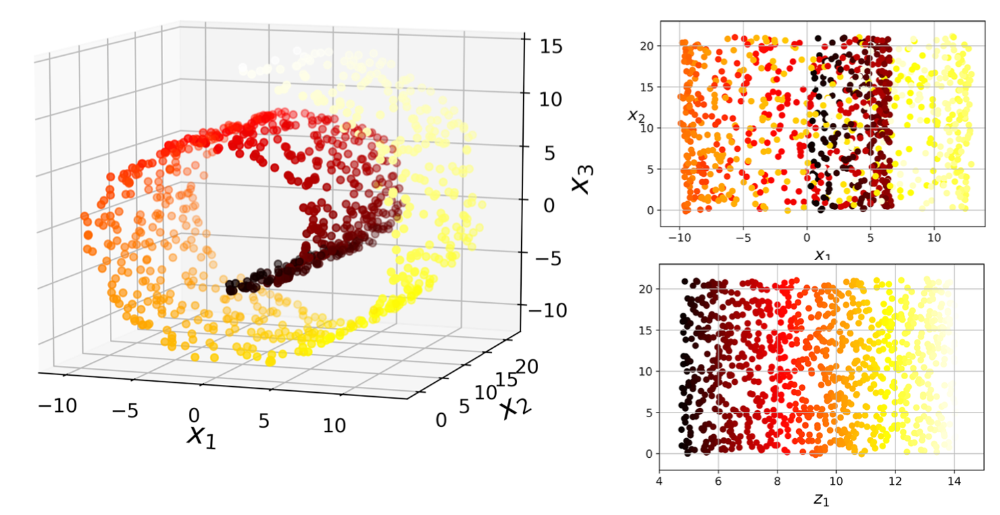

[TOC]


# Hands-on Machine Learning Part 2

This part contains my notes from Chapters 8 and 9 of the book. 

## Chapter 8: Dimensionality Reduction

When we have ML problems that involves hundreds and thousands of features for each training instance, the training becomes extremely slow. It also becomes harder to find a good solution as the model has the tendency to overfit. This problem is often referred to as the **curse of dimensionality**. 

There are many techniques that are used to reduce the dimensionality of the problem. We will see some techniques here. But more importantly, we can reduce some of the features by just looking at the data. For example, in the MNIST dataset, we can remove pixels that completely white as they don't any information. Pixels that are next to each other are highly correlated so these can also be removed. Such data cleaning/filtering process can quickly reduce the features. 

>   Reducing dimensionality does speed up training but it comes at the cost of information loss. Therefore, before applying dimensionality reduction techniques, run the pre- and post-feature reduction dataset to see if the speed up comes at the cost of information loss or not

### The Curse of Dimensionality

If you pick two points randomly in a unit square, the distance between them is on average 0.52. If the same is done in unit square cube, that would be 0.62. Now if we did the same for a hypercube with dimensions 1 million, the average distance would be 408.25. So, we see that as the dimensions increase the distance between points increase too. As a result high dimensional data are at risk of being very sparse: most training instances are likely to be far away from each other. This means that a new instance could be further away from all training examples and therefore making predictions on this new instance, which amounts of extrapolation will be inaccurate or less reliable.

>   The more dimensions the training set has, the greater the risk of overfitting it.

We could increase the training size to make the density of observations larger, but increasing training data with increasing feature is an exponential relationship. 

### Main Approaches for Dimensionality Reduction

There are two approaches to reduce dimensionality. They are **projection** and **manifold learning**. 

#### Projection

The idea behind projection is that by projecting data on lower dimension, we decrease the dimensions and increase the density of the observations. Consider a 3D data as shown in the figure on the left. We can pass a plane through the data and project their position on this plane. In doing so, we get the figure on the right. 


We see that we have just reduced the dimensionality from 3D to 2D. Note that the axes are now $z_1, z_2$ as the original data has be transformed after projection. 

However, it is to be noted that projection does not always work. Projection depends on how complex the form of the data are at higher dimensions. If we had a swiss roll, the simple projection will result in bad data (top right). What we want is data that looks like the one in bottom right: 



#### Manifold Learning

A 2D manifold is a 2D shape that can be bent and twisted in a higher-dimensional space. The Swiss roll is an example of a 2D manifold. More generally, a d-dimensional manifold is a part of an n-dimensional space (where d < n) that locally resembles a d-dimensional hyperplane. In the case of swissh roll, we have d = 2 and n = 3. It locally resembles a 2D plane (when unrolled), but is rolled in the 3rd dimension. 

Many dimensionality reduction algorithms work by modeling the manifold on which the training instances lie. This is called **Manifold learniing**. It relies on the assumption that most real-world high-dimensional datasets lie close to a much lower-dimensional manifold. This has been observed empirically. 

The similarity between observations bring about constraints on the observations and new instances. These constrains can then be used to reduce the dimensions of the feature space. For example, the MNIST dataset has white background, the numbers are all connected, and centered. Given these constraints, the probability of a randomly generated image that looks like the MNIST is very low. 

Another assumption of manifold is that the task at hand (e.g. classification or regression) will be simpler if expressed in the lower-dimensional space of the manifold. But that depends on the dataset at hand. This may not always be true.

### PCA

Principle Component Analysis (PCA) identifies the hyperplane that lies closest to the data, and then it projects the data onto it, just like we saw in the projection section. 

In order to project high dimensional data to lower dimensions, you need to choose the right hyperplane. PCA chooses the hyperplane that preserves the maximum amount of variance. Consider the figure below. We see that the solid line has the most variance while other lines no so much: 


#### Principle Components

PCA identifies the axis that accounts for the largest amount of variance in the training set. This becomes the first principle component. The second largest amount of variance, which is an axis orthogonal to the first becomes the second principle axis and so on, depending on the dimensions of the data. In the figure above, the $c_1$ is the first principle axis while $c_2$ is the second. 

HOw can yo find the principal components of a training set? This is done using a standard matrix factorization technique called **Singular Value Decomposition (SVD)**. This technique decompose the training set matrix $\bold{X}$ into a matrix multiplication of three matrices $\bold{U \ \Sigma \ V^T}$, where $\bold{V}$ contains the unit vectors that define all the principle components that we are looking for as shown below: 


In python, we can do this in the following way: 

```python
X_centered = X - X.mean(axis=0)
U, s, Vt = np.linalg.svd(X_centered)
c1 = Vt.T[:, 0]
c2 = Vt.T[:, 1]
```

>   PCA assumes that the dataset is centered around the origin. 

Once you have the principle axes, we project the training set onto this hyperplane to obtain the coordinates of the training set. This is done by taking a dot product of the training set matrix, $\bold{X}$ with the $\bold{W_d}$, which is defined as the matrix that contains the first $d$ principle components (or the columns) of matrix $\bold{V}$: 


In python, we would do: 

```python
W2 = Vt.T[:,:2]
X2D = X_centered.dot(W2)
```

Now we have a reduced dimensionality dataset such that the variance is preserved. 

In sklearn, we do all of this in the following way: 

```python
from sklearn.decomposition import PCA

pca = PCA(n_components=2)
X2D = pca.fit_transform(X)
```

After fitting the `PCA` transformer to the dataset, its components attribute holds the transpose of $\bold{W_d}$. So, you can get the components by taking a transpose, `pca.components_.T[:,0]`. 

Another useful piece of information is to get the explained variance of each of the components. We can get this in the following way: 

```python
print(pca.explained_variance_ratio_)

array([0.84248607, 0.14631839])
```

This tells us that the first component explains 84% of the variance in the data while the second explains 14%. This leaves 1.2% for the third component. 

#### Choosing the Right Number of Dimensions

So, how many dimensions should we choose? If you want to simply visualize, then we would take at max, 3 dimensions. But for the analysis, the general rule is to take dimensions that add up the variance to 95%. 

```python
pca = PCA()
pca.fit(X)
cumsum = np.cumsum(pca.explained_variance_ratio_)
d = np.argmax(cumsum >= 0.95) + 1
```

The above code gives us the number of dimensions. 

Anotehr way is to graphically decide the number of dimensions are ideal for the problem. So, we would plot the explained variance versus the dimensions. This is simply done by plotting the cumsum. This results in an elbow which symbolizes the change where the variance explained is much lower than that explained by the previous component. It is at this point, we stop. Such an elbow could occur at 95% explained variance or earlier. 


If we apply the PCA to MNIST dataset which has 784 features, we find that 95% of the variance is explained by 150 feature. This reduces the data by 20%. It is possible to get back to the original dataset by taking an inverse transform: 


The elbow is shown better in the following figure: 


Here's how to do an inverse transform to get back x-recovered: 

```python
# Transform the input data to principal components
pc = pipe.transform(X_test)

# Inverse transform the components to original feature space
X_rebuilt = pipe.inverse_transform(pc)
```


#### Randomized PCA

Rather than using SVD, you can use a stochastic process to quickly find an approximation of first $d$ principle components. This is done by using the `svd_solver="randomized"`: 

```python
rnd_pca = PCA(n_components=154, svd_solver="randomized")
X_reduced = rnd_pca.fit_transform(X_train)
```

#### Incremental PCA

The problem with general implementation of PCA is that it requires the whole training set to fit in memory in order for the algorithm to run. The incremental PCA works as mini-batches and is fed to the PCA algorithm one mini-batch at a time. 

Here's an implementation of MNIST dataset into 100 mini-batches: 

```python
from sklearn.decomposition import IncrementalPCA

n_batches=100
inc_pca = IncrementalPCA(n_components=154)
for X_batch in np.array_split(X_train, n_batches):
    inc_pca.partial_fit(X_batch)

X_reduced = inc_pca.transform(X_train)
```

#### Kernel PCA

Just like we applied the kernel trick in SVM, we can do the same in PCA. The kernel PCA allows us to perform complex nonlinear projections for dimensionality reduction. It is often good at preserving clusters of instances after projection, or sometimes even unrolling datasets that lie close to a twisted manifold. 

```python
from sklearn.decomposition import KernelPCA

rbf_pca = KernelPCA(n_components=2, kernel="rbf", gamma=0.04)
X_reduced = rbf_pca.fit_transform(X)
```

The figure below shows various kernel used: 


The kernel PCA is an unsupervised learning algorithm and therefore, the selection of the kernel type and hyperparameters comes down to doing a grid search. Here's an example of code that does the following: 

1.  Reduces the dimensions to 2 using kernel PCA
2.  Applies logistic regression for classification
3.  Uses grid search to find the best kernel and hyperparameters for kernel PCA to improve classification accuracy.

We construct a pipeline to find the best kernel and parameters: 

```python
from sklearn.model_selection import GridSearchCV
from skearn.linear_model import LogisticRegression
from sklearn.pipeline import Pipeline

clf = Pipeline([
    ("kpca", KernelPCA(n_components=2)),
    ("log_reg", LogisticRegression())
])

param_grid = [{
    "kpca__gamma": np.linspace(0.03, 0.05, 10),
    "kpca__kernel": ["rbf", "sigmoid"]
}]

grid_search = GridSearchCV(clf, param_grid, cv=3)
grid_search.fit(X, y)
```

We can then print out the best parameters: 

```python
grid_search.best_params_

{'kpca__gamma': 0.043333333333333335, 'kpca__kernel': 'rbf'}
```

### Other Techniques

#### LLE

**Locally Linear Embedding** (LLE) is another powerful nonlinear dimensionality reduction (NLDR) technique. This is a manifold learning technique that does not rely on projections. LLE works by first measur‐ ing how each training instance linearly relates to its closest neighbors (c.n.), and then looking for a low-dimensional representation of the training set where these local relationships are best preserved (more details shortly). This approach makes it particularly good at unrolling twisted manifolds, especially when there is not too much noise.

```python
from sklearn.manifold import LocallyLinearEmbedding

lle = LocallyLinearEmbedding(n_components=2, n_neighbors=10)
X_reduced = lle.fit_transform(X)
```

#### t-SNE Visualization of high-dimensional Data

t-SNE is the t-distributed Stochastic Neighbor Embedding method allows us to visualize high dimensional data using feature extraction. t-SNE maximizes the distance in 2D space between observations that are most different in high dimensional space. Observations that are similar to one another will be close  while observations that are different will be far away. Here's an example of t-SNE for the Iris dataset: 

```python
import seaborn as sns 
iris = sns.load_dataset('iris')

from sklearn.manifold import TSNE
m = TSNE(learning_rate=50)
tsne_features = m.fit_transform(iris.iloc[:, 0:4])

iris['X'] = tsne_features[:, 0]
iris['Y'] = tsne_features[:, 1]

sns.scatterplot(x='X', y='Y', hue='species', data=iris)
```


The higher the `learning_rate` the more adventurous the model gets and smaller the learning rate the more conservative it gets. We can use the first two features and X and Y and plot to see if we can notice any distinct groups. 

We can use various features as `hue` and figure out which feature allows us to distinguish groups.

For example, `sepal_length` is not a good feature to distinguish the groups: 


But `petal_length` is: 

```python
sns.scatterplot(x='X', y='Y', hue='petal_length', data=iris)
```


>   t-SNE does not work with categorical data but just numerical. 

Here's another example of taking a 91 features dataset and using t-SNE to reduce it down to 2: 

```python
# Non-numerical columns in the dataset
non_numeric = ['Branch', 'Gender', 'Component']

# Drop the non-numerical columns from df
df_numeric = df.drop(non_numeric, axis=1)
print(df_numeric.shape)

# Create a t-SNE model with learning rate 50
m = TSNE(learning_rate=50)

# Fit and transform the t-SNE model on the numeric dataset
tsne_features = m.fit_transform(df_numeric)
print(tsne_features.shape)
```

```python
(6068, 91)

(6068, 2)
```

We can use `hue` to see what the two features as distinct. 

```python
sns.scatterplot(x="x", y="y", hue='Gender', data=df)
```


We see that without giving it any information, it is able to distinguish the gender well. 

>   t-SNE allows us to identify feature that drives variance in the dataset. 


#### Recursive Feature Elimination 

The Recursive Feature Elimination (RFE) is a feature selection algorithm that can wrapped around around ML algorithm to select the number of desired features to use. Before using RFE, make sure that the features are scaled and standardized. 

```python
from sklearn.feature_selection import RFE

X_train_std = scaler.fit_transform(X_train)
X_test_std = scaler.fit_transform(X_test)

rfe = RFE(estimator=LogisticRegression(), n_features_to_select=2, verbose=1)
rfe.fit(X_train_std, y_train)
```

The RFE will take all the features to start with and in each iteration will drop the feature that has the smallest feature weights. It will keep doing this until the number of features equal the `n_features_to_select` as stated by the user. 

Once the process is done, we can check the features that remained:

```python
X.columns[rfe.support_]
```

We can also check which features were dropped in which iteration. This is done in the following way: 

```python
print(dict(zip(X.columns, rfe.ranking_)))
```

This will print something along the lines: 


The larger number indicates that it was dropped in the first iteration while the smaller numer indicates the feature that was kept. 

Finally, we can check the accuracy of the remaining features as follows: 

```python
accuracy_score(y_test, rfe.predict(X_test_std))
```

Sometimes if we have a lot of features, the iterative method can be computationally time consuming. Therefore, we can have the `step` in RFE to drop more features in each iteration than just one: 

```python
# Set the feature eliminator to remove 2 features on each step
rfe = RFE(estimator=RandomForestClassifier(),
          n_features_to_select=2,
          step=2,
          verbose=1)

# Fit the model to the training data
rfe.fit(X_train, y_train)

# Create a mask
mask = rfe.support_

# Apply the mask to the feature dataset X and print the result
reduced_X = X.loc[:, mask]
print(reduced_X.columns)
```

This will drop 2 features in each iteration. 

### Additional Notes

*   When the number of features are greater than 10, the data is considered high dimensional. 
*   Here are some ideas to drop features: 
    *   You can drop a feature if the variance of the feature is equal or close to zero.
    *   You can drop a feature if there are too many missing values
    *   Use feature extraction to reudce highly correlated features. Feature selection simply is not enough. 
*   Why does the model overfit higher dimension data? It does so because if we have limited observations and large number of features, we tend not to have unique observation-feature combinations. This results in the model learning the pattern by heart which in turn results in  high variance aka overfitting.
*   Correlation coefficient produce wierd results when the underlying data is non-linear or data had outliers.
*   Feature selection can be done with Random Forest. 