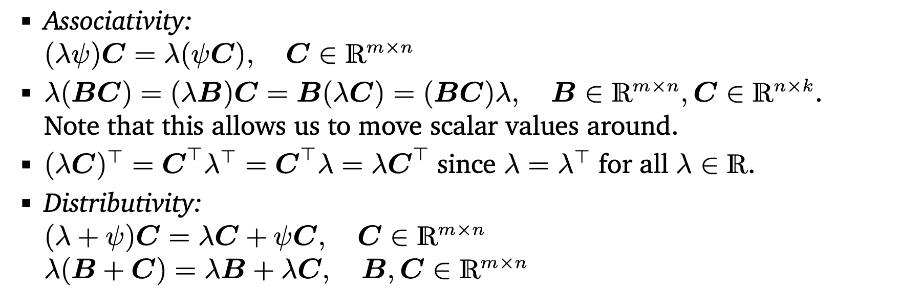
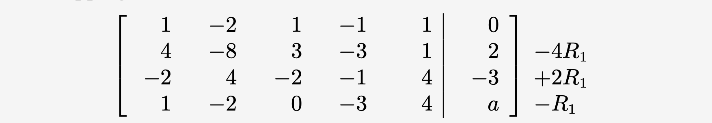

[TOC]

# Mathematics of Machine Learning 

These notes are from the book by the same title. 

## Part I Mathematical Foundations

## Chapter 1: Introduction

Machine learning concerns general purpose methodologies that can be applied to any datasets while producing something meaningful. There are three concepts at the core of ML: 

*   **data**: We need data to extract valuable patterns, ideally without domain-specific knowledge. 
*   **model**:  To achieve this goal, we need a model that can learn from the data and generalize well to yet unseen data. 
*   **learning**: The model "learns" from the data to find patterns and structure by optimizing parameters in an autonomous way. 

The first part of this book covers these three components of ML. We will briefly describe these components and revist them in Chapter 8. In greater detail we say that: 

*   **Data**: are represented as **vectors**. A vector can be represented as an array (CS concept) or one that has direction and magnitude (Physics concept) or an object that obeys addition and scaling (Mathematical concept). In this book, we assume that the data has already been preprocessed and is in the tidy format.
*   **Model**: A model is a process of generating data, similar to the dataset at hand. A good model is the one whose output closely resembles the data at hand.
*   **Learning**: means using the data and optimizing the model parameters with respect to a metric that evaluates how well the model predicts the training and test data. 

### Four Pillars

The fundamentals of ML problems are created by the four pillars: **regression, dimensionality reduction, density estimation, ** and **classification** while the foundation on which these pillars are build include: **Linear Algebra, Analytic Geometry, Matrix Decomposition, Vector Calculus, Probability & Distributions, ** and **Optimization**. This is illustrated in the figure below: 

The first part of the book deals with the foundation while the second deals with the four pillars. 

Here's how each component of the foundation is used: 

*   **Linear Algebra**: Data are represented as vectors while a collection of vectors is a **matrix**. So, when dealing with data, we need to deal with vectors and matrices. Hence, linear algebra is a study of vectors and matrices. 
*   **Analytic Geometry**: We make use of similarity of vectors or even distances between vectors. These two concepts are central to analytic geometry. 
*   **Matrix Decomposition**: Manipulation of data involves manipulation of matrices. Therefore, matrix decomposition plays a central part in working with matrices. 
*   **Probability Theory**: There is inherent uncertainty involved in measurement and predictions. The probability theory measures this uncertainty and quantifies the confidence we have about predictions and measurements. 
*   **Vector Calculus**: A model learns when it optimizes its parameters in order to make its predictions are accurate as possible. The optimization of parameters is performed by vector calculus such as computing gradients, finding maxima/minima of functions. 

The second part of the book deals with the four pillars. Here we describe what each pillar is composed of: 

*   **Linear Regression**: Linear regression allows us to map $\bold{x}\in \R^D$ to corresponding observed function values in $y \in \R$. 
*   **Dimensionality Reduction**: This pillar helps us to reduce the dimensions by finding a lower-dimension representation of our data so that is it easier to analyze it. Unlike regression, dimensionality reduction is only concerned about modeling the data. 
*   **Density Estimation**: The objective is to find a probability distribution that describes a given dataset. For this we tend to use Gaussians that mimic the distribution of the data. Here we do not seek lower dimensional representation but instead a density model of the data. 
*   **Classification**: Here we seek to map $\bold{x} \in \R^D$ to multiple categories. 

## Chapter 2: Linear Algebra

When formulating concepts, a common approach is to associate symbols to objects and manipulate these symbols by constructing a set of rules. This is known as **Algebra**. 

>   Linear Algebra is a study of vectors and rules to manipulate vectors

We take the mathematical concept of vectors here: vectors are objects that can be added or multiplied by a scalar to produce another object of the same kind.

>   A object that can be added with another object or multiplied by a scalar to produce an object of the same kind is called a **vector**. 

Here are some examples of vectors:

*   **Geometric Vectors**: These are vectors we have seen in school. They can be added and multiplied by a scalar quantity, $\lambda$ to produce another vectors. 

*   **Polynomials**: These are also vectors as we can add two polynomials and multiply one with a scalar to produce another polynomial.

*   **Audio Signals**: Audio signals are represented as a series of numbers. Such a series can be added and multiplied by a scalar to produce another audio series. 

*   **Elements of $\R^n$**: are vectors as numbers can be represented as such. For example, we define $a$ has a subset of $\R^3$: 

     

In this book, we will largely focus on $\R^n$ since most algorithms in linear algebra are formulated in $\R^n$. 

>   Be careful to check whether array operations actually perform vector operations when implementing on a computer

A major idea in mathematics is the idea of **closure**. This is the question: "What is the **set** of **all things** that can result from my **proposed operations**?" In the case of vectors, this question will be "What is the **set** of **vectors** that can result by starting with **a small set of vectors, and adding them to each other and scaling them**?" This results in a **vector space**. The concept of a vector space and its properties underlie much of machine learning. 

Here is a mind map of the concepts introduced in this chapter, along with where they are used in other parts of the book. 

### Systems of Linear Equations

Systems of linear equations play a central part in linear algebra. Many problems can be forumulated as or boiled down to systems and linear algebra gives us the tools to solve them.

The equation below gives a general form of a system of linear equations

where $a_{ij} \in \R$ and $b_i \in \R$ are constants and $x_i \in \R$ are the unknown of this systems. Every n-tuple $(x_1, x_2, ..., x_n) \in \R$ satisfies equation 2.3 is a solution of the **linear equation system**.

If we have a system of linear equation of two variables, $x_1, x_2$, such as these: 

each linear equation defines a line on the $x_1x_2$-plane. The solution space of a system of two linear equations with two variables can be geometrically interpreted as the intersection of two lines. Every point on the line satsifies that linear equation while the points at the intersection of the two lines satisfy both equations. 

Similarly in three dimensions, each linear equation determines a plane in 3D space. When these planes intersect, those values satisfy all linear equations. 

In general, for a real-valued system of linear equations we can obtain: 

1.  No solution (i.e. when there is no intersections)
2.  Exactly one solution (i.e. when there is just one intersection)
3.  Infinitely many solutions (i.e. when the planes are parallel to each other and touching)

Linear equations given by equation 2.3. is an example that a linear regression solves. We will see more on this later. Picture a table of values, our dataset. These would be our $x_i$. Each row is an observation and a single equation with $x_i$ variables. The output variable is $b_i$. When we solve the linear regression, we are in fact solving a system of linear equations (corresponding to $m$ observations) and find $a_i$ that satisfy this system.

For a systematic approach to solving systems of linear equations, we introduce a useful compact notation. Let's start with an example. Consider the following system of equations we have already seen in equation 2.8 above. We can represent these as follows: 
$$
x_1\begin{bmatrix}
4\\
2
\end{bmatrix} + x_2 \begin{bmatrix}
4\\
-4
\end{bmatrix} = \begin{bmatrix}
5\\
1
\end{bmatrix}
$$
In general, we would write equation 2.3 as follows: 

which we can write it more compactly as: 

This is a presentation in terms of matrices. Each of the square brackets is a matrix. 

### Matrices

Matrices play a central role in linear algebra and are used to compactly represent systems of linear equations. They can also represent linear functions as we will see later. We define a matrix as follows: 

By convention, $(1, n)$-matrices are called **rows** and $(m, 1)$-matrices are called **columns**. These are also called **vectors**. $\R^{m \times n}$ is a set of all real-valued $(m, n)$-matrices. 

#### Matrix Addition 

The matrix addition of two matrices is defined as the element-wise sum. So, if $\bold{A} \in\R^{m \times n}$ and $\bold{B} \in\R^{m \times n}$ then: 

#### Matrix Product

The matrix product of two matrices is defined as:

where $\bold{A} \in\R^{m \times n}$ and $\bold{B} \in\R^{n \times k}$ . 

This means that to compute element $c_{ij}$, we multiply the elements of the $i$th row of \bold{A} with the $j$th column fo $\bold{B}$ and then sum them up. This is also known as the **dot product**. 

>   Matrices can only be multiplied if their "neighboring" dimensions match. 

Product $\bold{BA}$ is not defined if $m \neq n$. 

>   Even if both matrix multiplication of AB and BA are defined, the dimensions of the result can be different. 

An **identity matrix** is a square matrix with `1 ` along the diagonal and `0` on the off-diagonal. 

#### Properties of Matrices

*   **Associativity:** 

    

*   **Distributivity:**

    

*   **Multiplication with identity matrix**:

    

#### Inverse & Transpose

>   A square matrix possesses the same number of columns and rows. 

Not every matrix has an inverse. If the inverse does not exist, the matrix is called **regular/singular/noninvertible**. When the matrix inverse exists, it is unique. 

Here are some properties of inverses and transpose: 

The identify matrix is a symmetric matrix. Note that only a square matrices can be symmetric. If $\bold{A}$ is invertible then so is $\bold{A}^T$. 

#### Multiplication by a Scalar

When a matrix is multiplied by a scalar, each element in the matrix is multiplied by it. Therefore a scalar multiplication can be thought of as: $K_{ij} = \lambda a_{ij}$ where $\bold{A}$ is a matrix and $\lambda$ is the scalar. 

Here are properties of scalar multiplication: 

#### Compact Representation of System of Linear Equations

As we have seen earlier, we can represent a series of linear equations compactly when we use a matrix notation. Consider the following system of linear equations: 

These can be represented using a matrix notation as: 

Generally, a system of linear equations are represented as $\bold{Ax = b}$, and the $\bold{Ax}$ is a linear combination of the columns of $\bold{A}$. 

### Solving Systems of Linear Equations

The key to solving a system of linear equations are *elementary transformations* that keep the solution set the same, but that transform the equation system into a simpler form. The objective is to bring the matrix such that the one side of the diagonal, all elements are zero. 

The steps taken to achieve that are: 

*   Exchange of two equations (rows in the matrix representing the system of equations)
*   Multiplication of an equation (row) with a constant $\lambda \in \R$. 
*   Addition of two equations (rows)

Let's see an example in action. Consider the following systems of equations: 

We write this as an **augmented matrix**: [**A**|b]: 

Now we swap the first and third rows. This leads to the following form:

Now we subtract -4 times row 1 from row 2, +2 times row 1 from row 3 and simply subtract row 1 from row 4. Doing this leads to the following transformation:

This is known as the **row-echelon form**. Doing so, we have transformed the system of linear equations to: 

Now we can only solve for $a$, which is $-1$. The rest we cannot as there are 5 unknowns and 3 values. However, we can get a particular solution if we set $x_5 = 0$. Such a solution will look like:

To get a general solution, we follow these steps: 

1.  Find a particular solution to $\bold{Ax} = \bold{b}$. 
2.  Find all solutions to $\bold{Ax} = \bold{0}$.
3.  Combine the solutions from steps 1 and 2 to the general solution. 

So, let's find a general solution to our example. If we set equation 2.45 to 0, we can solve for all $x_i$. We would get:
$$
x_1 = 2x_2 - 2x_5 \\
x3 = -x_5 \\
x4 = 2x_5
$$
Now, we substitute. If we take $x_5 = 0$ and $x_2 = 1$, we get: $[2, 1, 0, 0, 0]$. If we set $x_5 = 1$ and $x_2=0$, we get: $[2, 0, -1, 2, 1]$. Therefore, the general solution, which captures the set of all possible solutions is: 

Remember that the first solution is the particular one we obtained in equation 2.46. 

>   The leading coefficient of a row (first nonzero number from the left) is called the **pivot** and is always strictly to the right of the pivot of the row above it.

A matrix is in **row-echelon form** if: 

*   All rows that contain only zeros are at the bottom of the matrix; correspondingly, all rows that contain at least one nonzero element are on top of rows that contain only zeros.
*   Each row has a pivot

>   In solving a system of linear equations, it helps get to the row-echelon form. Once we get there, solving the systems of linear equations get easier. 

The variables that are associated with pivots are called **basic variables** while other variables are called **free variables**. In our example, $x_1, x_3, x_4$ are basic variables while $x_4, x_5$ are free variables. 

#### Calculating the Inverse

To find the inverse of a matrix $\bold{A}$, we need to find a matrix $\bold{X^{-1}}$ such that $\bold{AX} = \bold{I}$. Solving for $\bold{X}$ will give us the inverse of $\bold{A}$. The inverse of a matrix is easily done using the **Gaussian Elimination technique**. Let's take an example: 

We write this matrix as an augmented matrix:

Now we use Gaussian Elimination in such a way that our matrix looks like an identity matrix:

The resultant matrix on the right is then the inverse matrix:

#### Algorithms to Solving Systems of Linear Equations

In general, the ask is the solve a system of linear equations of the form $\bold{Ax} = b$. If the solution exists, there are various ways to solve it: 

1.  If $\bold{A}$ is a square matrix and invertible, we can find an inverse and then solve for $\bold{x}$. 

2.  We can find an approximate solution by using the approach of linear regression which we discuss in Chapter 9.

3.  Gaussian elimination is another approach to find solutions.

4.  An iterative method. In this case, the idea is to find $\bold{x}$ in an iterative fashion, often written as:
    $$
    x^{(k+1)} = Cx^{(k)} + d
    $$
    for suitable $C$ and $d$ that reduces the residual error $||x^{(k+1)} - x_{*}||$ in every iteration and converges to $x_{*}$.  

5.  Other practical methods to solve is to use Richardson method, the Jacobi method, and others. 

    

### Vector Spaces

A vector space is a structured space in which vectors live. A group is a set of elements and an operation defined on these elements that keeps some structure of the set intact. More formally, 

 

If the operation between two elements of the group is commutative then the group is called an **Abelian group**.

Here are few other properties of Vector Spaces

Another important property if **linear independence**. We say that set of linearly independent vectors consists of vectors that have no redundancy, i.e., if any vector is removed, we will lose something. 

 

Here are few other properties of linear dependence and independence: 

## Chapter 3: Analytic Geometry

In chapter 2 we studied vectors, vector spaces, and linear mappings at a general but abstract level. In this chapter we will add some geometric interpretation and intuition to all of these concepts. Analytic geometry is used in various ML algorithms such as SVM, kNN, including PCA. 

The figure below gives an overview of how the concepts in this chapter are related and how they connect to other chapters. 

We begin our discussion with the length of a vector. 

### Norms

The definition of norm is as follows: 

The triangle inequality simply states that the length of the hypothenus is less than or equal to the sum of the other two sides. 

There are two mosst common norms that exists. These are the Manhattan and the Euclidean Norms. 

#### Manhattan Norm

### Inner Products

