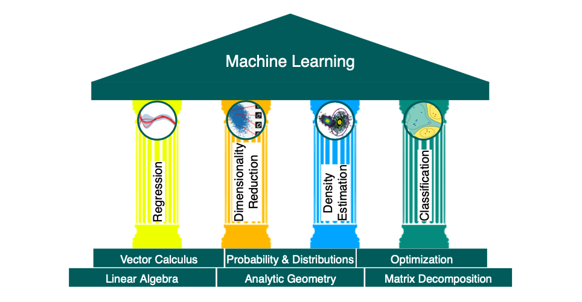

[TOC]

# Mathematics of Machine Learning 

These notes are from the book by the same title. 

## Part I Mathematical Foundations

## Chapter 1: Introduction

Machine learning concerns general purpose methodologies that can be applied to any datasets while producing something meaningful. There are three concepts at the core of ML: 

*   **data**: We need data to extract valuable patterns, ideally without domain-specific knowledge. 
*   **model**:  To achieve this goal, we need a model that can learn from the data and generalize well to yet unseen data. 
*   **learning**: The model "learns" from the data to find patterns and structure by optimizing parameters in an autonomous way. 

The first part of this book these three components of ML. We will briefly describe these components and revist them in Chapter 8. It is important to talk a little more about them as often in ML parlance they may be misinterpreted or misused. 

*   **Data**: In this book, we assume that the data has already been preprocessed and is in the tidy format. Data are represented as **vectors**. A vector can be represented as an array (CS concept) or one that has direction and magnitude (Physics concept) or an object that obeys addition and scaling (Mathematical concept). 
*   **Model**: A model is a process of generating data, similar to the dataset at hand. A good model is the one whose output closely resembles the data at hand.
*   **Learning**: Training means using the data and optimizing the model parameters with respect to a metric that evaluates how well the model predicts the training and test data. 

### Four Pillars

The fundamentals of ML problems are created by the four pillars: **regression, dimensionality reduction, density estimation, ** and **classification** while the foundation on which these pillars are build include: **Linear Algebra, Analytic Geometry, Matrix Decomposition, Vector Calculus, Probability & Distributions, ** and **Optimization**. This is illustrated in the figure below: 

The first part of the book deals with the foundation while the second deals with the four pillars. 

Here's how each component of the foundation is used: 

*   **Linear Algebra**: Data are represented as vectors while a collection of vectors is a **matrix**. So, when dealing with data, we need to deal with vectors and matrices. Hence, linear algebra, which is a study of vectors and matrices. 
*   **Analytic Geometry**: We make use of similarity of vectors or even distances between vectors. These two concepts are central to analytic geometry. 
*   **Matrix Decomposition**: Manipulation of data involves manipulation of matrices. Therefore, matrix decomposition plays a central part in working with matrices. 
*   **Probability Theory**: There is inherent uncertainty involved in measurement and predictions. The probability theory measures this uncertainty and quantifies the confidence we have about predictions and measurements. 
*   **Vector Calculus**: A model learns when it optimizes its parameters in order to make its predictions are accurate as possible. The optimization of parameters is performed by vector calculus such as computing gradients, finding maxima/minima of functions. 

The second part of the book deals with the four pillars. Here we describe what each pillar is composed of: 

*   **Linear Regression**: Linear regression allows us to map $\bold{x}\in \R^D$ to corresponding observed function values in $y \in \R$. 
*   **Dimensionality Reduction**: This pillar helps us to reduce the dimensions by finding a lower-dimension representation of our data so that is it easier to analyze it. Unlike regression, dimensionality reduction is only concerned about modeling the data. 
*   **Density Estimation**: The objective is to find a probability distribution that describes a given dataset. For this we tend to use Gaussians that mimic the distribution of the data. Here we do not seek lower dimensional representation but instead a density model of the data. 
*   **Classification**: Here we seek to map $\bold{x} \in \R^D$ to multiple categories. 

## Chapter 2: Linear Algebra

When formulating concepts, a common approach is to associate symbols to objects and manipulate these symbols by constructing a set of rules. This is known as **Algebra**. 

>   Linear Algebra is a study of vectors and certain rules to manipulate vectors

We take the mathematical concept of vectors here: vectors are objects that can be added or multiplied by a scalar to produce another object of the same kind.

>   A object that can be added with another object or multiplied by a scalar to produce an object of the same kind is called a **vector**. 

Here are some examples of vectors:

*   **Geometric Vectors**: These are vectors we have seen in school. They can be added and multiplied by a scalar quantity, $\lambda$ to produce another vectors. 

*   **Polynomials**: These are also vectors as we can add two polynomials and multiply one with a scalar to produce another polynomial.

*   **Audio Signals**: Audio signals are represented as a series of numbers. Such a series can be added and multiplied by a scalar to produce another audio series. 

*   **Elements of $\R^n$**: are vectors as numbers can be represented as such. For example, we define $a$ has a subset of $\R^3$: 

     

In this book, we will largely focus on $\R^n$ since most algorithms in linear algebra are formulated in $\R^n$. 

>   Be careful to check whether array operations actually perform vector operations when implementing on a computer

A major idea in mathematics is the idea of **closure**. This is the question: "What is the **set** of **all things** that can result from my **proposed operations**?" In the case of vectors, this question will be "What is the **set** of **vectors** that can result by starting with **a small set of vectors, and adding them to each other and scaling them**?" This results in a **vector space**. The concept of a vector space and its properties underlie much of machine learning. 

Here is a mind map of the concepts introduced in this chapter, along with where they are used in other parts of the book. 

### Systems of Linear Equations

Systems of linear equations play a central part in linear algebra. Many problems can be forumulated as systems and linear algebra gives us the tools for solving them. 

The equation below gives a general form of a system of linear equations

where $a_{ij} \in \R$ and $b_i \in \R$ are constants and $x_i \in \R$ are the unknown of this systems. Every n-tuple $(x_1, x_2, ..., x_n) \in \R$ satisfies equation 2.3 is a solution of the **linear equation system**. 