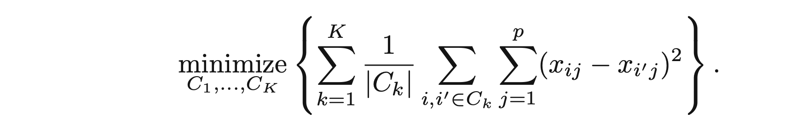
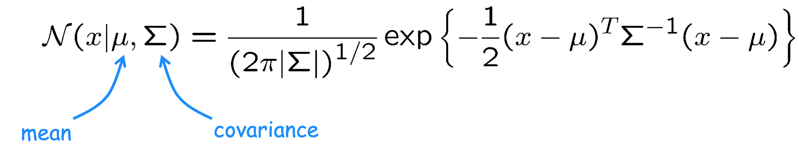

[TOC]


# Study Notes: Statistics & Machine Learning

These are my study notes that I plan to use to prepare for data science interviews. I hope that these notes will become one place to brush up on concepts, revise ideas, and get clarity on various topics. I have tried to keep these notes as consistent as possible. 

## Probability

My notes on probability also include python code that one can use to test or simulate certain problems. I start with the basics of probability and move on to more details. 

### Probability Basics

The flipping of the coin where the only possible outcomes of the event is either a head or a tail. In other words when the outcome is exactly two, such an event is called a **Bernoulli trial**. Each outcome is assigned a probability. For a fair coin, there is a50% chance each for getting a head or a tail. 

```python
from scipy.stats import bernoulli
bernoulli.rvs(p=0.5, size=1) 
```

The size tells us the number of trial we need to create. 

When the Bernoulli trial is performed $n$ number of times, we have **binomial distribution**. A binomial distribution is a distribution of $n$ Bernoulli trials with $k$ successes and $n - k$ failures. It is given by, 
$$
\text{Binomial Distribution} = {n \choose k}p^k(1-p)^{n-k}
$$

```python
from scipy.stats import binom
binom.rvs(n=10, p=0.5, size=5)
```

Here, $n$ are the total number of coin flips while `size` is the total number of trials. In other words, we do `10` coin flips in `5` trials. The mean of the Binomial distribution is $np$. 

> Any situation with exactly two possible outcomes can be modeled with binomial random variables

The **probability mass function (pmf)** is the probability distribution of discrete **random variable**. It answers the question, “What it is the probability of getting exactly $k$ successes?" 

The binomial distribution is an example of pmf. In the case of binomial distribution, the random variable is $k$, the number of successes, which is discrete. 

```python
# Probability of 2 heads after 10 throws with a fair coin
binom.pmf(k=2, n=10, p=0.5)
```

> As $n$ gets larger, the probability of getting $k$ heads gets smaller for the same $p$. 

The **cumulative distribution function (cdf)** is a probability distribution function  that answers the question, “What is the probability of getting $k$ or less successes in $n$ trials?”  The cdf does this by summing the probabilities upto $k$ successes. 

 The cdf for a binomial trial is shown on the left of the figure below: 


```python
# Binomial CDF
# Here we have the probability of 5 heads or less after 10 throws with a fair coin
binom.cdf(k=5, n=10, p=0.5)
```

CDF gives the range of probabilities rather than a single probability. It adds all the probabilities upto the point in question. If you want the probability from that point until infinity, we take the **complement of CDF**. 

```python
# Probability of 59 heads or less after 100 throws with p=0.7
binom.cdf(k=59, n=100, p=0.7)

# Probability of more than 59 heads after 100 throws with p=0.7
1 - binom.cdf(k=59, n=100, p=0.7)

# We can also do the above using: 
binom.sf(k=59, n=100, p=0.7)
```

Here `sf` stands for **survivial function**, which is a complement of CDF. 

The descriptive statistics that we use in statistics can also be used. The **expected value** is the sum of possible outcomes weighted by its probability, 
$$
E(X) = \sum_{i=1}^{n}x_ip_i
$$
The **arithmetic mean** is the sum of each outcome divided by the number of samples. The arithmetic mean converges to the expected value as $n$ increases. 

```python
from scipy.stats import describe
describe([0,1]).mean
```

The variance measures dispersion of a given random variable from its expected value. This is given by, 
$$
Var(X) = \sum_{i=1}^{n}p_i \times (x_i - E(X))^2
$$

```python
from scipy.stats import describe
describe([0,1]).var
```

We can compute the expected value and the variance for a binomial distribution using `binom.stats()`: 

```python
binom.stats(n=1, p=0.5)
```

### Probabilities of Two Events

Two events A and B are said to be **independent** if the order in which they occur does not affect their probabilities. If we wish to know the probabilties of A and B in an event, we use the following rule: 
$$
P(A \cap B) = P(A)P(B)
$$
Suppose we have two coins and we wish to know how many times we get: 

Tails = {0, 1, 2}

We can simulate this as follows: 

```python
from scipy.stats import binom, find_repeats
sample = binom.rvs(n=2, p=0.5, size=1000, random_state=42)
find_repeats(sample)
```

We get the following answer: 

```python
RepeatedResults(values=array([0., 1., 2.]), counts=array([269, 488, 243]))
```

We can also compute the relative probability for each of the outcomes: 

```python
from scipy.stats import relfreq
relfreq(sample, numbins=3).frequency
```

Here we use `numbins=3` because there are only three possible outcomes. 

We get the following: 

```python
array([0.269, 0.488, 0.243])
```

When we have two events, A and B, **the probability of event A happening or B happening** is given by, 
$$
P(A \cup B) = P(A) + P(B) - P(A \cap B)
$$

> When calculating the probabilities of multiple events, always make sure to notice whether there is an overlap between any two events

### Conditional Probabilities

When the events A and B are dependent, i.e., the order in which the events occur changes the probability of each, we make use of conditional probability. 

The probability of A and B occurring when A and B are **dependent** is: 
$$
P(A \cap B) = P(A)P(B|A)
$$

> Conditional probabilities allow us to calculate probabilities in a restricted sample space. Conditioning is simply changing probabilities.

The **Total Probability Law** states that for non-overlapping events, the total probability is the sum of individual probabilities. Suppose we have three types of parts, $V_1, V_2, V_3$ and D the probability of that part being damaged. Then, the total probability of damaged parts is given by the sum of each probabilities: 


> Some problems imply a partition of the sample space with nonoverlapping events. Total probability law is the perfect tool for those situations

### Bayes’ Rule

The Bayes’ rule is the rule for conditional probability where the events are not overlapping. This is given by, 
$$
P(A|B) = \frac{P(A)P(B|A)}{P(B)}
$$

### Probability Distributions

In this section we will review various probability distributions that are used in Statistcs. 

#### Bernoulli Distribution

A Bernoulli Distribution has only two possible outcomes, namely success (1) or failure (0) and a **single trial**. Therefore, the Bernoulli distribution looks something like this: 
$$
P(x) = \begin{cases}
1-p & \quad x = 0, \\
p & \quad x = 1
\end{cases}
$$
The probability of success and failure need not be equally likely. In this example of a Bernoulli distribution we have different probability of success and faillure. 

| Property           | Value               |
| ------------------ | ------------------- |
| Mean               | $\mu = $ p          |
| Variance           | $\sigma^2 = $p(1-p) |
| Standard Deviation | $                   |

#### Uniform Distribution

A uniform distribution is a distribution where the probability of each event is the same. For example, for a six-sided die, the outcome of any number in a throw of a die is exactly 1/6.

A uniform distribution has the following form: 
$$
f(x) = \frac{1}{b-a}  \quad -\infty< a \leq x \leq b < \infty
$$

| Properties         | Values                       |
| ------------------ | ---------------------------- |
| Mean               | $\mu = (a+b)/2$              |
| Variance           | $\sigma^2 = (b - a)^2/12$    |
| Standard Deviation | $\sigma = \sqrt{(b-a)^2/12}$ |

#### Binomial Distribution

Experiments that involve flipping a coin, tossing a die, or choosing a marble from an urn are called **Bernoulli trials** because each event is independent. In some cases the probability will not change such as the coin or the die. 

Let $p$ be the probability that an event, we are interested in, will happen. Such an event is called a **success**. Then the probability of failure is $q = 1 - p$. The probability that we will have $k$ successes in $n$ trials is given by: 
$$
P(X = k) = {n \choose k}p^kq^{n-k} = \frac{n!}{k!(n-k)!}p^kq^{n-k}
$$

Just like any distribution, the binomial distribution has a mean, variance, and standard deviation: 

| Property           | Value                 |
| ------------------ | --------------------- |
| Mean               | $\mu = np$            |
| Variance           | $\sigma^2 = npq$      |
| Standard Deviation | $\sigma = \sqrt{npq}$ |

An experiment is consider to be binomial if ALL of the following conditinos are satisfied: 

1. The experiment consists of$n$ identical trials
2. Each trial results in one of the two outcomes, called success and failure
3. The probability of success, denoted by$p$, remains the same from trial to trial
4. Each trial is independent of the other. 

**Caveat: ** As long as the number of trials are huge, the slight change in probability does not invalidate point #3. For example, if we have 10,000 marbles and we pick with replacement. The probability of each trial will change but so very slightly. In such case, as long as we only pick few marbles, the experiment is still Binomial. 

#### Normal Distribution

A normal distribution is unimodal and symmetric at its center. Any distribution is known as Normal Distribution if it has the following characteristics: 

1. The mean, median, and mode of the distribution coincide
2. The curve of the distribution is bell-shaped and symmetrical about the line x = $\mu$
3. The total area under the curve is 1
4. Exactly half of the values are to the left of the center and the other to the right

The probability density function is given by: 
$$
P(x) = \frac{1}{\sqrt{2\pi\sigma}}e^{\frac{1}{2}(\frac{x-\mu}{\sigma})^2}  \quad -\infty < x < \infty
$$
The **standard normal distribution** is defined as the distribution with mean 0 and standard deviation 1. 

| Properties         | Value                 |
| ------------------ | --------------------- |
| Mean               | $\mu = \mu$           |
| Variance           | $\sigma^2 = \sigma^2$ |
| Standard Deviation | $                     |

The normal density distribution is defined by two parameters: the **mean** and the**standard deviation**. The mean indicates the position of the distribution while the standard deviation indicates the width or the spread of the distribution. 

Here’s what you do in python

```python
from scipy.stats import norm
sample = norm.rvs(loc=0, scale=1, size=1000, random_state=42)

# Compute the probability density with PDF for a value of -1
norm.pdf(-1, loc=0, scale=1)

# Compute the CDF for a value of -1: 
norm.cdf(-1)

# Compute the complement of CDF: 
norm.sf(-1)

# Compute the CDF between two values:
norm.cdf(1) - norm.cdf(-1)

# Calculate the CDF over an interval. Think of this as the 
# confidence interval 
norm.interval(0.95)
```

#### Poisson Distribution

The **Poisson Distribution** is another useful distribution that determines the probability of an event happeniing within a fixed interval. Such an interval could be space or time. Suppose the mean number of calls from a call center is 2.2 per minute, what is the probability of making 3 calls in a minute? In Poisson distribution, the outcomes can be classified as successes and failures and the average number of successful events per unit is known. 

Let’s come back to our example of call center: 

```python
from scipy.stats import poisson
poisson.pmf(k=3, mu=2.2)

# To know the probability of having 2 or less calls per minute, we make use of the CDF: 
poisson.cdf(k=2, mu=2.2)

# To get values of 2 or greater, we use sf
poisson.sf(k-2, mu=2.2)

# To generate a Poisson distribution, we use rvs: 
poisson.rvs(mu=2.2, size=10000, random_state=42)
```

The shape of the distribution of Poisson distribution varies as the value of the mean changes. When the mean is small, the probability of having 0 events is higher and vice versa when the mean is larger. 

> If you know how many specific events occurred per unit of measure, you can assume that the distribution of the random variable follows a Poisson distribution

#### Geometric Distribution

The **Geometric Distribution** allows us to calculate the probability of success after $k$ trials given the probability of success for each trial.  For example, if a basketball player has 0.3 probability of scoring. what is the probability of missing the first throw and scoring the second?  

```python
from scipy.stats import geom
geom.pmf(k=2, p=0.3)

# Generating a geometric funciton 
geom.rvs(p=0.3, size=10000, random_state=42)

# How many attempts do we need to get a success of 0.9, when the probability is 0.0333: 
attempts = geom.ppf(q=0.9, p=0.0333)
68

# A basketcal player has a 90% probability of success in 68 attempts. 
```

The CDF, SF and PPF all work in Geometric distribution as they do in other distributions. 


## Data Preprocessing 

Data preprocessing an important part of Machine Learning (ML). Before running the models on the data, the data needs to be scrubed and cleaned and made ready for the models to ingest. 

### Imbalance Dataset

Often we will have an imbalance dataset that we have to work with. If you were to simply break the data into train and test, you may not get the right distribution of data across the two groups. That is when we need to use **stratified sampling**. Stratified sampling maintains the proportions of the data in the training and testing subsets. This is easily done in `sklearn` as follows. Suppose our response variable is `category_desc` which is a categorical variable. 

```python
from sklearn.model_selection import train_test_split

# Create a data with all columns except category_desc
volunteer_X = volunteer.drop("category_desc", axis=1)

# Create a category_desc labels dataset
volunteer_y = volunteer[["category_desc"]]

# Use stratified sampling to split up the dataset according to the volunteer_y dataset
X_train, X_test, y_train, y_test = train_test_split(volunteer_X, volunteer_y, stratify=volunteer_y)

# Print out the category_desc counts on the training y labels
print(y_train["category_desc"].value_counts())
```

### Standardization

Standardization is a preprocessing task that is performed on numerical and continuous data.  **Standardization converts a distribution of a given feature from non-normal to normal**.  When should we standardize the data? Here are some guidelines: 

* **Models in linear space**: If you use models that work in linear space such as kNN, linear regression. This is because they use some kind of distance metric. 
* **Features have high variance**: This is pretty self-explanatory
* **Datasets are continuous but on different scales**: As mentioned above, the models expect the range of all features to have the same dynamic range. If not, the model assumptions are wrong and we will get wrong answers. 

The above is generally applicable for models that make use of **linearity assumptions**. Those that don’t, don’t require the data to be standardized. 

Here are some solutions to the problems that you may encounter: 

* **Feature with high variance**: When we have feature in our dataset that has high variance, we make use of **log normlization** to standardize the data. This can easily be done on a given feature by simply applying `np.log(df[<feature>])` to normalize the feature that has high variance.

* **Features are at different scales**: When features have different scales, we need to normalize the data such that distribution of each feature has a mean of zero and standard deviation of 1. The scaling is done using the `sklearn` library: 

  ```python
  from sklearn.preprocessing import StandardScaler
  scaler = StandardScaler()
  df_scaled = pd.DataFrame(scaler.fit_transform(df), columns=df.columns)
  ```

### Feature Engineering

Feature engineering is creation of new data based on the data at hand. This could be creating interaction terms between features, new metrics, or simply descriptive statistics to better understand the data. Feature engineering gives us insight into the relationships between features which we can leverage to improve model accuracy. Note that feature engineering is data dependent. Here are some of the feature engineering techniques we use: 

* **Encoding binary variables**: When it comes to binary variables we make use of the `sklearn`’s `LabelEncoder` as follows: 

  ```python
  from sklearn.preprocessing import LabelEncoder
  le = LabelEncoder()
  df['users_enc'] = le.fit_transform(df['users'])
  ```

* **Encoding categorical variables with 2+ categories**: If you have a categorical variable with more than two classes, you can use the `pd.get_dummies()` method to encode the categorical feature: 

  ```python
  pd.get_dummies(df['users'], drop_first=True)
  ```

  > You may need to drop one dummy column as it is often redundant. This is done using the keyword `drop_first=True`. 


## Linear Regression

Linear regression is a technique to make predictions and inferences from data. The linear regression model is the easiest to implement and interpret. The linear regression model has the following form: 
$$
y = \beta_0 + \beta_1X_1 + \beta_2X_2 + ... + \beta_nX_n + \epsilon
$$
where the $\beta_i$ are the **coefficients** or **parameters** of a linear regression model, the $X_i$ are the **features** or **predictors**,  $y$ is the **response variable**, and $\epsilon$ is the **error term**. Such a model is called a **parametric model** because constructing the model constitutes determining the parameters of the model by fitting the model to the data. 

There are two types of errors: **systematic** and **unsystematic** errors. The systematic errors are errors caused by the experimeter and can be avoided while the unsystematic error is beyond our control. In all experiments, care is taken to reduce the systematic error as much as possible. 

### Finding the Best Fit

The quality of the fit of the model is determined by a metric called the **residual sum of errors (RSS)**, which is simply, 
$$
\text{RSS} = \sum_{i=1}^ne_i^2
$$
The residual sum of errors is simply the sum of the squared difference between the actual value and the model output value. The model that has the best fit corresponds to the lowest RSS. The RSS is determined by the use of **Ordinary Least Squares (OLS)**. 

The OLS is an optimization algorithm that works by fitting the data using various different values of parameters in a model and computing the RSS for each model. Once it has run through all the combinations of the parameters, it finds the mimimum of the all RSS values. This minimum corresponds to the best model that fit the data. 

### Get Accuracy of the Coefficients

The **confidence intervals** are computed by calculating the sample distribution of sample means and the standard error associated wtih coefficient. **The t-statistic** (**F-statistic** for multiple linear regression)  is then used to compute the confidence interval. In the similar manner, **hypothesis test** can be used to determine whether there is a linear relationship between the features and the response variable. This is done by stating the null hypothesis, which suggests that there is no relationship (i.e. all the coefficients are zero) and the alternative hypothesis which states that there is at least one non-zero coefficient. Again, using **t-statistic** (**F-statistic** for multiple linear regression) and p-value, we can establish whether we accept or reject the null hypothesis. 

### Get Accuracy of the Model

The accuracy of the model is determined by two metrics, the **Residual Standard Error (RSE)**, which means the lack of fit of the model to the data and $R^2$, which measures the amount of variance explained by the model. 

The RSE and $R^2$ are given by, 
$$
RSE = \sqrt{\frac{RSS}{n - p-1}} \\[15pt]

R^2 = 1 - \frac{RSS}{TSS}
$$
where $p$ are the number of features and  **TSS** is the total sum of squares, or the total variance before the regression is performed. 

When RSE is large, the model is a bad while a small RSE implies a good fit. This is quite the opposite for $R^2$, which is generally large (i.e close to 1) if the model is good and small (i.e. close to zero) when the model is bad. $R^2$ is also equal to the Pearson correlation for simple linear regression and a good approximation for multiple linear regression. 

### Find useful predictors 

Not all predictors are useful. Which are useful which are not is determined using three classical approaches: **Forward Selection, Backward Selection,** and **Mixed Selection**. 

- **Forward Selection:** In this case, we start with a null model, a model that has no predictors but just the intercept. We then pick a feature from the set of features and add to the null model. We fit the data and compute the RSS of the model. We then add another feature, fit the model, and check the RSS. If the added feature lowers the RSS, we keep it, else we reject it. We continue doing this until some stopping rule is satisfied. 

- **Backward Selection:** We start with all variables in the model and remove the variable that has the largest p-value. We then refit the model with one less feature and check the p-values of the subset of features. We again remove the one that has the largest p-value. We continue to do so until a stopping rule is reached. 

- **Mixed Selection:** This is a combination of forward and backward selection. We start with a null model and keep adding new feature and fit the model to the data. We check the p-values of all the features we have added. If at any point in the process, the p-value of a given feature goes over the threshold, we remove that variable from the model. We continue to perform these forward and backward steps until all variables in the model have suffciently low p-value and all variables outside the model would have a large p-value if added to the model. 

If features are **categorical**, we often convert them to numerical values through `one-hot encoding` or `pd.get_dummies()`. This allows to use the categorical variables in our dataset. 

### Move Away from Additive & Linearity Assumptions

Linear regression is additive in nature. However, this assumption can be removed by incorporating **interaction terms**. An interaction term is simply a product of two features associated with a coefficient. For example, 
$$
Y = \beta_0 + \beta_1X_1 + \beta_2X_2 + \beta_3X_1X_2 + \epsilon \\[15pt]
 = \beta_0 + \hat{\beta_1}X_1 + \beta_2X_2 + \epsilon
$$
where $\hat{\beta_1} = \beta_1 + \beta_3X_2$ . 

There are cases, when the underlying data are not linear but non-linear. In such cases, we can transform our linear model to include non-linear terms. This is particularly, done with the use of **Taylor Series.** For example, 
$$
y = \beta_0 + \beta_1X_1 + \beta_2X_1^2 + \epsilon
$$
is a case of one feature that is transformed to a non-linear regression model. We will see more later. 

 ### Potential Problems in Linear Regression

There are 6 potential problems that can occur in linear regression. 

#### 1. Non-linearity of the Response-Feature Relationships

If a linear regression model is fit to a non-linear data, the model will not fit well. This can be see in the plot of the residuals. In such a plot you will notice a structure rather than residuals are the distributed randomly around zero. 

**Solution:** Do a non-linear transformation of the features. These transformations include **$log(X), \sqrt{X}$** and $X^2$. 

#### 2. Correlation of Error Terms

An important assumption of a linear model is that the errors are not correlated. This typically happens in time series data. Various methods are used to remove such correlations. 

#### 3. Non-constant Variance of Error Terms

Another important assumption of the linear regression model is that the error terms have a constant variance. The non-constant error terms can be seen when residuals are plotted. They show up as a funnel. 

**Solution:** When faced with such a problem, one possible solution is to transform the response variable using $log Y, \sqrt{Y}$. 

#### 4. Outliers

An outlier is a point that is very far from the predicted values. Such points tend to have unusual value in y. The outliers can affect the accuracy of the model. However, care must be taken before an extreme point is deemed an outlier. 

**Solution:** One can identify an outlier by dividing each residual with its standard error. This is known as **studentized residual**. If the value of a given point exceeds 3, the point is flagged as an outlier. 

#### 5. High Leverage Points

High leverage points have an unusual value of x. Such points, just like the outliers can affect the accuracy of the model. 

**Solution:** To quantify if a value is a high leverage point, we compute the **leverage statistic**. The leverage statistic is always between 1/n and 1. If an obversation exceeds leverage statistic of (p+1)/n then the point is considered high leverage point. Here p are the number of features and n are the number of observations. 

#### 6. Collinearity

Collinearity refers to the situation when two or more predictor variables are closely related to one another. 

**Solution:** The statistic, **Variance inflation factor (VIF)**, allows us to identify the features that are highly collinear. 

### Linear Regression Assumptions

There are four assumptions that linear regression makes: 

1. **Additive:** The terms in the linear regression models are considered to be additive. That is to say, when  one feature is varied, it affects the response variable but has no effect on other features. Other features, act like constant values. 
2. **Linear:** The linear assumption states that a unit change in a give feature has a constant change in the response variable. 
3. **Error Terms are not Correlated:** The residuals of a given model should be random and not be correlated. 
4. **Constant Variance:** The residual are expected to have constant variance. 

### Linear Regression in Python

The linear regression in python is invoked using `scikit learn` library. Here’s an example of fitting a linear regression model. 

```python
# Import the library
from sklearn.linear_model import LinearRegression()
from sklearn.model_selection import train_test_split

# Split the data into training and testing
X_train, X_test, y_train, y_test = train_test_split(X, y,
                                                   test_size=0.3, random_state=42)
# Instantiate the object
reg = LinearRegression()

# Now fit the model: 
reg.fit(X, y)

# Make predictions: 
y_pred = reg.predict(X_test)

# Check the test MSE score: 
reg.score(X_test, y_test)
```

### Regularization in Linear Regression

The OLS works well when $n >> p$, where $n$ are the number of observations and $p$ are the number of features. However, when $p > n$, the OLS cannot find a unique solution as the variance becomes infinite. One way to solve this problem is to reduce the number of features that may not contribute towards the accuracy of the model. There are several methods that allow us to select only the features that contrinute to the accuracy of the model. Forward/Backward/Mixed selection is one technique to reduce the features and only keep those that are important. Here are few others: 

* **Subset Selection:** This technique works with a small number of features and is hardly used due to high computation. Here’s how it works: 

  * Start with a null model, which is simply the mean of the observations
  *  For each feature, $k$, fit all $p\choose k$ models that contain exactly $k$ predictors and compute their train MSE or $R^2$. 
  * Pick the model among all combination of features that has the lowest train MSE. This would be the best model. 
  * Use a validation set to determine the test MSE. 
    

* **Shrinkage:** In a shrinkage methods, all the $p$ features are kept to begin with. However, large coefficients are penalized by shrinking them to zero. This process significantly reduces the variance in the model as shrinking of the coefficients cause the bias to increase. The two best-known techniques are: 

  * **Ridge Regression: **The loss function for linear regression is the RSS. What ridge regression does is to add another term to this loss function as follows: 
    $$
    \text{RSS} + \lambda \sum_{j=1}^{p}\beta_j^2
    $$
    where $\lambda \geq 0$ is the **tuning parameter** that is determined separately. When $\lambda = 0$, we have the original loss function. When the coeffiicents are close to zero, the **shrinkage penalty** is small. The tuning parameter serves to control the relative impact of these two terms on the estimate of coefficients. Note that the shrinkage penalty is not applied to the intercept. The optimal tuning parameter value is determined through cross-validation. Ridge is known as **l2 norm**.

  * **Lasso Regression:** The disadvantage of ridge regression is that shrinkage penalty does not set the larger coefficients to zero but close to zero. This allows the model to keep all of its coefficients  even though some are close to zero. This poses a problem when it comes to interpretation of the model. Lasso overcomes this by modifying the loss function as follows, 
    $$
    \text{RSS} + \lambda\sum_{j=1}^{p}|\beta_j|
    $$
    This allows lasso regression to create sparse models that only have parameters that are non-zero.  Lasso is known as **l1 norm**. 

  So why do the coefficients of the ridge regression near zero but never get to zero while those of lass do? This is best illustrated by the figure below: 
  

  The figure shows the objective function, or the loss function. The  $\hat{\beta}$ is the minimum of the loss function while the concentric circles are higher values of the loss function. When $p=2$, the shrinkage penalty is an area. It is a diamond in the case of lasso and a disk in the case of ridge. The point where the penalty intersects the loss function corresponds to the optimal values of the coefficients. In the case of lasso, the penalty has the shape of the diamont so it touches at a single point causing the coefficient to become zero. For the ridge regression, however, it is a disk and therefore touches more than one point, causing the coefficients to get close to zero but not zero. 

  > In general, lasso will perform better in a setting where a relatively small number of predictors have substantial coefficients, and the remaining predictors have coefficients that are very small or that equal zero. 
  >
  > Ridge regression will perform better when the response is a function of many predictors, all with coefficients of roughly equal size. 


**ElasticNet Regression** is another regression technique that is used. The loss function in the elasticNet regression includes both the L1 and L2 regularizer. In other words, the elasticNet is a hybrid of ridge and lasso regressions. 

### Regularization in Python

The package used for regularization is again, `sklearn`: 

```python
from sklearn.linear_model import Ridge
from sklearn.linear_model import Lasso

X_train, X_test, y_train, y_test = train_test_split(X, y, test_size=0.4, random_state = 1)

# Here alpha is what we call lambda
ridge = Ridge(alpha=0.1, normalize=True)
ridge.fit(X_train, y_train)
ridge_pred = ridge.predict(X_test)
ridge.score(X_test, y_test)

# This exactly the same for lasso
lasso = Lasso(alpha=0.1, normalize=True)
lasso.fit(X_train, y_train)
lasso_pred = lasso.predict(X_test)
lasso.score(X_test, y_test)

# Elastic Net Regression
from sklearn.linear_model import ElasticNet
regr = ElasticNet()
regr.fit(X_train, y_train)
regr.predict(X_test)
```

Here's how we can do feature selection using Lasso: 

```python
# Drop the response column from the dataset: 
names = df..drop('y', axis=1).columns
lasso = Lasso(alpha=0.3, normalize=True)
lasso_coef = lasso.fit(X, y).coef_
# Now plot the names of the columns and their coefficients: 
plt.plot(range(len(names)), lasso_coef_)
plt.xticks(range(len(names)), names, rotation=45)
plt.ylabel('Coefficients')
plt.show() 
```

## Moving Beyond Linearity

Another way to extend the linear regression is to use a family of functions or transformations to the features. The **basis functions** approach does exactly that. We write the linear regression using a basis function as follows: 
$$
y_i = \beta_0 + \beta_1b_1(x_i) + \beta_2b_2(x_i) + ... + \beta_kb_k(x_i) + \epsilon_i 
$$
where $b_i(\odot)$ is the basis function that is fixed and known. 

For example, we can use  $b_i(x_i^j)$ as the basis function. This would then be called **polynomial regression** and look something like this: 
$$
y_i = \beta_0 + \beta_1x_i + \beta_2x_i^2 + \beta_3x_i^3 + ... + \beta_dx_i^d + \epsilon
$$
Another basis function is the **step-function** or a **piece-wise constant function**, $b_j(x_i) = I(c_j\leq x_i \leq c_{j+1})$. 

We see that this is additive and linear. The coefficients can again be determined using the OLS. 

> The order, $d$ is generally restricted to 3 or 4, else the variance of the model increases. 

Another technique used is the **piecewise polynomials**. In this technique, we break the feature space into k groups and we fit a polynomial regression to each group with a contrain that they are smooth between groups. If we break the feature space into two groups, the piecewise polynomial will look something like this: 


**Cubic Splines** and **smoothing Splines** are techniques use to fit a linear regression model to non-linear data. Both encorporate a hyperparameter that needs to be tuned to ensure that the cost function is the lowest. These splines tend to work better than polynomial functions, especially, at the endpoints.

**Local regression** consists of breaking the feature-space into really small intervals such that the data in those regions are approximately linear. Then a linear regression model is fit to the data to make predictions. 

The **Generalized Additive Models (GAMs)** provide a framework to extend the standard linear model by allowing non-linear functions of each of the variables while maintaining additivity. The GAM model is to treat each feature separately and fit it with a function that best explains the response variable. In general, the GAM looks like this: 


This is still additive as we have a separate $f_j(x_i)$ model for each feature $x_i$. We fit each feature by its best model and add all the models together. The only con with this approach is that GAMs are restricted to be additive. 

**Robust Regression** is another technique that works best when outliers are present. It is an iterative process where it seeks to identify outliers and minimize their impact on the coefficient estimates. It does this by assigning different weight to each observation. The weights are computed by an *influence function* (e.g. Huber’s Method or Tukey’s Biweight) which allow it to identify outliers. 

Here’s robust regression in sklearn: 

```python
from sklearn.linear_model import HuberRegressor
huber = HuberRegressor()
huber.fit(X, y)
```

### Classification and Regression Trees (CART) 

A decision tree is a data structure that consists of a hierarchy of individual units called **nodes**. A node is a point that involves either a question or a prediction. There are three kinds of nodes: 

* **Root**: It is the base of the tree. It has no parent node. A question asked at this node gives rise to two children nodes through two branches. 
* **Internal Node**: is a node whose parents are themselves children of a node or the children of a root. A question at the internal node gives rise to two children. 
* **Leaf**: is node that has no children but just parents. The leaf is a node that has no questions. This is because the predictions are made at the leaf. 

The maximum depth of the tree is its distance from the root to the leaves. It is counted in terms of the nodes. 

### Information Gain

The goal of the decision tree is to learn patterns from the features in a such a way as to produce the purest leaves. In other words, a decision tree produces leaves such that in each leaf, one class label is predominant. However, the question is, “how does a tree produce the purest leafs?”

A tree is built recursively. In other words, the creation of a node or a leaf depends on the state of its predecessors. To produce the purest leaf, at each node, the tree asks a question involving a feature and a split point. The tree picks the feature and the split point such that the information gained from the choice of the feature and the split point is the maximum. The information gain (IG) is given by, 
$$
IG(f, sp) = I(parent) - \left( \frac{N_{left}}{N} I(left) + \frac{N_{right}}{N} I(right) \right)
$$
where $f$ is the feature and $sp$ is the split-point. So, the tree picks the feature and the split point such that IG is maximized. 

> If IG(node) = 0, the node is declared to be a leaf for unrestricted tree. If the tree is restricted, when the condition of the restriction is satisfied would result in a leaf. 

The purity of a given node in a classification setting is determined by one of the two indexes:  **Gini Index** or the **Cross-entropy**.  The Gini index is defined as, 
$$
G = \sum_{k=1}^K\hat{p_{mk}}(1 - \hat{p_{mk}})
$$
where $\hat{p_{mk}}$ is the proportion of the training observations from the $k$th class that are in the $m$th class. The $\hat{p_{mk}}$ varies between 0 and 1. The Gini index is small if $\hat{p_{mk}}$ is small indicating when a node has observations that predominately belong to a single class. This is known as **node purity**. We see that Gini index is 0 when $\hat{p_{mk}}$ is either 0 or 1.

> Smaller the Gini index value greater is the purity

Another thing to note, 

>  The number of observations in each node may not be the same, therefore the Gini index for a given split is computed as a weighted average. This is done when deciding which feature to split on

The cross-entropy is given by, 
$$
D = -\sum_{k=1}^{K}\hat{p_{mk}}log(\hat{p_{mk}})
$$
We see that the cross-entropy is zero when $\hat{p_{mk}}$ is 0 or 1. Either of the loss function can be used to evaluate the decision tree classifier. 

In the regression setting, that is in the regression tree, the node is split on the feature at a split point that produces the lowest MSE value. The information criterion in the regression case is, 
$$
I(node) = MSE(node) = \frac{1}{N_{node}}\sum_{i \in node}(y_i - \hat{y}_{node})^2
$$
### Decision Trees

Tree-based methods are used for regression and classification. These methods **stratify** or **segment** the feature space into a number of simple regions. To make predictions for a given observation, they use the mean or the mode of the training observations in the region to which it belongs. The tree starts with a **root node**, the nodes between branches are known as **internal nodes** while the nodes at the end are called **terminal nodes** or **leaves**. 

The decision tree regressor works in the following way: 

1. It divides the feature space into $J$ distinct and non-overlapping regions, $R_j$. Each division of the feature space is done such that it minimizes the loss function, 
   $$
   \sum_{j=1}^J\sum_{i \in R_j}(y_i - \hat{y_{R_j}})^2
   $$
   where $\hat{y_{R_j}}$ is the mean response for the training observations within the $j$th box. We use the **top-down greedy recursive binary splitting** approach to successively split the feature space. It is top-down because we start with all features and each split the space into two new branches. It is greedy because at each step, we look for the best split at that step rather than the whole. 

2. For every observation that falls into a given region, $R_j$, we make the same prediction. This prediction could be the mean or mode of all the observations. 

Because the recursive splitting goes on until there is no more features to split, a decision tree tends to overfit the data leading to poor test MSE. Rather we use the **tree pruning** technique as follows: 

1. Start with a complete tree that splits down to a terminal node that has fewer than some minimum number of observations

2. Start pruning the tree for a given value of $\alpha$ such that, 
   
   the cost function is as small as possible. Here $|T|$ is the number of terminal nodes of a tree, $T$, $R_m$ is the $m$th terminal node and $\hat{y_{R_m}}$ is the predicted response associated with the $R_m$. 

3. Once you find the subtree, keep it aside and repeat steps 1 and 2 for a different value of $\alpha$. This will generate a lot of subtrees

4. For each value of $\alpha$ and associated subtree, run the k-fold CV and compute the test MSE. 

5. The value of $\alpha$ that gives the lowest test MSE will be the $\alpha$ and subsequently the subtree we will select as our model. 

The decision trees, by themselves don’t have the predictive accuracy as some of the other regression and classification approaches. However, this can be be solved using other techniques such as **Bagging, Random Forest,** and **Boosting**.  

### Bagging

Decision trees tend to suffer from high variance. One of the ways to reduce variance is to use average. This is exactly what **bagging** does. Using bootstrap, baggins creates $B$ separate training sets and fits a decision tree to each of these sets. When it comes time to make predictions, it makes use of all $B$ decision trees and outputs the **mean prediction value** in the case of regression or takes a **majority vote** in case of classification. The test MSE for bagging can easily be determined using the OOB dataset. Generally, 1/3 of the initial dataset is not fit during training when is used for testing the performance of bagging. 

Though with bagging we lose the interpretability of the model, we can get the feature importances. This is done by finding which features, on average, have decreased the RSS (in regression) or the Gini Index (in classification). The larger the decrease, greater the value of that feature. 

### Random Forest

If a particular feature dominates over all the other features in reducing the loss function, a decision tree could split every time over that feature. Therefore, the drawback of bagging is that there is a risk of creating the same type of trees. This is avoided by adding another randomness into the tree-creation process.

The random forest follows the same procedure as bagging but every time a split in the tree is considered, the random forest decides to split, it randomly picks $m$ features from $p$ features ($m \subset p$). RF is then allowed to pick one of the features from $m$ to do the split. Typically, $m \approx \sqrt{p}$.

### Boosting

The boosting, especially, **Adaboost**, which stands for Adaptive Boosting works by learning from the mistake the model made previously. Here’s how it works. 

1. Start by randomly sampling data from the training set. Each sample has the same weight so it is equally likely to be picked.
2. We train the model on this subset of data. Call this model 1
3. We use all of the trainiing data to test the model. The observations that the model got wrong are given higher weights so they are more likely to be picked the next time
4. We again randomly pick the data from the training set, this time picking those that the model got wrong with others. 
5. We train the model with this subset of data. Call this model 2
6. We again take all of the training set but we run it through model 1 and model 2. We comebine their output to produce a single output.
7. We check which observations model 1 + model 2 got wrong. We weight those more and repeat steps 4- 7. 

This process is called **ensemble learning** where we create weak individual learners but combining them we get better precision. Ensemble learning allows us to reduce the variance. Typically ensemble learning is carried out when individual models are likely to overfit. 

## Resampling Method

### k-Fold Cross Validation

The most popular and effective methods for resampling data are the **k-fold Cross Validation** and **Bootstrap**. 

The k-fold Cross validation or k-fold CV works by randomly dividing the data into k groups. One group is separated as a **validation set** while $k-1$ groups are used to train the model. The test MSE is computed on the validation set. The second time, another group is left out as a validation set while the previous validation set is used along with others for training the model. Another test MSE is computed. This is repeated a total of k-times which results in k test MSE values. 

The k-fold CV in python works the following way: 

```python
from sklearn.model_selection import cross_val_score
reg = linear_model.LinearRegression()
# Here we do a 5-fold CV:
cv_results = cross_val_score(reg, X, y, cv=5)
```

### Bootstrap

We use bootstrap to determine the uncertainty involved in the coefficients of the model. For example, bootstrap is often to used to estimate the standard errors of the coefficients in the linear regression model. Bootstrap is particularly useful when estimating statistical parameters when: 

* data are not normal
* have unknown statistical properties
* lack standard calculations we see in statistics

The idea behind the bootstrap method is the following: we have a set of observations at hand. Generally, this works well when these observations are large. This is because large samples tend to contain the population parameters. Each observation is assumed to be equally likely. Random observations are picked **with replacement** to create a training set. The model is then trained on this set and the model parameters are determined. The observations that were not picked, called **Out Of Bag (OOB)** observations are then used as a test set to test the accuracy of the model. This process is then repeated thousands of times. This allows us to compute the standard error of the model parameters in the case of parametric models or on the result for the non-parametric models. 

Some parameters tend to be biased during the bootstrap procedure for example the standard deviation or  the variance. This can be corrected using the **balanced bootstrap** method where the offset is corrected. 

In python, the bootstrap can be used in the following way: 

```python
from sklearn.utils import resample
# data sample
data = [0.1, 0.2, 0.3, 0.4, 0.5, 0.6]
# prepare bootstrap sample
bootstrap = resample(data, replace=True, n_samples=4, random_state=1)
# out of bag observations
oob = [x for x in data if x not in bootstrap]
```

The `boot` and `oob` can then be passed to the model to be trained and evaluated. 

## Classifiers 

### kNN Classifier in Python

The kNN works by taking an unlabeled data point as an input and associating it to the majority label of its k-nearest neighbors.  In other words, looks at the labels of the k neighbors surrouding the unlabeled data point and associates it to the majority label among those k neighbors. The kNN makes use of **Euclidean distance** or the **l2 norm** to determine the k closest neightbors to the unlabeled data point. During the training phase, the kNN takes each observation and associates it with the majority label, thus creating a classification of the data. 

* When k is large, we have a smoother decision boundary and the model is less complex. Such a model has high bias but low variance and tends to underfit. 
* When k is small, we have a jagged decision boundary and the model is more complex. Such a model has low bias but high variance and tends to overfit. 


The KNN classifier in python works the following way, 

```python
from sklearn.neighbors import KNeighborsClassifier
knn = KNeighborsClassifier(n_neighbors=6)
knn.fit(X, y)
prediction = knn.predict(X_new)
```

## Metrics in Classification

When we carry out classification, we use a different set of metrics to determine whether the classification model is accurate or not. In this section we will learn various metrics that are used to measure the performance of a classifier. 

### Confusion Matrix

A confusion matrix computes the number of times observations have been correctly classfiied and incorrectly classified. A confusion matrix consists of $ 2 \times 2 $ matrix. The matrix looks something like this: 


In a confusion matrix, there are two classes: **actual class** and **predicted class**. The actual class is the class to which a given observation belongs to. The predicted class is the class that is predicted for by the model.  

What we are looking for becomes a positive class and the other becomes a negative class. For example, if we build a spam filter than `is spam` becomes a positive class while `not a spam` becomes a negative class. The four squares in a confusion matrix are: 

* **True Positive (TP):** are the counts of observations that are correctly classified by the model that belong to the positive class. 
* **False Positive (FP):** are the counts of observations that are wrongly classified as positive when in fact they should belong to the negative class. 
* **True Negative (TN):** are the counts of observations that are correctly classified by the model that belong to the negative class.
* **False Negative (FN):** are the counts of observations that are wrongly classified as negative when in fact they should belong to the positive class. 

An example to illustrate these concepts: We have set an alarm in our car to prevent theft of the car. We have nobs to chance the sensitivity of the alarm. Now, there are 4 possible events: 

1. The alarm goes off and this is because of the thief. This is considered **True Positive**. 
2. The alarm goes off and this is because of a motorcycle rode by or someone touched the car. This is considered **False Positive**, as it is a false alarm. 
3. The alarm does not go off and the theft happens. This is known as **False Negative**. 
4. The alarm does not go off and there is no theft. This is known as **True Negative**. 

Our objective is then to minimize the False Positive and False Negative counts. Now, we if increase the sensitivity of the alarm, the False Positive will go up but the False Negative will go down. So, there will be less likely to have thefts when the alarm does not go off but the alarm will go off more often. If you decrease the sensitivity, the False Positive will go down but False Negative will go up. 

### Other Classification Metrics

Confusion matrix gives us a lot of information but we may prefer a more concise metric. Here are two other metrics that are often used: 

* **Accuracy:** is the ratio of total number of correctly classified observations over the total number of observations, 
  $$
  \text{Accuracy} = \frac{TP + TN}{TP + TN + FP + FN}
  $$
  
* **Precision:** is the ratio of correct positive classification (true positive) from the cases that are predicted as positive. 
  $$
  \text{precision} = \frac{TP}{TP + FP}
  $$

* **Recall:** is the ratio of correct positive classifications (true positives) from cases that are actually positive. It is also known as **sensitivity**. 
  $$
  \text{recall} = \frac{TP}{TP + FN}
  $$
  When FN is small, sensitivity is high. 

* **F-1:** is the harmonic mean of precision and recall. It is given by, 
  $$
  2 \times \frac{\text{precision} \times \text{recall}}{\text{precision} + \text{recall}}
  $$
  
  

* **False Positive Rate:** is the ratio of observations that have been misclassified as belonging to the positive class over the total number of wrongly predicted observations. 
  $$
  \text{FPR} = \frac{FP}{FP + FN}
  $$

* **True Positive Rate (TPR):** is simply the **recall. ** It is also called **sensitivity**. 

* **True Negative Rate (TNR):** is the ratio of observations that are correctly classified as negative over the total number of actual negative observations. It is also called **specificity**, 
  $$
  \text{TNR} = \frac{TN}{TN + FP}
  $$
  So, when specificity is high, we would have low FP. **Sensitivity = 1 - specificity**.

Coming back to our example, we see that we can either increase the sensitivity (i.e. decrease False Negative counts) or increase specificity (i.e. decrease False Positive counts) but can’t do both. 

Suppose we have a total of 100,000 observations and we find: 


Then the above metrics would be: 

* Accuracy = (97,750 + 1,770) / 100,000 = 0.9952
* Recall = 1770 / (1770 + 330) = 0.8428
* Precision = 1170 / (1770 + 150) = 0.9219
* F-1 = 2 * (0.9219 * 0.8428) / (0.9219 + 0.8428) = 0.8806

Here’s how to create a confusion matrix in python: 

```python
from sklearn.metrics import confusion_matrix
confusion_matrix(y_train, y_pred)
```

Generally, the output is something like this: 

```pythonb
array([[1770,  150],
       [330,  97750]])
```

The diagonal is the TP and TN while the off-diagonal is FP and FN. 

```python
from sklearn.metrics import precision_score, recall_score, f1_score
precision_score(y_train, y_pred)
recall_score(y_train, y_pred)
f1_score(y_train, y_pred)
```

> Increasing precision reduces the recall and vice versa. This is known as **precision-recall trade-off**

### ROC & the AUC

Another technique used to visualize the performance of classification model is with the Receiver Operating Characterisitcs (ROC) curve. The ROC curve plots the True Positive Rate on the y-axis and the False Positive Rate. The default threshold to differentiate the two classes is 0.5 probability. 

What the ROC does is varies the threshold from 0 to 1. With the ROC curve, you can see the performance of the model at various threshold, which you cannot see with a confusion matrix or the other metrics above which use the default 0.5 threshold.  

If the model has well separated the two classes, the ROC curve will hug the left and top portion of the ROC figure. If the model does a poor job, it will be close to the 45-degree line at the middle of the figure. Traversing the ROC curve corresponds to moving the threshold from 0 to 1.  

Here’s an example of ROC curve that compares the performance of two classifiers: 


We see that Random Forest does a better job than Stochastic Gradient Descent. 

The **Area Under the Curve (AUC)** is simply the area under the ROC curve. When the ROC curve is close to the 45-degree line, the AUC = 0.5, while the ROC curve hugs the left and top axes, the AUC = 1.0. In other words, a good binary classifier is the one for which the AUC is close to 1.   

> AUC can be thought of as the probability that a classifier will rank a randomly selected positive observation higher than a randomly chosen negative observation. Therefore, it is useful for high imbalance classes.

The ROC curves can be extended to problems with three or more classes using the one-versus-all technique.

Finally, to decide whether we need higher FPR or TPR depends on the business decision. In other words, the business will dictate whether we need high sensitivity or low sensitivity. 

> When we have an imbalance dataset, a precision-recall curve is better than the ROC curve

## Logistic Regression

When the response variable is categorical with exactly two categories, we make use of **logistic regression**. The logistic regression makes use of the **logistic model** with the following form, 


The logistic model computes the probability of the feature vector, $X$. When X is very large and positive, the logistic function limits towards 1. When X is very large but negative, the logistic function limits towards 0. 

Rather than looking at the logistic function, if we were to look at the log-odds, we have the following form, 


We see that the left-hand size, is the log-odds while the right-hand size is a linear regression. 

### Estimating the Regression Coefficients

As in any statistical learning, we try to find a model that best fits the data. Here the "best fits" means we find a model that returns a response variable, $\hat{y}$ that is close to $y$. In the case of logistic regression we do so by finding the coefficients of the model such that we get either 1 for observations that belong to one class, and 0 for the other class. Mathematically, we write this using the likelihood function,


Here it is shown for a simple linear regression but the same can be done for mulitple linear regression. The coefficients are determined such that the coefficient **maximize the likelihood function**. This is known as the **Maximum Likelihood Estimation (MLE)**.  The MLE is a very general method that is used to fit many of the non-linear models. 

When it comes to measuring the accuracy of the coefficients, we make use of the Z-statistic.  

### Regularization in Logistic Regression

The cost function in the logistic regression is the log-likelihood function. The tendency of logistic regression is to overfit when it is given a lot of data. We can prevent this by adding the shrinkage terms we saw in linear regression. L1 and L2 regularization are often to used in logistic regression as we do in linear regression. They are simply added to the log-likelihood function. 

### Linear Discriminant Analysis (LDA)

 The limitations associated with logistic regression are the following: 

* The logistic regression is designed to work with two-classes. When there are more than two, the logistic regression does not work. 
* When the data are small, the estimation of parameters in the logistic function gets harder thus making the model unstable. 
* When the classes are well separated the logistic function can become unstable. 

The LDA allows us to work with a linear classification model with more than two classes. It also is not affected by any of the limitations that affect logistic regression.

The LDA works in the following ways: 

1. It makes an assumption of the initial probability of each of the classes, called the **prior**. This is simply based on the class and the total number of data points. 
2. It makes an assumption of the probability distribution of each class. Generally, a Gaussian distribution is assumed. The mean and the variance are determined for each class using the class data. 
3. The LDA then uses the Bayes’ theorem to determine the probabilities of each class. For a given input, the probability of each class is calculated. The input is assigned to the class that has the highest probability. 

> LDA assumes that the observations within each class come from a normal distribution with a class-specific mean. The variance is assumed to the same across classes. 

Because LDA makes use of a normal distribution or the Gaussian, it is important to normalize the data before applying the LDA. 

### Extensions of LDA

Linear Discriminant Analysis is a simple and effective method for classification. Because it is simple and so well understood, there are many extensions and variations to the method. Some popular extensions include:

- **Quadratic Discriminant Analysis (QDA)**: Each class uses its own estimate of variance (or covariance when there are multiple input variables). In other words, the restriction on variance is relaxed when compared to LDA. 
- **Flexible Discriminant Analysis (FDA)**: Where non-linear combinations of inputs is used such as splines.
- **Regularized Discriminant Analysis (RDA)**: Introduces regularization into the estimate of the variance (actually covariance), moderating the influence of different variables on LDA.

The original development was called the Linear Discriminant or Fisher’s Discriminant Analysis. The multi-class version was referred to Multiple Discriminant Analysis. These are all simply referred to as Linear Discriminant Analysis now.

## Dimensionality Reduction

When the number of columns in your dataset is greater than 10, we call the data high dimensional. Columns that have very little variance can be dropped. You can use the `df.describe()` to check properties of the dataset. For categorical data, use `df.describe(exclude=’number’)`. 

Reducing the dimensionality will make the dataset: 

* Less complex
* Require less disk space
* Require less computation time
* Have lower chance of model overfitting

Columns that do not help the prediction in any way or columns that are highly correlated can easily be dropped thus reducing the dimensions. At times dropping the features/column can lose the data. Rather than that, the features can be extracted, that is, combined to create a new feature. This allows us to keep the features without losing any information. 

### t-SNE

The t-Distributed Stochastic Neighbor Embedding (t-SNE) is a powerful technique to visualize high dimensional data using feature extraction. t-SNE is particularly good when you want to visually explore the patterns in a high dimensional dataset. t-SNE will maximize the distance in two dimensional space between observations that are most different in a high-dimensional space. Because of this, observations that are similar will be close to one another and may become clustered. When t-SNE is applied on the Iris dataset, this is what happens:


The Iris dataset is a 4D dataset. Here we see that two features are close to each other while the third is well away indicating non-similarity between the other two features. t-SNE does not work with non-numeric dataset. 

```python
from sklearn.maniform import TSNE
m = TSNE(learning_rate=50)
tsne_features= m.fit_transform(df)

# You can check the shape of the data frame to see
# how many dimensions have been removed: 
print(tsne_features.shape)
```

### Curse of Dimensionality

Models fit badly when the data have high dimensions as they tend to overfit. In general, as the feature  (dimensions) increase, the number of observations should increase exponentially to prevent the model from overfitting. This is known as the **curse of dimensionality**. 

One way to remove the features and thus reduce the dimensionality is to create a mask. A mask can be created for a set variance threshold in the dataset or null values. We can set the threshold for both the variance and the null values in the dataset as follows: 

```python
from sklearn.feature_selection import VarianceThreshold
# Set the threshold for the variance to be 1
sel = VarianceThreshold(threshold=1)
# Normalize the data before creating the mask
set.fit(df/df.mean())
mask = sel.get_support()
# Now apply the mask onto the data frame
reduced_df = df.loc[:, mask]

# Create a mask for NaN values. Here we set the threshold
# to be 30% of missing values in the dataset. 
mask = df.isna().sum() / len(df) < 0.3
reduced_df = df.loc[:, mask]
```

Pearson Correlation allows us to see which of the features are correlated. We can also create a heatmap to visualize the correlation between features as follows: 

```python
corr = df.corr()
mask = np.triu(np.ones_like(corr, dtype=bool))
sns.heatmap(df.corr(), mask=mask,
            center=0, cmap=cmap, linewidths=1,
            annot=True, fmt='.2f')
```

If you find that certain features are highly correlated and you wish to then remove those features, you can do this in the following way: 

```python
# Create a positive correlation matrix 
corr_df = df.corr().abs()

# Create and apply a mask
mask = np.triu(np.ones_like(corr_df, dtype=bool))
tri_df = corr_matrix.mask(mask)

# Find columns that meet threshold
to_drop = [c for c in tri.df.columns if any(tri_df[c] > 0.95)]

# Now drop the features
reduced_df = df.drop(to_drop, axis=1)
```

#### Selecting Features for Model Performance

So, far what we have done is to hand-pick the features that either have low variance or do not contribute to the response variable. Another, more computational way is to use **Recursive Feature Elimination (RFE)**. RFE looks at the model score and remove features that do not contribute to its performance. 

```python
from sklearn.feature_selection import RFE

rfe = RFE(estimator=LogisticRegression(), n_features_to_select=2, verbose=1)
rfe.fit(X_train, y_train)
```

Here, `n_features_to_select=2` means that we only want to keep two features. 

We can check which features were dropped by the model by doing the following: 

```python
X.columns[rfe.support_]
```

We can also check which features were kept until the end and which features were dropped first: 

```python
print(dict(zip(X.columns, rfe.ranking_)))
```

The higher values mean that the feature was dropped first. 

When you drop a feature, the other features in the model could also weaken in making predictions, so it is important to drop one feature at a time.  

The RFE can also be used with Random Forest as follows: 

```python
from sklearn.feature_selection import RFE
rfe = RFE(estimator=RandomForestClassifier(), 
          n_features_to_select=6, verbose=1)
rfe.fit(X_train, y_train)
```

However, running the model each time can be computationally intensive. So, we could use the `step=n` argument in RFE to drop `n` features at a time.  

### Principle Component Analysis 

The **principle component Analysis (PCA)** is another technique to reduce the dimensionality in the data. PCA makes use of **Singular Value Decomposition (SVD)** to reduce the dimensions. 

Given a dataset, that has been standardized, either through mean standardization or feature scalar, the PCA does the following: 

1. PCA first computes the mean of each of the features
2. It then takes the mean of the mean of all the features and sets that as the origin of its coordinate system. 
3. The observations are then shifted it is centered on the new origin. 
4. PCA then fits a line through the data. It does that in the following way: 
   1. Creates a line that passes through the origin. 
   2. It projects each of the observations on that line and measures the squared distance from the origin to the observation. 
   3. The squared distances are then sum to create one value. 
   4. The line is rotated and steps 2-3 are repeated. 
   5. PCA goes through all rotations until it finds the position of the line that gives the maximum value of sum of the squared distances of all observations. It labels this line or the direction as the **first principle component or PC1.** 
5. Next, it takes another line that passes through the origin and is normal to the first line. PCA algorithm then projects all of the observations on this second line and It calls this the second principle component or PC2.  
6. It comes to create more components until the number of components equal the number of dimensions in the data. 

Because each principle component has x and y components of the observation, we say the **PC1 is a linear combination** of x and y. The same goes with other components of PCA. In terms of matrix terminalogy, the vector associated with PC1 is called the **Singular Vector** or the **Eigenvector** of PC1 while the sum of squared distances of observations is called the **Eigenvalue** of PC1.

If we were to divide the eigenvalues of each of the components by `n-1`, we would get the variance. Therefore, the PC1 has the higest variance followed by PC2, and so forth. 

>  Principle Component Analysis (PCA) reduces the dimensions of the data by finding the compoennts along the direction of maximum variance. 

Typically, we pick components that cumulatively explain 90% of the variance in the data. This amounts to a total of $k$ vectors or principle components in a $n$ dimensional dataset. Thus we have reduced an $n$ dimensional dataset into a $k$ dimensional dataset. 

The number of components that are adequate can be selected by drawing the components along with their variance, somehing like this: 


We can see that by choosing the first two components, we are able to explain 90% of the variance in the data. Hence, we have reduced the dimensions from 4 to 2. Sometimes, the plots may not look so clean but using PCA, we can still figure out which observations are similar to each other and which are not. 

## Support Vector Machines

The source of **Support Vector Machines** (SVM) is the **maximum marginal classifier.** A hyperplane is a boundary that has $p-1$ dimensions in a $p$-dimensional space. It is defined as, 
$$
\beta_0 + \beta_1X_1 + \beta_2X_2 + ... + \beta_pX_p = 0
$$
In two dimensions, the hyperplane is a line and in 3D, it is a plane. If a $X$ value satisfies the above equation, then the value belongs to the hyperplane. If the $X$ value is such that the above equation is greater than zero, then the value lies above the plane. Similarly, if the equation is less than zero for a value, it would be below the plane. Thus a hyperplane divides the space. However, such methodology results in an infinite possible hyperplanes. Instead, we want just one that optimally separates two classes using the hyperplane. 

To decide on a single hyperplane, we pick a hyperplane that has the smallest perpendicular distance from each of the observations. This is known as the **margin**. The maximum margin hyperplane is the one that has the farthest minimum distance from the training observations of one class to another. The end result are three lines that divide the classes


A test observation which lies in either of the sides belongs to that class. Notice the boundary of a maximum margin classifier is linear. 

The steps in determining the hyperplane involve finding the coefficients of the hyperplane such that for each of the observations, they are classified to be in the right class. This involves that the following equation is satisfied for a positive $M$, the width of the margin: 


>  The maximum margin classifier fails when there is no hyperplane that can correctly classify observations or that there is solution to the above equation. It is also very sensitive to a change in a single observation. 

So, we may want a classifier that does not perfectly classify observations in the interest of

* Greater robustness to individual observations
* Better classification of most of the observations

### Support Vector Classifier

This is done in the **Support Vector Classifier** (SVC). The SVC chooses a hyperplane that maximizes the margin width subject to: 


where $C$ is a nonnegative tuning parameter and $\epsilon_i$ are the slack variables that allow individual observations to be on the wrong side of the margin or the hyperplane. If $\epsilon_i = 0$, then the individual observation is on the right side of the margin, when $\epsilon_i > 0$, then it is on the wrong side of the margin and when $\epsilon_i > 1$ then it is on the wrong side of the hyperplane. 


**Left Figure**: The blue observations 7 and 10 are on the right side of the margin while 8 is on the wrong side of the margin. Observation 9 is on the margin. **Right Figure**: Observations 12 and 11 are on the wrong side of the hyperplane. 

The hyperparameter, $C$, bounds the sum of $\epsilon_i$, and so determines the number and violations to the margin that we will tolerate. When $C= 0$, no violations are accepted as we have the maximum margin classifier. When $C>0$, then no more than $C$ observations are allowed to be violated. As $C$ increases, more and more observations can be misclassified. $C$ is a tuning parameter that can be chosen using cross-validation. 

Observations that lie directly on the margin are known as **support vectors**. These observations along with those that lie on the wrong side of the margin or hyperplane affect SVC. **This means that SVC is robust against outliers.** 

When $C$ is large, the margin is wide. The SVC will have a lot more support vectors. This results in high bias and therefore low variance. However, when $C$ is small, the margin is narrow and therefore has less support vectors. This results in low bias and therefore high variance. 

### Support Vector Machines

So far we have used linear decision boundaries to classify observations. However, not all observations can be separated by linear boundaries. One way to solve this problem is to transform the observations space into higher dimension and then apply linear SVC to classify the data. This is exactly what the SVM do. 

 A linear SVC can be represented as follows, 


where $\alpha_i$ is a cofficient associated with each observation. Inside the summation, we have the inner product of a new point, $x$ with each of the observation, $x_i$. The calculations of the inner product will help us determine the two coefficients. The calculations are simplified with the fact that $\alpha_i$ is non-zero only for the support vectors. Thus the calculations of the coefficients boils down to compute the inner product of the new point with support vectors. 

We could rewrite the above equation as follows, 


which is simply the generalization. The function within the sum is called a **Kernel**. The kernel allows us to transform the data into higher dimensions where non-linear observations become linear. For example, the kernels can be of the following type, 


The **radial kernel**  or the **Kernel Basis Function** is most popular in SVM. The radial kernel works by computing the Euclidean distance between the new observation and the training observations. It then classifies the new observation to that of nearest neighbors labels. This allows it to skip the calculations as the local observations are likely to influence the new observation than observations that are far away.  

### SVM with More than Two Classes

The SVMs don’t lend themselves easily to more than two classes. There are two solutions that allow us to extend to more than two classes. They are **one-versus-one** and **one-versus-all**. 

##k-Means Clustering

The k-Means Clustering is an algorithm that partitions the dataset into user-defined $K$ distinct non-overlapping clusters. The objective is to create $K$ distinct clusters such that the within-cluster variation summed over all $K$ cllusters is as small as possible. 

The $K$-Means Clustering uses the following steps: 

1. Start by randomly positioning the $K$ cluster centers in the feature space
2. Measure the Euclidean distance to each of the observation for each of the cluster centers. 
3. Assign observations to the cluster that are closest to that cluster. 
4. Once step 3 is completed, move each cluster center to the mean of the cluster that it belongs to. 
5. Repeat steps 2-4 until there is no variation in cluster centers. 

Given $K$ that partitions the feature space into $C_k$ clusters, the objective of the K-Means Clustering algorithm is to minimze the following objective function: 



In Python, the K Means is given by, 

```python
from sklearn.cluster import KMeans
means = KMeans(n_clusters=2, random_state=0)
means.fit(X, y)
```

#### Pros of K Means

* Easy to implement
* Guaranteed to converge
* Easily adapts to new examples
* Generalizes to cluster shapes
* Scales to large datasets

#### Cons of K Means

* $K$ needs to be pre-defined
* Algorithm depends on the initial values of the cluster
* Has difficulty when the size and density of the cluster have varying size
* Not robust to outliers. The centroids are affected by outliers. 
* Affected by the curve of dimensionality. As the dimension increases, K Means less and less effective at distinguising between examples.

> If you have high dimensionality data and wish to use K Means Clustering then reduce the dimensions first using PCA. 

## Gaussian Mixture Models

The drawback to K means clustering is that the technique is **hard clustering**. Hard clustering is when the clusters do not overlap. So, either an element belongs to a given cluster or it does not. The **soft clustering** on the other hand consists of clusters that overlap. Each element in the cluster has a mix of probabilities corresponding to the probability of the element belonging to each of the cluster. Therefore each point belongs to all the clusters with certain degrees of probability. 

The mixture models use the soft clustering technique. The mixture models make the assumption that the elements of each cluster comes from a **generative model** (Gaussian or multinomial) with a set of parameters such as the mean and the variance (for 1D or covariance in 2D+).  The **expectation maximization (EM) algorithm** allows us to automatically discover the parameters of the K Gaussians. 

Here’s how the EM algorithm works: 

1. The algorithm begins by placing K Gaussians of a given mean and standard deviation (covariance) randomly in the data space. 
2. For each element on the space, it computes the conditional probability that it belongs to a given cluster. Therefore, if there are 7 Gaussians, each point will have 7 probabilities associated with it. It assigns the label of the cluster for which the element had the highest probability. 
3. Once it has run through all the elements, the algorithm then recomputes the mean and standard deviations for each of the clusters and assigns them to the Gaussians to fit the elements little bit better. In other words, the parameters of the Gaussians are updated after one iteration. 
4. Repeat steps 2 and 3 until there is no change in the parameters of the Gaussians. It’s then that we have a convergence of the solution. 

#### 1D Example

We have points along an axis, $x$ and we wish to cluster it into two clusters. The figures below show the steps taken: 

1. We start wtih two Gaussians with a mean and same standard deviation that are placed randomly on the $x$ axis. 

   

2. We use the conditional probability to determine the probability of each point belonging to a given cluster. In the example we have compute the probability of$x_i$ that belongs to the blue Gaussian. This is given by $P(x_i|b)$.  

   

3. We repeat this process for each of the points for the blue Gaussian. Once we have computed all the points for the blue points, we find the points for the yellow points as, $a_i = 1 - b_i$. 

4. Now we compute the new mean for the blue Gaussian by taking the average of the expected value and the standard error the same way, 

5. We calculate the mean and the standard deviation for the yellow as well. 

6. We repeat steps 2-5 until we have convergence. 

The process through itertation will look something like this: 


#### General Example

As we have seen, in the GMM, each cluster is mathematically represented by a parametric distribution. The entire data set therefore, is modeled by a mixture of these distributions. 

In GMM, we assume that each cluster is composed of a Gaussian given by, 



The task, therefore, is to determine the parameters of this multivariate Gaussian. These parameters include the mean and the covariance. In order to determine them, we make use of the **likelihood Estimation**, specifically, **log likelihood** as follows, 


The likelihood function gives us the joint probability distribution for a combination of parameters. With the use of **Maximum Likelihood Estimate**, we can find the model parameters of the Gaussian. The MLE for a Gaussian is given by, 


However, note that we do not have a single Gaussian but K Gaussians corresponding to K clusters. We therefore, create a linear combination of Gaussians whose parameters are to be estimated: 


We go through each of the data points and compute the log likelihood of the Gaussian Mixtures. As each point is given a probability corresponding to the each of the clusters, we recompute the parameters of each of the points given the new probabilities. With this information, we repeat the computation of probabilities of each of the steps until we arrive at the maximum of the log likelihood. If the log likelihood were to decrease, we would have crossed the maximum point. 

The maximum point of the log likelihood gives us the parameters of the Gaussian Mixture model. 

#### Pros for GMM

* Given probabilistic cluster assignment
* Have probabilistic interpretation
* Can handle clusters with varying sizes, variance etc.

#### Cons for GMM

* Initialization matters, generally done using k-fold CV 
* Choose appropriate distributions
* Overfitting issues

#### Difference between K-Means & GMM

| Topics             | K-Means                                                      | GMM                                                          |
| ------------------ | ------------------------------------------------------------ | ------------------------------------------------------------ |
| Objective Function | Minimize sum of squred Euclidean distnace                    | Maximize log likelihood                                      |
| Steps              | * Assign points to to cluster<br />* optmize clusters<br />* Perform hard assignments | * Compute posterior probability of membership<br />* Optimize parameters<br />* Perform soft assignments |
| Other topics       | Assumes spherical clusters with equal probability of a cluster | * can be used for non-spherical clusters<br />* Can generate clusters with different probabilities |

## Loss Functions, Cost Functions & Objective Functions

The loss function is a metric that is used in Machine Learning algorithms to find the optimal solution to the problem. The loss function and the cost function are used interchangeably but they are quite different. 

A **loss function** is for a single training example. It is also sometimes called an **error function**. A **cost function**, on the other hand, is the **average loss** over the entire training dataset. The optimization strategies aim at minimizing the **cost function**. Sometimes, we also hear about an **objective function**. An objective function is the most general term for any function that you optmize during training. The MLE is an example of an objective function that is maximized. 

> A loss function is a part of the cost function which is a type of an objective function

Examples of loss function include Residual Sum of Squares,  **hinge loss**, and **Huber Loss**. The **Huber Loss** combines the L1 and L2 loss functions. It is quadratic for smaller errors and linear otherwise. Examples of cost functions include **Mean Squared Error (L2 cost)** and  **Mean Absolute Error (L1 Cost)**. 

## Gradient Descent

In Machine Learning, the optmization of the cost function is in finding the maximum or the minimum of the cost function in terms of its parameters. Finding the minima of the cost function in the linear regression setting gives us the best fit of the line while maximizing the likelihood estimation gives us the parameters that best describe the logistic regression parameters. 

Gradient Descent algorithm is an algorithm that is used to find the maximum or the minimum of the cost function. Gradient descent come in two flavors: 

* Vanilla Gradient Descent: We use a single sample to compute the gradient
* Batch Gradient Descent: We use a sub sample of the data to compute the gradient. 
* Stochastic Gradient Descent: We use a single randomly selected sample to compute the gradient.

Suppose the cost function has the form, $J(\theta)$. Here the parameter $\theta$ is to be found that gives the minimum value of $J(\theta)$. The gradient descent is then written as, 
$$
\theta_j = \theta_j - \alpha\frac{\partial}{\partial \theta}J(\theta)
$$
where $\alpha$ is the **learning rate**. The learning rate is the step we take in computing the gradient for the next value of $\theta$. 

If the gradient is differentiable and has a mathematical form, we simply compute the gradient beforehand. Then we do the following steps:  

1. Pick a random value for the parameter, $\theta$. 
2. Plug the paramter into the derivative and compute the value of the derivative or the gradient
3. Multiply the value from Step 2 by $\alpha$, the learning rate. This will give us the step size, which is a product of the gradient and learning rate. 
4. Now subtract that step size from the parameter value we calculated in Step 1. This gives us the new value of parameter, $\theta$. 
5. Repeat steps 2 - 5 until the step size is very small or you’ve reached the maximum number of steps. 

This method is known as **batch gradient descent** because for each step, we use all of the data to compute the gradient. We repeat this until convergence. This means that until the steps become very small or the variation in the value of $\theta$ is smaller than some value $\epsilon$. 


